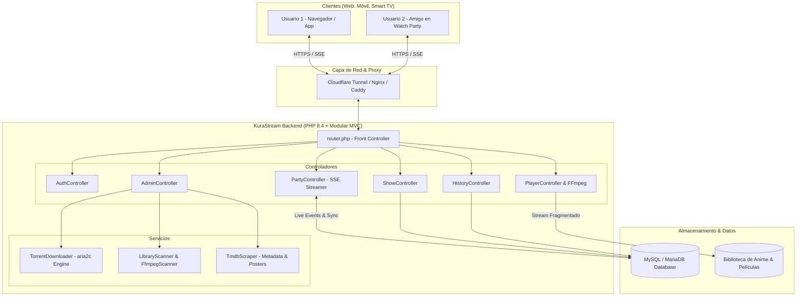

# 蔵 KuraStream — Cloud Anime & Streaming Media Platform

<p align="center">
  
</p>

<p align="center">
  <strong>Plataforma moderna de streaming de anime y medios en la nube</strong><br>
  Sincronización en tiempo real, salas virtuales Watch Party, reproductor avanzado con subtítulos estilizados (.ass), descarga automatizada de torrents en español y perfiles multi-usuario.
</p>

<p align="center">
  
  
  
  
  
  
</p>

---

## 🌟 Características Principales

### 🎬 1. Reproductor de Video de Alto Rendimiento (Estilo VLC / Crunchyroll)
* **Remuxing y Transmisión Fragmentada al Vuelo**: Transmisión instantánea de archivos `.mkv` y `.mp4` con audio AAC multicanal (`/api/stream`) sin demoras de búfer.
* **Subtítulos Estilizados por WebAssembly (`JavascriptSubtitlesOctopus`)**: Renderizado pixel-perfect en canvas de fuentes, efectos de karaoke, tipografías y posiciones de subtítulos `.ass` y `.ssa` nativos de fansubs de anime.
* **Selector Multi-Audio y Multi-Sub**: Detección y cambio instantáneo de pistas de audio (Japonés, Latino, Castellano, Inglés) y subtítulos, con memoria persistente de tus idiomas preferidos.
* **Salto Automático de Intro & Outro (Auto-Skip OP/ED)**: Detección visual inteligente y botones para saltar aperturas o finales automáticamente.
* **Efectos Ambientales & PiP**: Modo **Ambilight** dinámico reactivo a los colores de la escena, animación ambiental de pétalos de sakura en pausa y soporte para **Picture-in-Picture (PiP)**.
* **Handoff a Móvil mediante QR**: Genera códigos QR instantáneos en pantalla para transferir la reproducción y el segundo exacto a tu teléfono o tablet.

---

### 🎉 2. Watch Party — Salas Virtuales en Vivo con Sincronización en Tiempo Real
* **Ver Sincronizado con Amigos**: Reproducción compartida donde el anfitrión controla el Play, Pausa, Adelantar y cambio de episodio para todos los espectadores.
* **Tecnología Server-Sent Events (SSE)**: Canal de comunicación de baja latencia (`/api/party/stream`) compatible de forma nativa con **Cloudflare Tunnels, Proxies Inversos y WAN** sin necesidad de abrir puertos adicionales ni levantar daemons WebSocket externos.
* **Algoritmo Inteligente de Corrección de Desfase (*Drift Correction*)**: Ajusta micro-desfases (<1.5s) acelerando o ralentizando sutilmente la velocidad (`1.06x` / `0.94x`) sin saltos de audio molestos, y sincroniza por fotograma en saltos temporales grandes.
* **Chat Flotante y Reacciones Voladoras (*Flying Emojis*)**: Barra lateral de chat retráctil con glassmorphism dentro del reproductor (incluso en pantalla completa) y botones de reacciones rápidas (🔥, 😭, 😱, ❤️, 🎉, 👏) que lanzan partículas animadas sobre la pantalla de todos los miembros.
* **Salas Públicas y Códigos Cortos**: Entra con un clic mediante enlace directo (`/#/party/KURA-EA6402`), código de 6 caracteres o descubre salas activas de la comunidad.

---

### 📥 3. Auto-Descargador de Torrents Nyaa con Filtro en Español
* **Motor Integrado `aria2c`**: Descargas ultrarrápidas multihilo en segundo plano con control de pausa (`kill -STOP`) y reanudación (`kill -CONT`) en vivo.
* **Filtros Automáticos de Idioma**: Monitoreo continuo de RSS que detecta y prioriza animes en **Sub Español, Doblaje Latino, Castellano, Multi-Audio y Multi-Sub**.
* **Protección Anti-Duplicados**: Compara automáticamente cada torrent contra la base de datos de episodios ya organizados y la cola activa para evitar descargas redundantes.
* **Organizador Automático ("Por Organizar")**: Los animes descargados pasan a una bandeja de preparación donde el sistema parsea títulos, temporadas y números de capítulo para publicarlos con 1 solo clic en el catálogo.

---

### 👤 4. Cuentas, Perfiles Multi-Usuario y Modo Infantil
* **Selector de Perfiles Estilo Netflix ("¿Quién está viendo?")**: Múltiples perfiles independientes bajo una misma cuenta, cada uno con su propio historial de *Seguir Viendo*, lista de favoritos y preferencias de audio/subtítulos.
* **Bloqueo por PIN y Perfil Infantil (Kids)**: Bloqueo de perfiles mediante código PIN y modo seguro para niños que filtra contenido no apto para menores.
* **Autenticación Segura**: Tokens JWT con hashing de contraseñas de alta seguridad.

---

### 📅 5. Calendario Simulcast y Scraper Inteligente de Metadatos
* **Integración con AniList GraphQL API**: Calendario de estrenos simulcast actualizado en tiempo real con caché inteligente de 6 horas y cruce automático con tu catálogo local.
* **Scraper TMDB**: Descarga automática de sinopsis en español, carátulas en alta resolución, fondos panorámicos, reparto de voces, estudios de animación y trailers de YouTube.

---

## 🏛️ Arquitectura del Sistema



---

## 📂 Estructura del Código

```
KuraStream/
├── frontend/                         # Cliente Web SPA (Vanilla JS + CSS3 Moderno)
│   ├── index.html                    # Documento raíz, vistas, modales y reproductor
│   ├── style.css                     # Sistema de diseño (Glassmorphism, Neon Dark Theme)
│   ├── app.js                        # Enrutador cliente, navegación, auth y modales
│   ├── player.js                     # Motor de reproducción, SubtitlesOctopus y eventos
│   └── js/modules/                   # Módulos JS independientes
│       ├── party.js                  # Motor cliente de Watch Party (SSE + Drift Sync)
│       ├── admin_torrents.js         # Panel de descargas aria2c y cola de torrents
│       ├── navigation.js             # Dropdowns, cursor interactivo y barra superior
│       └── auth.js                   # Gestión de sesiones y cabeceras JWT
│
├── php_backend/                      # Backend Modular en PHP 8.4
│   ├── config.php                    # Variables de entorno, constantes globales y CORS
│   ├── db.php                        # Conexión PDO MySQL y capa de datos (DbHelper)
│   ├── router.php                    # Front Controller (Enrutador de API y estáticos)
│   │
│   ├── controllers/                  # Controladores de la API REST / SSE
│   │   ├── AuthController.php        # Registro, login y tokens JWT
│   │   ├── PartyController.php       # Watch Party (SSE streaming, sync, chat, reacciones)
│   │   ├── ShowController.php        # Catálogo, búsquedas, filtrado y comentarios
│   │   ├── PlayerController.php      # Streaming de video con HTTP 206 y remuxing FFmpeg
│   │   ├── CalendarController.php    # Calendario simulcast vía AniList API
│   │   ├── HistoryController.php     # Historial de reproducción y favoritos
│   │   └── AdminController.php       # Gestión de descargas, staged y mantenimiento
│   │
│   ├── services/                     # Servicios y Motores en Segundo Plano
│   │   ├── TorrentDownloader.php     # Gestor de descargas aria2c y RSS de Nyaa
│   │   ├── LibraryScanner.php        # Escaneo y organización de archivos físicos
│   │   ├── FfmpegScanner.php         # Análisis técnico FFprobe y generación de thumbnails
│   │   └── TmdbScraper.php           # Scraper de sinopsis e imágenes de TMDB
│   │
│   └── tests/                        # Suite de Pruebas Automatizadas
│       ├── test_party_rooms.php      # Pruebas unitarias de Watch Party y SSE
│       └── test_torrent_downloader.php# Pruebas del descargador aria2c y filtros
│
├── library/                          # Almacén de Medios
│   ├── Anime/                        # Series organizadas por carpeta
│   ├── Movies/                       # Películas independientes
│   └── Por Organizar/                # Descargas automáticas pendientes de catalogar
│
├── bin/                              # Binarios Estáticos del Sistema (aria2c)
├── docs/                             # Especificaciones técnicas y documentación
├── Dockerfile                        # Imagen Docker para despliegue en contenedores
├── docker-compose.yml                # Configuración de Docker Compose con MySQL
└── README.md                         # Documentación oficial
```

---

## ⚡ Requisitos del Sistema

* **PHP**: Versión `8.2` o superior (Recomendado `PHP 8.4`) con extensiones `pdo_mysql`, `curl`, `mbstring`.
* **Base de Datos**: MySQL `8.0+` o MariaDB `10.5+`.
* **Herramientas Multimedia**: `ffmpeg` y `ffprobe` instalados en el sistema (`sudo apt install ffmpeg` / `pacman -S ffmpeg`).
* **Descargas (Opcional)**: Binario de `aria2c` (incluido en `bin/aria2c`).

---

## 🚀 Guía de Instalación y Despliegue

### Opción 1: Despliegue Directo (PHP + MySQL)

1. **Clonar el Repositorio**:
   ```bash
   git clone https://github.com/TheCarlosS5/KuraStream.git
   cd KuraStream
   ```

2. **Configurar la Base de Datos**:
   Crea la base de datos en tu servidor MySQL:
   ```sql
   CREATE DATABASE kurastream CHARACTER SET utf8mb4 COLLATE utf8mb4_unicode_ci;
   CREATE USER 'kurastream'@'localhost' IDENTIFIED BY 'tu_contraseña_segura';
   GRANT ALL PRIVILEGES ON kurastream.* TO 'kurastream'@'localhost';
   FLUSH PRIVILEGES;
   ```

3. **Configurar Variables de Entorno (`.env`)**:
   Copia el archivo de ejemplo y ajusta tus credenciales:
   ```bash
   cp .env.example .env
   ```
   Edita `.env` con tus datos de base de datos y clave de TMDB (opcional para metadata):
   ```env
   DB_HOST=127.0.0.1
   DB_PORT=3306
   DB_NAME=kurastream
   DB_USER=kurastream
   DB_PASS=tu_contraseña_segura
   JWT_SECRET=tu_clave_secreta_jwt_muy_larga
   TMDB_API_KEY=tu_api_key_de_tmdb
   ```

4. **Iniciar el Servidor**:
   ```bash
   php -d extension=pdo_mysql -S 0.0.0.0:3000 php_backend/router.php
   ```
   Accede desde tu navegador en `http://localhost:3000` o la IP de tu servidor.

---

### Opción 2: Despliegue Online con Cloudflare Tunnel (Recomendado para Internet)

Para acceder a tu servidor KuraStream de forma segura desde cualquier parte del mundo sin abrir puertos en tu router:

1. Instala `cloudflared` en tu servidor:
   ```bash
   curl -L --output cloudflared.deb https://github.com/cloudflare/cloudflared/releases/latest/download/cloudflared-linux-amd64.deb
   sudo dpkg -i cloudflared.deb
   ```
2. Inicia un túnel directo apuntando a KuraStream:
   ```bash
   cloudflared tunnel --url http://localhost:3000
   ```
3. Cloudflare te proporcionará una URL HTTPS segura (ej. `https://tu-anime.trycloudflare.com`) lista para compartir salas de Watch Party y transmitir a tus dispositivos.

---

### Opción 3: Despliegue con Docker y Docker Compose

```bash
docker-compose up -d --build
```
El contenedor levantará automáticamente el servidor web PHP 8.4 junto con un contenedor MySQL vinculado en el puerto `3000`.

---

## 🧪 Ejecutar Pruebas Automatizadas

KuraStream cuenta con suites de pruebas unitarias y de integración para validar el funcionamiento del sistema:

```bash
# Probar base de datos, Watch Party y streaming SSE
php -d extension=pdo_mysql php_backend/tests/test_party_rooms.php

# Probar descargador de torrents aria2c y filtros en español
php -d extension=pdo_mysql php_backend/tests/test_torrent_downloader.php
```

---

## 📡 Referencia Rápida de la API

| Método | Endpoint | Descripción |
| :--- | :--- | :--- |
| `POST` | `/api/login` | Autenticación de usuarios y emisión de tokens JWT |
| `GET` | `/api/shows` | Catálogo completo de animes y películas con filtros |
| `GET` | `/api/stream/{episode_id}` | Streaming de video fragmentado con remuxing FFmpeg |
| `POST` | `/api/party/create` | Crear una nueva sala de Watch Party |
| `POST` | `/api/party/join` | Unirse a una sala de Watch Party con apodo o usuario |
| `POST` | `/api/party/sync` | Sincronizar tiempo de video (`play`, `pause`, `seek`) |
| `POST` | `/api/party/message` | Enviar mensaje de chat o reacción animada |
| `GET` | `/api/party/stream?room_id={id}` | Canal SSE en tiempo real de eventos de la sala |
| `GET` | `/api/party/public-rooms` | Listar salas públicas activas en vivo |
| `GET` | `/api/calendar/schedule` | Calendario simulcast sincronizado con AniList |
| `GET` | `/api/admin/autodownload/status`| Estado de descargas activas de torrents aria2c |

---

## 🛡️ Seguridad y Privacidad

- **Sin Telemetría Invasiva**: KuraStream es 100% privado y autohospedado; tus datos e historial de visualización permanecen en tu propio servidor.
- **Protección contra Traversal de Rutas**: Validación estricta en el controlador de streaming para evitar accesos indebidos fuera del directorio de biblioteca.
- **Aislamiento de Sesiones de Invitados**: Progreso y preferencias de invitados guardados de forma segura en local sin sobreescribir datos de otros perfiles.

---

## 🤝 Licencia y Créditos

Desarrollado con ❤️ para los amantes del anime.  
KuraStream utiliza tecnologías de código abierto: [SubtitlesOctopus](https://github.com/libass/JavascriptSubtitlesOctopus), [FFmpeg](https://ffmpeg.org/), [Aria2](https://aria2.github.io/), [Lucide Icons](https://lucide.dev/) y [AniList API](https://anilist.gitbook.io/anilist-api/).
