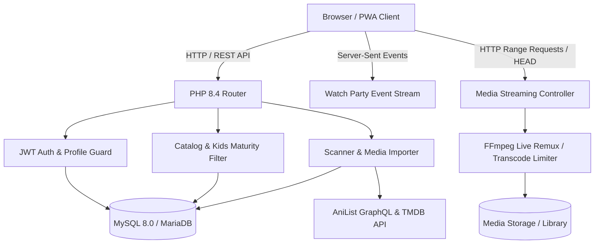

# KuraStream - Cloud Anime & Media Streaming Platform

KuraStream is a self-hosted, cloud-native anime and media streaming platform engineered for personal collections and home servers. It combines a cinematic web experience with real-time synchronized playback (Watch Party), multi-user profile isolation, and on-the-fly media transcoding.

---

## Architecture Overview

KuraStream utilizes a modern service architecture with PHP 8.4 handling API routing, security, and media transcoding orchestration, backed by MariaDB/MySQL for metadata and state persistence. The client interface is built with Vanilla JavaScript and native ES Modules.


```mermaid
graph TD
    Client[Browser / PWA Client] -->|HTTP / REST API| Router[PHP 8.4 Router]
    Client -->|Server-Sent Events| SSE[Watch Party Event Stream]
    Client -->|HTTP Range Requests / HEAD| StreamEngine[Media Streaming Controller]

    Router --> AuthMiddleware[JWT Auth & Profile Guard]
    Router --> ShowController[Catalog & Kids Maturity Filter]
    Router --> AdminController[Scanner & Media Importer]

    StreamEngine --> FFmpeg[FFmpeg Live Remux / Transcode Limiter]
    FFmpeg --> Library[(Media Storage / Library)]

    AuthMiddleware --> MySQL[(MySQL 8.0 / MariaDB)]
    ShowController --> MySQL
    AdminController --> MySQL
    AdminController --> MetadataScrapers[AniList GraphQL & TMDB API]
```

---

## Core Capabilities

### 1. High-Performance Video Player
- **On-the-Fly Remuxing and Transcoding**: Instant fragmented MP4 streaming (`/api/stream/{id}`) with optional stereo downmix, managed software transcoding, and strict worker concurrency limits to prevent host saturation.
- **WebAssembly Subtitle Rendering**: Pixel-perfect canvas rendering for advanced `.ass` and `.ssa` subtitle styles, karaoke effects, and custom fonts using WebAssembly libass.
- **Multi-Track Audio and Subtitle Management**: Instant switching between original audio, localized dubs, and multiple subtitle streams with persistent user preferences.
- **Chapters and Smart Skip**: Support for opening/ending timestamps with automated skip prompts and progress tracking.
- **Picture-in-Picture & Local Handoff**: Native browser Picture-in-Picture and in-browser SVG QR code generation for mobile handoff without external network requests.

### 2. Synchronized Watch Party
- **Real-Time Playback Synchronization**: Shared viewing rooms where playback state, timestamps, and active episodes synchronize across participants.
- **Server-Sent Events (SSE) Engine**: Low-latency push architecture (`/api/party/stream`) compatible with Cloudflare tunnels, reverse proxies, and firewalls without requiring external WebSocket servers.
- **Adaptive Drift Correction**: Subtly accelerates or slows playback (`1.06x` / `0.94x`) relative to each user's chosen playback speed, preserving base rates and eliminating audio distortion.
- **Interactive Chat and Reactions**: Overlay chat drawer and animated reaction particles visible during fullscreen playback.

### 3. Multi-User Profiles and Parental Controls
- **Independent User Profiles**: Netflix-style profile selector supporting unique watch history, continue watching queues, and custom avatars under a single account.
- **PIN Protection and IDOR Elimination**: Cryptographic bcrypt PIN verification and ownership checks on profile mutation and deletion.
- **Server-Side Kids Mode**: Enforcement of content ratings (filtering adult titles, TV-MA/18+ classifications, and adult genres) within application-side PHP controllers and streaming capability gates.

### 4. Automated Catalog & Metadata Scraping
- **Local Filesystem Scanner**: Scans media libraries (`Anime/` and `Movies/`), extracting codecs, resolutions, and audio channels using FFprobe.
- **Metadata Enrichment**: Enriches local titles via AniList GraphQL and TMDB REST APIs, fetching synopses, release years, cover artwork, and episode descriptions.
- **Staging and Import Pipeline**: Dedicated staging workflow for organizing, naming, and importing media files safely with directory traversal verification.

### 5. Progressive Web App (PWA)
- Fully installable desktop and mobile web application with offline service worker shell and responsive layouts.

---

## Technology Stack

- **Backend**: PHP 8.4 (CLI)
- **Database**: MySQL 8.0+ / MariaDB 10.11+
- **Media Engine**: FFmpeg / FFprobe
- **Frontend**: Vanilla JavaScript (ES Modules), CSS Custom Properties
- **Subtitles**: SubtitlesOctopus (libass WebAssembly)
- **Real-Time Push**: Server-Sent Events (SSE)
- **Containerization**: Docker, Docker Compose

---

## Installation & Deployment

### Method 1: Docker Deployment (Recommended)

1. Clone the repository:
   ```bash
   git clone https://github.com/TheCarlosS5/KuraStream.git
   cd KuraStream
   ```

2. Create an environment configuration file:
   ```bash
   cp .env.example .env
   ```
   Configure your database credentials, media path, and JWT secret.

3. Start services using Docker Compose:
   ```bash
   docker compose up -d
   ```

4. Access the web interface at `http://localhost:3000`.

### Method 2: Manual Host Setup

#### Requirements
- PHP 8.4 or higher with extensions: `pdo_mysql`, `curl`, `mbstring`, `fileinfo`
- MySQL 8.0 or MariaDB 10.11+
- FFmpeg and FFprobe installed in system PATH
- Node.js 20+ (for asset linting and test execution)

#### Steps
1. Clone and enter directory:
   ```bash
   git clone https://github.com/TheCarlosS5/KuraStream.git
   cd KuraStream
   ```

2. Configure environment:
   ```bash
   cp .env.example .env
   ```
   Set `DB_HOST`, `DB_NAME`, `DB_USER`, `DB_PASS`, `JWT_SECRET`, and `MEDIA_LIBRARY_PATH`.

3. Initialize database and migrations:
   ```bash
   php -r 'require "php_backend/db.php"; Database::initializeSchema();'
   ```

4. Start development server:
   ```bash
   npm run dev
   # Or directly: php -S 0.0.0.0:3000 php_backend/router.php
   ```

---

## Configuration Variables

| Variable | Description | Default |
|---|---|---|
| `DB_HOST` | Database server address | `127.0.0.1` |
| `DB_PORT` | Database server port | `3306` |
| `DB_NAME` | Database schema name | `kurastream` |
| `DB_USER` | Database username | `kurastream` |
| `DB_PASS` | Database password | None |
| `JWT_SECRET` | Secret key for signing authentication tokens | Required |
| `MEDIA_LIBRARY_PATH` | Absolute path to media storage directory | `./library` |
| `TMDB_API_KEY` | Optional TMDB v3 API Key for metadata scraping | None |
| `ALLOWED_ORIGINS` | Comma-separated CORS allowed origins | `localhost, LAN` |
| `TRUSTED_PROXIES` | Comma-separated list of trusted reverse proxy IPs | None |

---

## Directory Structure

```
KuraStream/
├── frontend/                     # Client application (Vanilla JS + ES Modules)
│   ├── index.html                # Single-page application shell
│   ├── css/                      # Modular CSS architecture
│   │   ├── tokens.css            # Design tokens (colors, typography, radii, spacing)
│   │   ├── base.css              # Reset, typography, and base elements
│   │   ├── layout.css            # Grid, navbar, sidebar, and container layouts
│   │   ├── components.css        # Buttons, cards, modals, form controls
│   │   ├── catalog.css           # Billboard hero, media rails, grid filters
│   │   ├── player.css            # Player chrome, HUD, controls, overlays
│   │   └── admin.css             # Administrative dashboard and staging tables
│   ├── js/
│   │   ├── main.js               # Canonical application entrypoint
│   │   ├── core/                 # Core utilities (API client, auth, router, state, UI)
│   │   └── features/             # Domain modules (catalog, player, profiles, admin)
│   ├── player.js                 # Video playback engine & SubtitlesOctopus integration
│   ├── sw.js                     # Service worker with offline precaching
│   └── manifest.json             # PWA web manifest
├── php_backend/                  # PHP 8.4 REST API & streaming backend
│   ├── config.php                # Environment config, CORS, and security headers
│   ├── db.php                    # PDO database connection and query helpers
│   ├── router.php                # REST routing, static file handler, and CSP dispatch
│   ├── controllers/              # Domain controllers (Auth, Show, Player, Party, Admin)
│   ├── middleware/               # Auth token verification and atomic rate limiting
│   ├── migrations/               # Versioned SQL database migrations
│   └── services/                 # Scrapers, migration manager, and transcode limiter
├── tests/                        # Unified automated test suite (PHP & Node.js)
├── .github/workflows/            # CI workflows (Security audit & test automation)
├── Dockerfile                    # Unprivileged single-stage container build
└── docker-compose.yml            # Docker Compose service definition
```

---

## Security Architecture

- **Unprivileged Containers**: Docker containers run under a non-root `kurastream` user account.
- **Content Security Policy & Hardening**: Standard CSP with scoped script-src, `X-Content-Type-Options: nosniff`, `X-Frame-Options: DENY`, and `SameSite=Lax` HTTP-only cookies are enforced on all routes.
- **Key-Based Remote Operations**: Deployment scripts (`deploy_remote.py`) strictly require SSH key authentication with TOFU (Trust On First Use via accept-new) host verification.
- **Path Traversal Guards**: Strict `realpath()` boundary checks prevent access outside designated library and staging roots.
- **Secret Scanning**: Automated CI scanning via Gitleaks verifies no credentials, API keys, or private keys are committed.
- **Notice**: Any credentials or access keys committed prior to version 2.0 must be rotated immediately in external systems.

### Known Post-Release Limitations

- **Stateless Profile JWTs**: Currently, profile-scoped JWTs are stateless and remain cryptographically valid until their expiry timestamp. Previously issued profile JWTs are not centrally revoked in the database upon switching profiles. Active watch party memberships enforce real-time profile binding and active profile context validation server-side (preventing capability reuse across adult/kids profiles). Future architectural iterations may incorporate `session_version`, active-profile session IDs, or central token revocation.

---

## Quality & Testing

Run all test suites locally:

```bash
# Run JavaScript UI regression tests
node tests/ui_catalogue_rendering.mjs
node tests/ui_review_regressions.mjs

# Run Playwright end-to-end browser tests
npm run test:e2e

# Run ESLint linter
npm run lint

# Run unified PHP test suite
php tests/run_all_tests.php
```

---

## License

No software license file is currently provided. All rights reserved unless otherwise stated by the owner.
