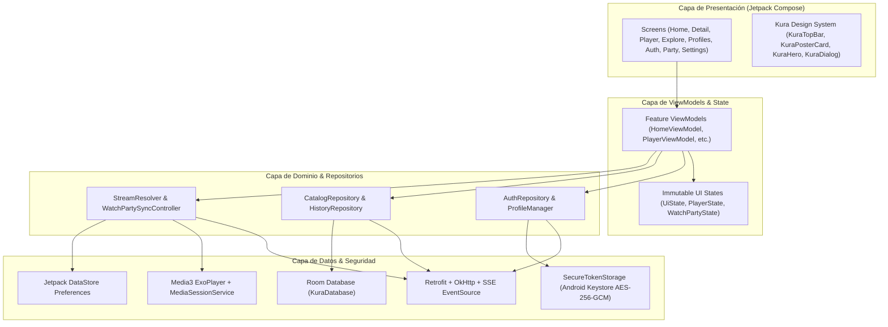

# KuraStream Android Native Architecture

Este documento detalla la arquitectura de software, patrones de diseño y flujo de datos implementados en el cliente Android nativo de **KuraStream**.

---

## 1. Principios de Arquitectura

El cliente nativo sigue estrictamente las directrices modernas de desarrollo en Android recomendadas por Android Developers y Google DeepMind:
- **100% Nativo**: Escrito exclusivamente en **Kotlin** y **Jetpack Compose**.
- **Separación de Responsabilidades Unidireccional (UDF)**:
  `UI (Composables) <--> StateFlow / Events <--> ViewModel <--> Repository <--> Data Sources (Remote / Local)`.
- **Aislamiento Multi-Servidor y Multi-Perfil**: Todas las tablas de base de datos local y almacenes de credenciales aíslan sus datos mediante la clave compuesta `(serverId, profileId)`.
- **Sin Dependencias Innecesarias ni Mocks en Runtime**: No se utilizan WebViews ni librerías híbridas. Toda la funcionalidad se conecta con el backend PHP 8.4 + MySQL existente.

---

## 2. Diagrama de Capas



---

## 3. Estructura de Directorios y Paquetes

```
android/app/src/main/java/com/kurastream/app/
├── KuraStreamApp.kt                      # Application class (Hilt AndroidApp)
├── MainActivity.kt                       # Single activity host con soporte Edge-to-Edge y PiP
├── core/
│   ├── database/                         # Room DB, Entidades (ShowEntity, HistoryEntity) y DAOs
│   │   ├── Daos.kt
│   │   ├── Entities.kt
│   │   └── KuraDatabase.kt
│   ├── designsystem/                     # Tokens CSS mapeados, Tipografía Outfit/Inter y Componentes
│   │   ├── component/Components.kt
│   │   └── theme/
│   │       ├── Color.kt                  # Nocturnal Indigo, Mint, Dark Surfaces
│   │       ├── Dimensions.kt             # Rejilla de 4dp, radios 8/12/14/16dp
│   │       ├── Theme.kt                  # KuraTheme Composable
│   │       └── Type.kt
│   ├── di/
│   │   └── AppModule.kt                  # Módulos de inyección Hilt (OkHttp, Retrofit, Room, Keystore)
│   ├── model/                            # Modelos inmutables de dominio (Show, Episode, Track, User)
│   │   ├── AuthModels.kt
│   │   ├── CalendarModels.kt
│   │   ├── HistoryModels.kt
│   │   ├── PartyModels.kt
│   │   ├── ServerProfile.kt
│   │   ├── ShowModels.kt
│   │   └── UiState.kt                    # Sealed interface (Loading, Success, Error, Empty)
│   ├── network/                          # Networking HTTP, SSE, Interceptors y Normalización
│   │   ├── DeepLinkParser.kt             # Parser kurastream://
│   │   ├── Interceptors.kt               # DynamicBaseUrl, Auth, SafeOrigin, Redaction
│   │   ├── KuraApiService.kt             # Definición Retrofit de contratos REST
│   │   ├── ServerUrlResolver.kt          # Normalización de URL y detección LAN/WAN
│   │   └── WatchPartyClient.kt           # OkHttp Server-Sent Events con fallback a Polling
│   ├── player/                           # Motor de reproducción Media3 ExoPlayer
│   │   ├── KuraPlaybackService.kt        # MediaSessionService nativo para lockscreen/background
│   │   ├── PlayerState.kt                # Estado inmutable de reproducción
│   │   ├── StreamResolver.kt             # Offset absoluto, HTTP Range vs Remux, y Next Episode
│   │   └── WatchPartySyncController.kt   # Sincronización y detección de drift para salas
│   ├── preferences/
│   │   └── KuraPreferencesDataSource.kt  # Jetpack DataStore no sensible
│   └── security/
│       └── SecureTokenStorage.kt         # Android Keystore AES-256-GCM para JWT
├── feature/                              # Módulos de pantalla organizados por feature
│   ├── auth/                             # Login y Registro nativo
│   ├── detail/                           # Detalle de show, lista de episodios, temporadas y CTA
│   ├── explore/                          # Búsqueda con debounce, filtros y vista de calendario
│   ├── favorites/                        # "Mi Lista" con actualización optimista segura
│   ├── history/                          # Historial cronológico con reanudación y borrado
│   ├── home/                             # Billboard hero dinámico, rieles de anime, películas y emisiones
│   ├── party/                            # Watch Party nativa con chat en vivo y controles de sala
│   ├── player/                           # Reproductor landscape/portrait con controles Compose
│   ├── profiles/                         # Selector de perfil, modal de PIN e indicador Kids
│   ├── server/                           # Pantalla de conexión, validación /api/health y lista reciente
│   └── settings/                         # Ajustes del player, servidor activo y diagnóstico
└── navigation/
    ├── AppNavGraph.kt                    # Grafo de navegación Jetpack Navigation Compose
    └── Screen.kt                         # Rutas fuertemente tipadas
```

---

## 4. Gestión de Estado (`UiState<T>`)

Cada pantalla opera sobre una máquina de estados explícita:
```kotlin
sealed interface UiState<out T> {
    data object Loading : UiState<Nothing>
    data class Success<T>(val data: T) : UiState<T>
    data class Error(val message: String, val canRetry: Boolean = true) : UiState<Nothing>
    data object Empty : UiState<Nothing>
}
```
Esto elimina spinners infinitos ante fallos de conexión y garantiza mensajes de error comprensibles con botones de reintento.

---

## 5. Diseño Adaptativo y Formatos

- **Teléfonos**: Navegación principal inferior (Bottom Navigation Bar) con 5 destinos máximos (Inicio, Explorar, Mi Lista, Historial, Perfil).
- **Tabletas y Pantallas Grandes**: `WindowSizeClass` adapta automáticamente los rieles de contenido aumentando las columnas de los posters (hasta 6 columnas) y manteniendo el hero cinematográfico con proporciones balanceadas.
- **Player Edge-to-Edge**: En orientación horizontal el reproductor ocupa el 100% de la pantalla usando `WindowInsetsControllerCompat` para ocultar las barras del sistema de manera inmersiva.
