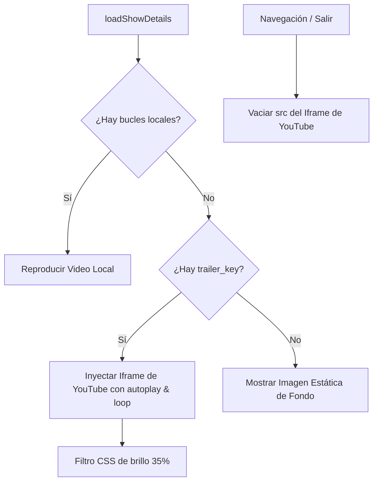

# Cinematic Background Trailer Loop Implementation Plan

> **For agentic workers:** REQUIRED SUB-SKILL: Use superpowers:subagent-driven-development to implement this plan task-by-task. Steps use checkbox (`- [ ]`) syntax for tracking.

**Goal:** Reproducir de fondo el tráiler de YouTube en bucle y silenciado en la pantalla de detalles de una serie si no cuenta con bucles de video locales.

**Architecture:** 
- HTML: Contenedor con iframe de YouTube absoluto dentro de `.detail-ambient-bg`.
- CSS: Estilos de redimensionamiento responsivo, escalado (`scale(1.2)`) y oscurecimiento (`brightness(0.35)`).
- JS: Lógica en `loadShowDetails` para inyectar/limpiar la URL de YouTube.

**Architecture Diagram:**



**Tech Stack:** HTML, CSS, Vanilla JS

## Global Constraints

- No realizar comandos `git commit` bajo ninguna circunstancia.
- Asegurar que el `src` del iframe siempre quede vacío al salir de la vista de detalles para evitar descargas innecesarias.

---

### Task 1: Modificaciones de Estructura y Diseño (HTML y CSS)

**Files:**
- Modify: `frontend/index.html:113-118`
- Modify: `frontend/style.css:545-560`

**Interfaces:**
- Consumes: Ninguno.
- Produces: Contenedor `#detail-bg-youtube-container` estructurado y estilizado.

- [ ] **Step 1: Añadir el contenedor del iframe en index.html**

Modificar [frontend/index.html](file:///home/carlossgr/Escritorio/KuraStream/frontend/index.html):
```diff
       <div class="detail-ambient-bg">
         <video id="detail-bg-video" loop muted playsinline></video>
+        <div id="detail-bg-youtube-container" class="detail-bg-youtube-container" style="display: none;">
+          <iframe id="detail-bg-youtube-iframe" src="" allow="autoplay; encrypted-media" frameborder="0"></iframe>
+        </div>
       </div>
```

- [ ] **Step 2: Añadir las reglas de estilos en style.css**

Modificar [frontend/style.css](file:///home/carlossgr/Escritorio/KuraStream/frontend/style.css):
```diff
 .detail-ambient-bg {
   position: absolute;
   top: 0;
   left: 0;
   width: 100%;
   height: 70vh;
   overflow: hidden;
   z-index: 1;
   pointer-events: none;
 }
+
+.detail-bg-youtube-container {
+  position: absolute;
+  inset: 0;
+  width: 100%;
+  height: 100%;
+  overflow: hidden;
+  z-index: 1;
+  pointer-events: none;
+}
+
+#detail-bg-youtube-iframe {
+  position: absolute;
+  top: 50%;
+  left: 50%;
+  width: 100vw;
+  height: 56.25vw;
+  min-height: 100vh;
+  min-width: 177.77vh;
+  transform: translate(-50%, -50%) scale(1.2);
+  pointer-events: none;
+  border: none;
+  filter: brightness(0.35) saturate(120%);
+}
```

---

### Task 2: Implementar Lógica y Ciclo de Vida del Iframe (JS)

**Files:**
- Modify: `frontend/app.js`

**Interfaces:**
- Consumes: Contenedor HTML y estilos definidos en la Task 1.
- Produces: Carga y descarga dinámica del iframe de YouTube.

- [ ] **Step 1: Añadir limpieza del iframe en handleRoute**

En `handleRoute` en [frontend/app.js](file:///home/carlossgr/Escritorio/KuraStream/frontend/app.js) (cerca de la línea 150), asegúrate de que al cambiar de vista se destruya la reproducción en bucle:
```javascript
    // Limpieza de trailers de fondo
    const bgYoutubeIframe = document.getElementById('detail-bg-youtube-iframe');
    const bgYoutubeContainer = document.getElementById('detail-bg-youtube-container');
    if (bgYoutubeIframe) bgYoutubeIframe.src = '';
    if (bgYoutubeContainer) bgYoutubeContainer.style.display = 'none';
```

- [ ] **Step 2: Integrar la lógica en loadShowDetails**

Modificar `loadShowDetails` en [frontend/app.js](file:///home/carlossgr/Escritorio/KuraStream/frontend/app.js) para controlar el iframe:
- Si `show.backdrop_loops` está vacío/nulo y existe `show.trailer_key`:
  - Mostrar `#detail-bg-youtube-container`.
  - Inyectar URL:
    `https://www.youtube.com/embed/${show.trailer_key}?autoplay=1&mute=1&controls=0&loop=1&playlist=${show.trailer_key}&playsinline=1&showinfo=0&rel=0&iv_load_policy=3&enablejsapi=1`
  - Ocultar `#detail-bg-video`.
- De lo contrario (hay video local o no hay tráiler):
  - Detener y ocultar el iframe de YouTube.
  - Cargar el video local si existe.
