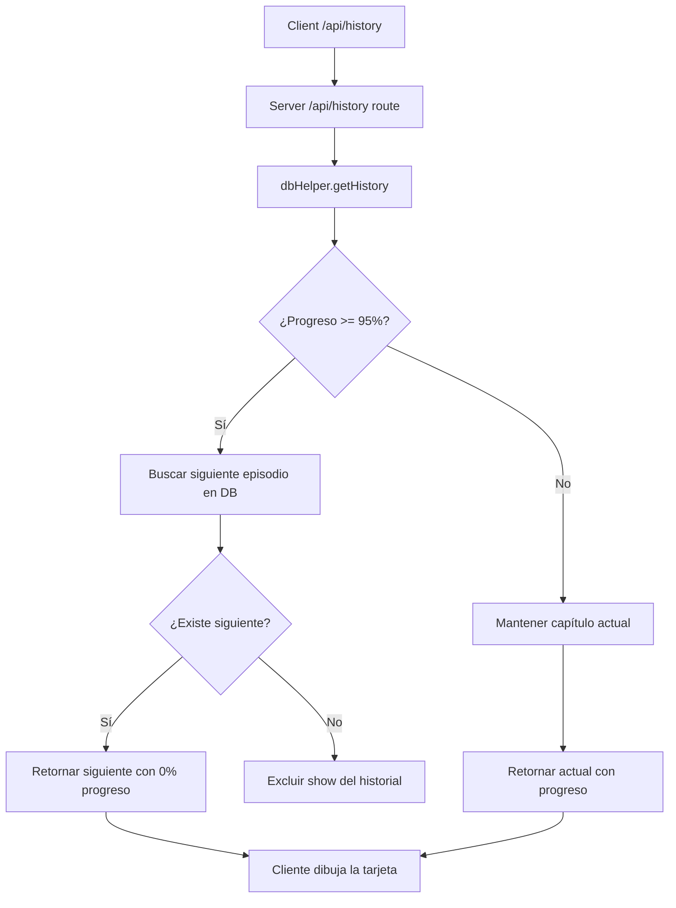

# Continue Watching Promotion Implementation Plan

> **For agentic workers:** REQUIRED SUB-SKILL: Use superpowers:subagent-driven-development to implement this plan task-by-task. Steps use checkbox (`- [ ]`) syntax for tracking.

**Goal:** Automatically promote the next episode of a series to the "Seguir Viendo" row when the current one is completed (>=95% progress).

**Architecture:** Modificar `getHistory` en la base de datos para detectar capítulos completos, realizar una subconsulta para encontrar el siguiente capítulo y, si existe, retornarlo con progreso `0`. Si no existe más capítulos, se oculta la serie del carrusel.

**Architecture Diagram:**



**Tech Stack:** Node.js, SQLite (better-sqlite3)

## Global Constraints

- No realizar comandos `git commit` bajo ninguna circunstancia.
- Mantener la firma del método `getHistory(username)` idéntica.

---

### Task 1: Implementar lógica de Auto-Promoción en la Base de Datos

**Files:**
- Modify: `backend/db.js:389-404`

**Interfaces:**
- Consumes: Ninguno.
- Produces: `getHistory(username)` retorna un array procesado con el siguiente episodio para shows completados.

- [ ] **Step 1: Crear caso de prueba local o verificar lógica**

No tenemos un framework de pruebas formal configurado, por lo que crearemos un script de prueba temporal en el proyecto para validar el comportamiento del método `getHistory`.

Crea el archivo `backend/test_continue_watching.js`:
```javascript
import { dbHelper, db } from './db.js';

async function runTest() {
  console.log("=== INICIANDO PRUEBA DE SEGUIR VIENDO ===");
  // Limpiar historial de prueba
  db.prepare("DELETE FROM watch_history WHERE username = 'test_user'").run();
  
  // 1. Insertar un show y dos episodios
  db.prepare("INSERT OR IGNORE INTO shows (id, title, media_type) VALUES ('test_show', 'Test Show', 'anime')").run();
  db.prepare("INSERT OR IGNORE INTO episodes (id, show_id, title, season_number, episode_number, duration) VALUES ('ep1', 'test_show', 'Episodio 1', 1, 1, 100)").run();
  db.prepare("INSERT OR IGNORE INTO episodes (id, show_id, title, season_number, episode_number, duration) VALUES ('ep2', 'test_show', 'Episodio 2', 1, 2, 100)").run();

  // 2. Insertar progreso incompleto (50%) para ep1
  dbHelper.saveWatchProgress('test_user', 'ep1', 50);
  let history = dbHelper.getHistory('test_user');
  console.log("Prueba 1 (En progreso):", history[0]?.episode_id === 'ep1' ? "PASSED" : "FAILED", `(Esperado ep1, recibido ${history[0]?.episode_id})`);

  // 3. Insertar progreso completo (98%) para ep1
  dbHelper.saveWatchProgress('test_user', 'ep1', 98);
  history = dbHelper.getHistory('test_user');
  console.log("Prueba 2 (Promoción):", history[0]?.episode_id === 'ep2' ? "PASSED" : "FAILED", `(Esperado ep2, recibido ${history[0]?.episode_id})`);
  console.log("Prueba 2 Progreso:", history[0]?.progress_seconds === 0 ? "PASSED" : "FAILED", `(Esperado 0, recibido ${history[0]?.progress_seconds})`);

  // 4. Insertar progreso completo (98%) para ep2 (fin de la serie)
  dbHelper.saveWatchProgress('test_user', 'ep2', 98);
  history = dbHelper.getHistory('test_user');
  console.log("Prueba 3 (Completado todo):", history.length === 0 ? "PASSED" : "FAILED", `(Esperado vacío, recibido ${history.length} elementos)`);

  // Limpiar
  db.prepare("DELETE FROM watch_history WHERE username = 'test_user'").run();
  console.log("=== PRUEBAS FINALIZADAS ===");
}

runTest();
```

- [ ] **Step 2: Ejecutar test inicial para confirmar que falla**

Ejecuta el comando:
```bash
node backend/test_continue_watching.js
```
Esperado: Falla en la Prueba 2 (retorna `ep1` en lugar de `ep2` porque aún no hay lógica de promoción).

- [ ] **Step 3: Implementar la lógica en db.js**

Edita la función `getHistory` en [backend/db.js](file:///home/carlossgr/Escritorio/KuraStream/backend/db.js):

```diff
  // Watch History
  getHistory: (username = 'guest') => {
    const stmt = db.prepare(`
      SELECT h.*, e.title as episode_title, e.episode_number, e.season_number, s.id as show_id, s.title as show_title, s.poster_path, e.thumbnail_path, e.duration
      FROM watch_history h
      JOIN episodes e ON h.episode_id = e.id
      JOIN shows s ON e.show_id = s.id
      WHERE h.username = ? AND h.updated_at = (
        SELECT MAX(h2.updated_at)
        FROM watch_history h2
        JOIN episodes e2 ON h2.episode_id = e2.id
        WHERE e2.show_id = s.id AND h2.username = ?
      )
      ORDER BY h.updated_at DESC
    `);
-   return stmt.all(username, username);
+   const records = stmt.all(username, username);
+   const finalHistory = [];
+
+   for (const rec of records) {
+     const isFinished = rec.duration && rec.progress_seconds >= 0.95 * rec.duration;
+     
+     if (isFinished) {
+       // Buscar el siguiente episodio de la serie por orden de temporada y capítulo
+       const nextEpStmt = db.prepare(`
+         SELECT e.id, e.title, e.episode_number, e.season_number, e.thumbnail_path, e.duration
+         FROM episodes e
+         WHERE e.show_id = ? AND (e.season_number > ? OR (e.season_number = ? AND e.episode_number > ?))
+         ORDER BY e.season_number ASC, e.episode_number ASC
+         LIMIT 1
+       `);
+       const nextEp = nextEpStmt.get(rec.show_id, rec.season_number, rec.season_number, rec.episode_number);
+       
+       if (nextEp) {
+         finalHistory.push({
+           id: rec.id,
+           username: rec.username,
+           episode_id: nextEp.id,
+           progress_seconds: 0,
+           updated_at: rec.updated_at,
+           episode_title: nextEp.title,
+           episode_number: nextEp.episode_number,
+           season_number: nextEp.season_number,
+           show_id: rec.show_id,
+           show_title: rec.show_title,
+           poster_path: rec.poster_path,
+           thumbnail_path: nextEp.thumbnail_path,
+           duration: nextEp.duration
+         });
+       }
+     } else {
+       if (rec.progress_seconds > 0) {
+         finalHistory.push(rec);
+       }
+     }
+   }
+   
+   return finalHistory;
  },
```

- [ ] **Step 4: Ejecutar test de nuevo para confirmar que pasa**

Ejecuta el comando:
```bash
node backend/test_continue_watching.js
```
Esperado: Todas las pruebas reportan `PASSED`.

- [ ] **Step 5: Limpieza de archivos temporales**

Elimina el script de prueba temporal:
```bash
rm backend/test_continue_watching.js
```
