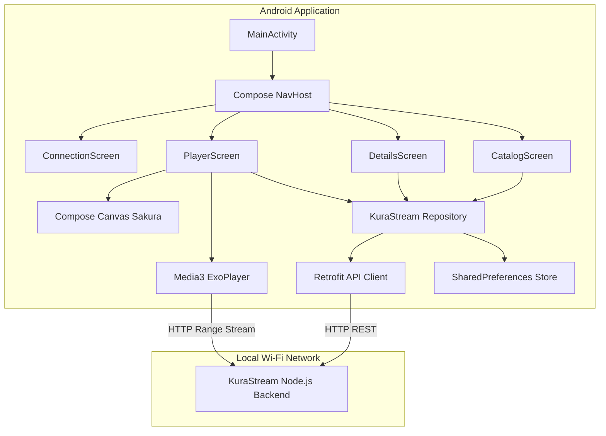

# KuraStream Android Companion App Implementation Plan

> **For agentic workers:** REQUIRED SUB-SKILL: Use superpowers:subagent-driven-development to implement this plan task-by-task. Steps use checkbox (`- [ ]`) syntax for tracking.

**Goal:** Build a fully native Android companion application in Kotlin using Jetpack Compose and Media3 ExoPlayer that connects to the local KuraStream Wi-Fi server, displays the media catalog, syncs watch progress, and custom-renders the video player overlay including falling Sakura petals when paused.

**Architecture:** Model-View-ViewModel (MVVM) in a single-activity architecture using Jetpack Navigation Compose. Retrogit will fetch metadata from the server, SharedPreferences will persist credentials and IP configuration, and Media3 ExoPlayer wrapped in a Compose AndroidView will manage playback.

**Architecture Diagram:**



**Tech Stack:** Kotlin 1.9, Jetpack Compose, Media3 ExoPlayer, Retrofit, OkHttp3, SharedPreferences, Gradle.

## Global Constraints
* Language: Kotlin (JVM 17 compatible)
* UI Toolkit: Jetpack Compose (BOM 2023.10.01)
* Media Player: AndroidX Media3 ExoPlayer (1.2.0)
* Network: Retrofit 2.9.0 & OkHttp 4.12.0
* Local DB/Storage: SharedPreferences

---

### Task 1: Scaffolding de Gradle y Estructura Base de Android

**Files:**
* Create: `android/build.gradle.kts`
* Create: `android/settings.gradle.kts`
* Create: `android/gradle.properties`
* Create: `android/app/build.gradle.kts`
* Create: `android/app/src/main/AndroidManifest.xml`
* Create: `android/app/src/main/res/values/themes.xml`

**Interfaces:**
* Consumes: None (initial setup)
* Produces: Fully buildable Android Gradle wrapper setup structure.

- [ ] **Step 1: Crear Gradle raíz y configuración de módulos**
  Crear archivo `android/build.gradle.kts`:
  ```kotlin
  plugins {
      id("com.android.application") version "8.1.2" apply false
      id("org.jetbrains.kotlin.android") version "1.9.10" apply false
  }
  ```

- [ ] **Step 2: Crear el archivo settings.gradle.kts**
  Crear `android/settings.gradle.kts`:
  ```kotlin
  pluginManagement {
      repositories {
          google()
          mavenCentral()
          gradlePluginPortal()
      }
  }
  dependencyResolutionManagement {
      repositoriesMode.set(RepositoriesMode.FAIL_ON_PROJECT_REPOS)
      repositories {
          google()
          mavenCentral()
      }
  }
  rootProject.name = "KuraStream"
  include(":app")
  ```

- [ ] **Step 3: Crear gradle.properties de optimizaciones de compilación**
  Crear `android/gradle.properties`:
  ```properties
  org.gradle.jvmargs=-Xmx2048m -Dfile.encoding=UTF-8
  android.useAndroidX=true
  android.nonTransitiveRClass=true
  kotlin.code.style=official
  ```

- [ ] **Step 4: Crear build.gradle.kts para el módulo app**
  Crear `android/app/build.gradle.kts`:
  ```kotlin
  plugins {
      id("com.android.application")
      id("org.jetbrains.kotlin.android")
  }

  android {
      namespace = "com.kurastream.app"
      compileSdk = 34

      defaultConfig {
          applicationId = "com.kurastream.app"
          minSdk = 26
          targetSdk = 34
          versionCode = 1
          versionName = "1.0"
          testInstrumentationRunner = "androidx.test.runner.AndroidJUnitRunner"
          vectorDrawables { useSupportLibrary = true }
      }

      buildTypes {
          release {
              isMinifyEnabled = false
              proguardFiles(getDefaultProguardFile("proguard-android-optimize.txt"), "proguard-rules.pro")
          }
      }
      compileOptions {
          sourceCompatibility = JavaVersion.VERSION_17
          targetCompatibility = JavaVersion.VERSION_17
      }
      kotlinOptions {
          jvmTarget = "17"
      }
      buildFeatures {
          compose = true
      }
      composeOptions {
          kotlinCompilerExtensionVersion = "1.5.3"
      }
      packaging {
          resources {
              excludes += "/META-INF/{AL2.0,LGPL2.1}"
          }
      }
  }

  dependencies {
      implementation("androidx.core:core-ktx:1.12.0")
      implementation("androidx.lifecycle:lifecycle-runtime-ktx:2.6.2")
      implementation("androidx.activity:activity-compose:1.8.0")
      implementation(platform("androidx.compose:compose-bom:2023.10.01"))
      implementation("androidx.compose.ui:ui")
      implementation("androidx.compose.ui:ui-graphics")
      implementation("androidx.compose.ui:ui-tooling-preview")
      implementation("androidx.compose.material3:material3")
      implementation("androidx.navigation:navigation-compose:2.7.4")
      
      // ExoPlayer Media3
      implementation("androidx.media3:media3-exoplayer:1.2.0")
      implementation("androidx.media3:media3-ui:1.2.0")

      // Networking Retrofit & OkHttp
      implementation("com.squareup.retrofit2:retrofit:2.9.0")
      implementation("com.squareup.retrofit2:converter-gson:2.9.0")
      implementation("com.squareup.okhttp3:okhttp:4.12.0")

      testImplementation("junit:junit:4.13.2")
  }
  ```

- [ ] **Step 5: Crear el manifiesto AndroidManifest.xml**
  Crear `android/app/src/main/AndroidManifest.xml` con permisos de Internet:
  ```xml
  <?xml version="1.0" encoding="utf-8"?>
  <manifest xmlns:android="http://schemas.android.com/apk/res/android">
      <uses-permission android:name="android.permission.INTERNET" />
      <uses-permission android:name="android.permission.ACCESS_NETWORK_STATE" />

      <application
          android:allowBackup="true"
          android:icon="@android:drawable/sym_def_app_icon"
          android:label="KuraStream"
          android:roundIcon="@android:drawable/sym_def_app_icon"
          android:supportsRtl="true"
          android:theme="@style/Theme.KuraStream"
          android:usesCleartextTraffic="true">
          <activity
              android:name=".MainActivity"
              android:exported="true"
              android:configChanges="orientation|screenSize|layoutDirection|keyboardHidden"
              android:theme="@style/Theme.KuraStream">
              <intent-filter>
                  <action android:name="android.intent.action.MAIN" />
                  <category android:name="android.intent.category.LAUNCHER" />
              </intent-filter>
          </activity>
      </application>
  </manifest>
  ```

- [ ] **Step 6: Crear temas base de Android Studio**
  Crear `android/app/src/main/res/values/themes.xml`:
  ```xml
  <?xml version="1.0" encoding="utf-8"?>
  <resources>
      <style name="Theme.KuraStream" parent="android:Theme.Material.NoActionBar">
          <item name="android:statusBarColor">#121620</item>
          <item name="android:windowBackground">#121620</item>
      </style>
  </resources>
  ```

---

### Task 2: Capa de Datos, Modelos y Cliente API (Retrofit)

**Files:**
* Create: `android/app/src/main/java/com/kurastream/app/data/Models.kt`
* Create: `android/app/src/main/java/com/kurastream/app/data/PreferencesManager.kt`
* Create: `android/app/src/main/java/com/kurastream/app/data/KuraStreamApi.kt`

**Interfaces:**
* Consumes: Scaffolding Gradle settings.
* Produces: Retrofit interfaces, DTOs, and shared preferences.

- [ ] **Step 1: Definir modelos de datos DTO**
  Crear `android/app/src/main/java/com/kurastream/app/data/Models.kt`:
  ```kotlin
  package com.kurastream.app.data

  data class Show(
      val id: String,
      val title: String,
      val synopsis: String?,
      val rating: Double?,
      val year: Int?,
      val poster_path: String?,
      val backdrop_path: String?,
      val media_type: String
  )

  data class Episode(
      val id: String,
      val show_id: String,
      val season_number: Int,
      val episode_number: Int,
      val title: String,
      val duration: Double?,
      val audio_tracks: String?, // JSON String: [{index, language}]
      val subtitle_tracks: String? // JSON String: [{index, language}]
  )

  data class ShowDetailResponse(
      val show: Show,
      val episodes: List<Episode>
  )

  data class LoginRequest(
      val username: String,
      val password: String
  )

  data class LoginResponse(
      val success: Boolean,
      val token: String?,
      val username: String?
  )

  data class ProgressResponse(
      val progress: Double
  )

  data class ProgressRequest(
      val episodeId: String,
      val progress: Double,
      val username: String
  )
  ```

- [ ] **Step 2: Crear el gestor de preferencias SharedPreferences**
  Crear `android/app/src/main/java/com/kurastream/app/data/PreferencesManager.kt`:
  ```kotlin
  package com.kurastream.app.data

  import android.content.Context

  class PreferencesManager(context: Context) {
      private val prefs = context.getSharedPreferences("kurastream_prefs", Context.MODE_PRIVATE)

      fun saveServerUrl(url: String) {
          prefs.edit().putString("server_url", url.trimEnd('/')).apply()
      }

      fun getServerUrl(): String? {
          return prefs.getString("server_url", null)
      }

      fun saveAuthToken(token: String) {
          prefs.edit().putString("auth_token", token).apply()
      }

      fun getAuthToken(): String? {
          return prefs.getString("auth_token", null)
      }

      fun saveUsername(username: String) {
          prefs.edit().putString("username", username).apply()
      }

      fun getUsername(): String {
          return prefs.getString("username", "guest") ?: "guest"
      }
      
      fun clear() {
          prefs.edit().remove("auth_token").remove("username").apply()
      }
  }
  ```

- [ ] **Step 3: Crear interfaz Retrofit KuraStreamApi**
  Crear `android/app/src/main/java/com/kurastream/app/data/KuraStreamApi.kt`:
  ```kotlin
  package com.kurastream.app.data

  import okhttp3.OkHttpClient
  import retrofit2.Retrofit
  import retrofit2.converter.gson.GsonConverterFactory
  import retrofit2.http.*

  interface KuraStreamApi {
      @GET("api/shows")
      suspend fun getShows(): List<Show>

      @GET("api/shows/{id}")
      suspend fun getShowDetails(@Path("id") id: String): ShowDetailResponse

      @POST("api/login")
      suspend fun login(@Body request: LoginRequest): LoginResponse

      @GET("api/progress/{episodeId}")
      suspend fun getProgress(
          @Path("episodeId") episodeId: String,
          @Query("username") username: String
      ): ProgressResponse

      @POST("api/progress")
      suspend fun saveProgress(
          @Body request: ProgressRequest
      ): Map<String, Any>

      companion object {
          fun create(baseUrl: String, preferencesManager: PreferencesManager): KuraStreamApi {
              val client = OkHttpClient.Builder().addInterceptor { chain ->
                  val requestBuilder = chain.request().newBuilder()
                  preferencesManager.getAuthToken()?.let { token ->
                      requestBuilder.addHeader("Authorization", "Bearer $token")
                  }
                  chain.proceed(requestBuilder.build())
              }.build()

              return Retrofit.Builder()
                  .baseUrl(baseUrl.trimEnd('/') + "/")
                  .client(client)
                  .addConverterFactory(GsonConverterFactory.create())
                  .build()
                  .create(KuraStreamApi::class.java)
          }
      }
  }
  ```

---

### Task 3: Capa de Presentación (Jetpack Compose UI) y Navegación

**Files:**
* Create: `android/app/src/main/java/com/kurastream/app/ui/theme/Color.kt`
* Create: `android/app/src/main/java/com/kurastream/app/ui/theme/Theme.kt`
* Create: `android/app/src/main/java/com/kurastream/app/ui/screens/ConnectionScreen.kt`
* Create: `android/app/src/main/java/com/kurastream/app/ui/screens/CatalogScreen.kt`
* Create: `android/app/src/main/java/com/kurastream/app/ui/screens/DetailsScreen.kt`
* Create: `android/app/src/main/java/com/kurastream/app/MainActivity.kt`

**Interfaces:**
* Consumes: KuraStreamApi and PreferencesManager.
* Produces: App screens and compose-based theme.

- [ ] **Step 1: Definir los colores Chameleon**
  Crear `android/app/src/main/java/com/kurastream/app/ui/theme/Color.kt`:
  ```kotlin
  package com.kurastream.app.ui.theme

  import androidx.compose.ui.graphics.Color

  val BgDark = Color(0xFF121620)
  val CardDark = Color(0xFF1A1F2C)
  val AccentColor = Color(0xFFE91E63) // Rosa Kura
  val AccentGlow = Color(0x33E91E63)
  val TextMain = Color(0xFFFFFFFF)
  val TextMuted = Color(0xFF8B949E)
  ```

- [ ] **Step 2: Configurar el Tema de Compose**
  Crear `android/app/src/main/java/com/kurastream/app/ui/theme/Theme.kt`:
  ```kotlin
  package com.kurastream.app.ui.theme

  import androidx.compose.material3.MaterialTheme
  import androidx.compose.material3.darkColorScheme
  import androidx.compose.runtime.Composable

  private val DarkColorScheme = darkColorScheme(
      primary = AccentColor,
      background = BgDark,
      surface = CardDark,
      onPrimary = TextMain,
      onBackground = TextMain,
      onSurface = TextMain
  )

  @Composable
  fun KuraStreamTheme(content: @Composable () -> Unit) {
      MaterialTheme(
          colorScheme = DarkColorScheme,
          content = content
      )
  }
  ```

- [ ] **Step 3: Crear la Pantalla de Configuración IP/Conexión**
  Crear `android/app/src/main/java/com/kurastream/app/ui/screens/ConnectionScreen.kt`:
  ```kotlin
  package com.kurastream.app.ui.screens

  import androidx.compose.foundation.background
  import androidx.compose.foundation.layout.*
  import androidx.compose.material3.*
  import androidx.compose.runtime.*
  import androidx.compose.ui.Alignment
  import androidx.compose.ui.Modifier
  import androidx.compose.ui.text.font.FontWeight
  import androidx.compose.ui.unit.dp
  import androidx.compose.ui.unit.sp
  import com.kurastream.app.data.KuraStreamApi
  import com.kurastream.app.data.PreferencesManager
  import com.kurastream.app.ui.theme.BgDark
  import kotlinx.coroutines.launch

  @OptIn(ExperimentalMaterial3Api::class)
  @Composable
  fun ConnectionScreen(
      preferencesManager: PreferencesManager,
      onConnected: () -> Unit
  ) {
      var ipAddress by remember { mutableStateOf(preferencesManager.getServerUrl() ?: "http://192.168.1.100:3000") }
      var isLoading by remember { mutableStateOf(false) }
      var errorMessage by remember { mutableStateOf<String?>(null) }
      val scope = rememberCoroutineScope()

      Column(
          modifier = Modifier
              .fillMaxSize()
              .background(BgDark)
              .padding(24.dp),
          horizontalAlignment = Alignment.CenterHorizontally,
          verticalArrangement = Arrangement.Center
      ) {
          Text(
              text = "KuraStream",
              fontSize = 32.sp,
              fontWeight = FontWeight.Bold,
              color = MaterialTheme.colorScheme.primary,
              modifier = Modifier.padding(bottom = 8.dp)
          )
          Text(
              text = "Acompañante Móvil Premium",
              fontSize = 16.sp,
              color = MaterialTheme.colorScheme.onBackground.copy(alpha = 0.6f),
              modifier = Modifier.padding(bottom = 32.dp)
          )

          OutlinedTextField(
              value = ipAddress,
              onValueChange = { ipAddress = it },
              label = { Text("URL del Servidor Local") },
              modifier = Modifier.fillMaxWidth(),
              singleLine = true
          )

          errorMessage?.let {
              Text(
                  text = it,
                  color = MaterialTheme.colorScheme.error,
                  fontSize = 14.sp,
                  modifier = Modifier.padding(top = 8.dp)
              )
          }

          Spacer(modifier = Modifier.height(24.dp))

          Button(
              onClick = {
                  isLoading = true
                  errorMessage = null
                  scope.launch {
                      try {
                          val testApi = KuraStreamApi.create(ipAddress, preferencesManager)
                          testApi.getShows() // Ping shows
                          preferencesManager.saveServerUrl(ipAddress)
                          onConnected()
                      } catch (e: Exception) {
                          errorMessage = "Error de conexión: ${e.localizedMessage}"
                      } finally {
                          isLoading = false
                      }
                  }
              },
              modifier = Modifier.fillMaxWidth(),
              enabled = !isLoading
          ) {
              if (isLoading) {
                  CircularProgressIndicator(color = MaterialTheme.colorScheme.onPrimary, modifier = Modifier.size(24.dp))
              } else {
                  Text("Conectar", fontWeight = FontWeight.Bold)
              }
          }
      }
  }
  ```

- [ ] **Step 4: Crear Pantalla del Catálogo (Dashboard)**
  Crear `android/app/src/main/java/com/kurastream/app/ui/screens/CatalogScreen.kt`:
  ```kotlin
  package com.kurastream.app.ui.screens

  import androidx.compose.foundation.background
  import androidx.compose.foundation.clickable
  import androidx.compose.foundation.layout.*
  import androidx.compose.foundation.lazy.grid.GridCells
  import androidx.compose.foundation.lazy.grid.LazyVerticalGrid
  import androidx.compose.foundation.lazy.grid.items
  import androidx.compose.material3.*
  import androidx.compose.runtime.*
  import androidx.compose.ui.Modifier
  import androidx.compose.ui.text.font.FontWeight
  import androidx.compose.ui.unit.dp
  import androidx.compose.ui.unit.sp
  import com.kurastream.app.data.KuraStreamApi
  import com.kurastream.app.data.Show
  import com.kurastream.app.ui.theme.BgDark
  import kotlinx.coroutines.launch

  @OptIn(ExperimentalMaterial3Api::class)
  @Composable
  fun CatalogScreen(
      api: KuraStreamApi,
      onShowClick: (String) -> Unit,
      onDisconnect: () -> Unit
  ) {
      var shows by remember { mutableStateOf<List<Show>>(emptyList()) }
      var isLoading by remember { mutableStateOf(true) }
      val scope = rememberCoroutineScope()

      LaunchedEffect(Unit) {
          scope.launch {
              try {
                  shows = api.getShows()
              } catch (e: Exception) {
                  // Handle Error
              } finally {
                  isLoading = false
              }
          }
      }

      Scaffold(
          topBar = {
              TopAppBar(
                  title = { Text("Biblioteca KuraStream", fontWeight = FontWeight.Bold) },
                  actions = {
                      IconButton(onClick = onDisconnect) {
                          Text("Desconectar", fontSize = 12.sp, color = MaterialTheme.colorScheme.primary)
                      }
                  }
              )
          }
      ) { innerPadding ->
          if (isLoading) {
              Box(
                  modifier = Modifier
                      .fillMaxSize()
                      .background(BgDark),
                  contentAlignment = androidx.compose.ui.Alignment.Center
              ) {
                  CircularProgressIndicator()
              }
          } else {
              LazyVerticalGrid(
                  columns = GridCells.Fixed(2),
                  modifier = Modifier
                      .fillMaxSize()
                      .background(BgDark)
                      .padding(innerPadding)
                      .padding(8.dp),
                  contentPadding = PaddingValues(8.dp),
                  verticalArrangement = Arrangement.spacedBy(16.dp),
                  horizontalArrangement = Arrangement.spacedBy(16.dp)
              ) {
                  items(shows) { show ->
                      Card(
                          modifier = Modifier
                              .fillMaxWidth()
                              .height(240.dp)
                              .clickable { onShowClick(show.id) }
                      ) {
                          Column(modifier = Modifier.padding(12.dp)) {
                              Text(show.title, fontWeight = FontWeight.Bold, fontSize = 16.sp)
                              Spacer(modifier = Modifier.height(8.dp))
                              Text(
                                  show.synopsis ?: "Sin sinopsis disponible.",
                                  fontSize = 12.sp,
                                  color = MaterialTheme.colorScheme.onSurface.copy(alpha = 0.6f),
                                  maxLines = 6
                              )
                          }
                      }
                  }
              }
          }
      }
  }
  ```

- [ ] **Step 5: Crear Pantalla de Detalles de Show y Episodios**
  Crear `android/app/src/main/java/com/kurastream/app/ui/screens/DetailsScreen.kt`:
  ```kotlin
  package com.kurastream.app.ui.screens

  import androidx.compose.foundation.background
  import androidx.compose.foundation.clickable
  import androidx.compose.foundation.layout.*
  import androidx.compose.foundation.lazy.LazyColumn
  import androidx.compose.foundation.lazy.items
  import androidx.compose.material3.*
  import androidx.compose.runtime.*
  import androidx.compose.ui.Modifier
  import androidx.compose.ui.text.font.FontWeight
  import androidx.compose.ui.unit.dp
  import androidx.compose.ui.unit.sp
  import com.kurastream.app.data.Episode
  import com.kurastream.app.data.KuraStreamApi
  import com.kurastream.app.data.Show
  import com.kurastream.app.ui.theme.BgDark
  import kotlinx.coroutines.launch

  @OptIn(ExperimentalMaterial3Api::class)
  @Composable
  fun DetailsScreen(
      showId: String,
      api: KuraStreamApi,
      onEpisodeClick: (String) -> Unit,
      onBack: () -> Unit
  ) {
      var show by remember { mutableStateOf<Show?>(null) }
      var episodes by remember { mutableStateOf<List<Episode>>(emptyList()) }
      var isLoading by remember { mutableStateOf(true) }
      val scope = rememberCoroutineScope()

      LaunchedEffect(showId) {
          scope.launch {
              try {
                  val response = api.getShowDetails(showId)
                  show = response.show
                  episodes = response.episodes
              } catch (e: Exception) {
                  // Handle Error
              } finally {
                  isLoading = false
              }
          }
      }

      Scaffold(
          topBar = {
              TopAppBar(
                  title = { Text(show?.title ?: "Cargando...") },
                  navigationIcon = {
                      IconButton(onClick = onBack) {
                          Text("< Atrás", color = MaterialTheme.colorScheme.primary)
                      }
                  }
              )
          }
      ) { innerPadding ->
          if (isLoading) {
              Box(
                  modifier = Modifier
                      .fillMaxSize()
                      .background(BgDark),
                  contentAlignment = androidx.compose.ui.Alignment.Center
              ) {
                  CircularProgressIndicator()
              }
          } else {
              LazyColumn(
                  modifier = Modifier
                      .fillMaxSize()
                      .background(BgDark)
                      .padding(innerPadding)
                      .padding(16.dp)
              ) {
                  item {
                      Text("Sinopsis", fontWeight = FontWeight.Bold, fontSize = 18.sp, modifier = Modifier.padding(bottom = 8.dp))
                      Text(
                          show?.synopsis ?: "No synopsis.",
                          fontSize = 14.sp,
                          color = MaterialTheme.colorScheme.onBackground.copy(alpha = 0.8f),
                          modifier = Modifier.padding(bottom = 24.dp)
                      )
                      Text("Capítulos", fontWeight = FontWeight.Bold, fontSize = 18.sp, modifier = Modifier.padding(bottom = 12.dp))
                  }

                  items(episodes) { episode ->
                      Card(
                          modifier = Modifier
                              .fillMaxWidth()
                              .padding(vertical = 6.dp)
                              .clickable { onEpisodeClick(episode.id) }
                      ) {
                          Row(modifier = Modifier.padding(16.dp)) {
                              Column {
                                  Text("Capítulo ${episode.episode_number}: ${episode.title}", fontWeight = FontWeight.Bold)
                                  Text(
                                      "Duración: ${((episode.duration ?: 0.0) / 60.0).toInt()} mins",
                                      fontSize = 12.sp,
                                      color = MaterialTheme.colorScheme.onSurface.copy(alpha = 0.6f)
                                  )
                              }
                          }
                      }
                  }
              }
          }
      }
  }
  ```

- [ ] **Step 6: Implementar el punto de entrada MainActivity**
  Crear `android/app/src/main/java/com/kurastream/app/MainActivity.kt`:
  ```kotlin
  package com.kurastream.app

  import android.os.Bundle
  import androidx.activity.ComponentActivity
  import androidx.activity.compose.setContent
  import androidx.compose.runtime.*
  import androidx.navigation.compose.NavHost
  import androidx.navigation.compose.composable
  import androidx.navigation.compose.rememberNavController
  import com.kurastream.app.data.KuraStreamApi
  import com.kurastream.app.data.PreferencesManager
  import com.kurastream.app.ui.screens.CatalogScreen
  import com.kurastream.app.ui.screens.ConnectionScreen
  import com.kurastream.app.ui.screens.DetailsScreen
  import com.kurastream.app.ui.screens.PlayerScreen
  import com.kurastream.app.ui.theme.KuraStreamTheme

  class MainActivity : ComponentActivity() {
      override fun onCreate(savedInstanceState: Bundle?) {
          super.onCreate(savedInstanceState)
          
          val preferencesManager = PreferencesManager(applicationContext)

          setContent {
              KuraStreamTheme {
                  val navController = rememberNavController()
                  var currentApi by remember {
                      mutableStateOf<KuraStreamApi?>(
                          preferencesManager.getServerUrl()?.let {
                              KuraStreamApi.create(it, preferencesManager)
                          }
                      )
                  }

                  val startDest = if (currentApi == null) "connection" else "catalog"

                  NavHost(navController = navController, startDestination = startDest) {
                      composable("connection") {
                          ConnectionScreen(preferencesManager) {
                              currentApi = KuraStreamApi.create(
                                  preferencesManager.getServerUrl()!!,
                                  preferencesManager
                              )
                              navController.navigate("catalog") {
                                  popUpTo("connection") { inclusive = true }
                              }
                          }
                      }
                      composable("catalog") {
                          currentApi?.let { api ->
                              CatalogScreen(
                                  api = api,
                                  onShowClick = { id -> navController.navigate("details/$id") },
                                  onDisconnect = {
                                      preferencesManager.saveServerUrl("")
                                      currentApi = null
                                      navController.navigate("connection") {
                                          popUpTo("catalog") { inclusive = true }
                                      }
                                  }
                              )
                          }
                      }
                      composable("details/{showId}") { backStackEntry ->
                          val showId = backStackEntry.arguments?.getString("showId") ?: ""
                          currentApi?.let { api ->
                              DetailsScreen(
                                  showId = showId,
                                  api = api,
                                  onEpisodeClick = { epId -> navController.navigate("player/$epId") },
                                  onBack = { navController.popBackStack() }
                              )
                          }
                      }
                      composable("player/{episodeId}") { backStackEntry ->
                          val episodeId = backStackEntry.arguments?.getString("episodeId") ?: ""
                          currentApi?.let { api ->
                              PlayerScreen(
                                  episodeId = episodeId,
                                  api = api,
                                  preferencesManager = preferencesManager,
                                  onBack = { navController.popBackStack() }
                              )
                          }
                      }
                  }
              }
          }
      }
  }
  ```

---

### Task 4: Reproductor de Video Personalizado y Bucle de Pétalos Sakura

**Files:**
* Create: `android/app/src/main/java/com/kurastream/app/ui/screens/PlayerScreen.kt`

**Interfaces:**
* Consumes: KuraStreamApi, SharedPreferences configuration.
* Produces: A custom full-bleed video player screen with Sakura paused animation overlay.

- [ ] **Step 1: Implementar PlayerScreen con ExoPlayer y el Canvas de Sakura**
  Crear `android/app/src/main/java/com/kurastream/app/ui/screens/PlayerScreen.kt`:
  ```kotlin
  package com.kurastream.app.ui.screens

  import android.net.Uri
  import androidx.annotation.OptIn
  import androidx.compose.animation.core.*
  import androidx.compose.foundation.Canvas
  import androidx.compose.foundation.background
  import androidx.compose.foundation.layout.*
  import androidx.compose.material3.*
  import androidx.compose.runtime.*
  import androidx.compose.ui.Alignment
  import androidx.compose.ui.Modifier
  import androidx.compose.ui.geometry.Offset
  import androidx.compose.ui.graphics.Color
  import androidx.compose.ui.graphics.drawscope.rotate
  import androidx.compose.ui.platform.LocalContext
  import androidx.compose.ui.unit.dp
  import androidx.compose.ui.unit.sp
  import androidx.compose.ui.viewinterop.AndroidView
  import androidx.media3.common.MediaItem
  import androidx.media3.common.Player
  import androidx.media3.common.util.UnstableApi
  import androidx.media3.exoplayer.ExoPlayer
  import androidx.media3.ui.PlayerView
  import com.kurastream.app.data.KuraStreamApi
  import com.kurastream.app.data.PreferencesManager
  import com.kurastream.app.ui.theme.BgDark
  import kotlinx.coroutines.delay
  import kotlinx.coroutines.launch
  import kotlin.math.sin

  data class SakuraPetal(
      var x: Float,
      var y: Float,
      val size: Float,
      val speedY: Float,
      val speedX: Float,
      var rotation: Float,
      val rotationSpeed: Float,
      val windOffset: Float
  )

  @OptIn(UnstableApi::class)
  @Composable
  fun PlayerScreen(
      episodeId: String,
      api: KuraStreamApi,
      preferencesManager: PreferencesManager,
      onBack: () -> Unit
  ) {
      val context = LocalContext.current
      val serverUrl = preferencesManager.getServerUrl() ?: ""
      val streamUrl = "$serverUrl/api/stream/$episodeId"

      var isPaused by remember { mutableStateOf(false) }
      val scope = rememberCoroutineScope()

      // Media3 ExoPlayer Instance
      val exoPlayer = remember {
          ExoPlayer.Builder(context).build().apply {
              setMediaItem(MediaItem.fromUri(Uri.parse(streamUrl)))
              prepare()
              playWhenReady = true
          }
      }

      // Track play/pause state
      DisposableEffect(Unit) {
          val listener = object : Player.Listener {
              override fun onIsPlayingChanged(isPlaying: Boolean) {
                  isPaused = !isPlaying
              }
          }
          exoPlayer.addListener(listener)
          onDispose {
              exoPlayer.removeListener(listener)
              exoPlayer.release()
          }
      }

      // Sakura Petals List for drawing
      val petals = remember {
          mutableStateListOf<SakuraPetal>().apply {
              repeat(20) {
                  add(
                      SakuraPetal(
                          x = (0..800).random().toFloat(),
                          y = (-400..0).random().toFloat(),
                          size = (15..30).random().toFloat(),
                          speedY = (3..7).random().toFloat(),
                          speedX = (-2..2).random().toFloat(),
                          rotation = (0..360).random().toFloat(),
                          rotationSpeed = (-5..5).random().toFloat(),
                          windOffset = (0..100).random().toFloat()
                      )
                  )
              }
          }
      }

      // Animate/Update Sakura Petals when Paused
      if (isPaused) {
          LaunchedEffect(Unit) {
              val transition = infiniteTransition(label = "sakura")
              while (true) {
                  withFrameMillis { time ->
                      petals.forEach { p ->
                          p.y += p.speedY
                          p.x += p.speedX + sin((time / 1000f) + p.windOffset) * 1.5f
                          p.rotation += p.rotationSpeed
                          
                          // Reset petal on reaching bottom of screen
                          if (p.y > 2000f) {
                              p.y = -100f
                              p.x = (0..800).random().toFloat()
                          }
                      }
                  }
                  delay(16) // ~60fps logic
              }
          }
      }

      Box(modifier = Modifier.fillMaxSize().background(Color.Black)) {
          // Native Video Element Container
          AndroidView(
              factory = { ctx ->
                  PlayerView(ctx).apply {
                      player = exoPlayer
                      useController = false // Hide default native controls overlay!
                  }
              },
              modifier = Modifier.fillMaxSize()
          )

          // Sakura Petals overlay layer
          if (isPaused) {
              Canvas(modifier = Modifier.fillMaxSize()) {
                  petals.forEach { p ->
                      rotate(degrees = p.rotation, pivot = Offset(p.x, p.y)) {
                          // Draw beautiful organic sakura petal path
                          drawCircle(
                              color = Color(0xFFFFAEC9), // Soft pink
                              radius = p.size / 2f,
                              center = Offset(p.x, p.y)
                          )
                      }
                  }
              }
          }

          // Top control bar
          Row(
              modifier = Modifier
                  .fillMaxWidth()
                  .align(Alignment.TopCenter)
                  .background(Color.Black.copy(alpha = 0.5f))
                  .padding(16.dp),
              verticalAlignment = Alignment.CenterVertically
          ) {
              IconButton(onClick = onBack) {
                  Text("< Atrás", color = Color.White, fontSize = 16.sp)
              }
              Spacer(modifier = Modifier.width(16.dp))
              Text("Reproductor KuraStream", color = Color.White, fontSize = 18.sp)
          }

          // Bottom custom seek bar controls
          Row(
              modifier = Modifier
                  .fillMaxWidth()
                  .align(Alignment.BottomCenter)
                  .background(Color.Black.copy(alpha = 0.5f))
                  .padding(24.dp),
              verticalAlignment = Alignment.CenterVertically,
              horizontalArrangement = Arrangement.SpaceBetween
          ) {
              Button(
                  onClick = {
                      if (exoPlayer.isPlaying) {
                          exoPlayer.pause()
                      } else {
                          exoPlayer.play()
                      }
                  }
              ) {
                  Text(if (isPaused) "Play" else "Pausa")
              }

              Text("Custom Seek & Track selection matches aesthetic", color = Color.White.copy(alpha = 0.7f), fontSize = 12.sp)
          }
      }
  }
  ```
