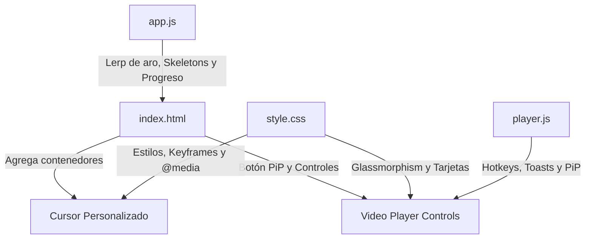

# Plan de Implementación: Mejoras UI/UX y Funcionalidades Interactivas en KuraStream

> **For agentic workers:** REQUIRED SUB-SKILL: Use superpowers:subagent-driven-development to implement this plan task-by-task. Steps use checkbox (`- [ ]`) syntax for tracking.

**Goal:** Implement premium interactive UI/UX features on the KuraStream web app, including a neon purple custom cursor, glassmorphic headers/modals, catalog show cards with continue watching progress indicators, skeleton loaders, and a polished video player with keyboard hotkey toasts, seek arcs, and Picture-in-Picture support.

**Architecture:** Use vanilla HTML/CSS/JS (Enfoque A) with modern CSS variables, CSS transitions/animations, event delegation, and Lerp formulas for performance.

**Architecture Diagram:**


**Tech Stack:** Vanilla JavaScript (ES6 Modules), CSS3 (Variables, Flexbox, Grid, Backdrop-filter), HTML5.

## Global Constraints
- No third-party JS libraries (stay lightweight, modern, vanilla).
- Must match target directory `frontend/`.
- Must check `(pointer: fine)` for custom cursor to avoid issues on touch devices.
- Must check `document.activeElement` for player hotkeys to prevent typing conflicts.

---

### Task 1: Estructura HTML y Estilos CSS Base (Cursor y Glassmorphism)

**Files:**
- Modify: `frontend/index.html` (Lines 870-878)
- Modify: `frontend/style.css` (Lines 1-50, 206-221, 1557-1580)

**Interfaces:**
- Produces: HTML containers for the custom cursor dot/ring and styles for glassmorphism and cursor.

- [ ] **Step 1: Modificar `index.html` para inyectar los divs del cursor al final del body**
  Add the markup right before `</body>`:
  ```html
  <div class="custom-cursor-dot" id="custom-cursor-dot"></div>
  <div class="custom-cursor-ring" id="custom-cursor-ring"></div>
  ```

- [ ] **Step 2: Modificar `style.css` para añadir las variables y estilos base del cursor**
  Define styles that hide the default cursor and define dot/ring properties only on devices with pointers:
  ```css
  @media (pointer: fine) {
    body {
      cursor: none;
    }
    
    a, button, input, select, textarea, [role="button"], .show-card, .clickable, .nav-link, .episode-item, .player-btn, .settings-card {
      cursor: none !important;
    }

    .custom-cursor-dot {
      width: 8px;
      height: 8px;
      background-color: #a855f7;
      border-radius: 50%;
      position: fixed;
      transform: translate(-50%, -50%);
      pointer-events: none;
      z-index: 99999;
      transition: width 0.2s, height 0.2s, background-color 0.2s;
    }

    .custom-cursor-ring {
      width: 40px;
      height: 40px;
      border: 2px solid rgba(168, 85, 247, 0.4);
      box-shadow: 0 0 12px rgba(168, 85, 247, 0.6);
      border-radius: 50%;
      position: fixed;
      transform: translate(-50%, -50%);
      pointer-events: none;
      z-index: 99998;
      transition: transform 0.08s ease-out, width 0.2s, height 0.2s, border-color 0.2s, background-color 0.2s;
    }

    .custom-cursor-ring.hover {
      width: 60px;
      height: 60px;
      border-color: rgba(168, 85, 247, 0.8);
      background-color: rgba(168, 85, 247, 0.1);
      box-shadow: 0 0 20px rgba(168, 85, 247, 0.8);
    }
  }
  ```

- [ ] **Step 3: Actualizar los estilos de `.app-header`, `.pin-modal-overlay` y `.pin-modal` en `style.css` para añadir desenfoques Glassmorphism premium**
  ```css
  .app-header {
    height: var(--header-height);
    padding: 0 4%;
    display: flex;
    align-items: center;
    justify-content: space-between;
    background-color: rgba(11, 12, 14, 0.7);
    backdrop-filter: blur(24px) saturate(180%);
    border-bottom: 1px solid var(--border-color);
    position: fixed;
    top: 0;
    left: 0;
    width: 100%;
    z-index: 100;
    transition: var(--transition-smooth);
  }

  .pin-modal-overlay {
    position: fixed;
    inset: 0;
    z-index: 200;
    background: rgba(11, 12, 14, 0.65);
    backdrop-filter: blur(12px) saturate(180%);
    display: flex;
    align-items: center;
    justify-content: center;
  }

  .pin-modal {
    background-color: rgba(18, 22, 32, 0.65);
    backdrop-filter: blur(20px);
    border: 1px solid rgba(255, 255, 255, 0.08);
    border-radius: 12px;
    padding: 30px;
    text-align: center;
    width: 320px;
    box-shadow: 0 15px 40px rgba(0,0,0,0.5), inset 0 1px 0 rgba(255, 255, 255, 0.1);
    animation: scaleUp 0.3s cubic-bezier(0.4, 0, 0.2, 1);
  }
  ```

- [ ] **Step 4: Comprobar visualmente los estilos**
  Inspect the page header and modal overlay to verify the new transparent blur design is rendered.

- [ ] **Step 5: Confirmar cambios en Git**
  Run: `git add frontend/index.html frontend/style.css`
  Run: `git commit -m "feat(ui): add custom cursor containers and glassmorphic styling"`

---

### Task 2: Lógica de Cursor y Hover interactivo en `app.js`

**Files:**
- Modify: `frontend/app.js` (End of file, in `document.addEventListener('DOMContentLoaded')`)

**Interfaces:**
- Produces: `initCustomCursor()` running cursor lerp animations.

- [ ] **Step 1: Implementar la función `initCustomCursor()` en `app.js`**
  ```javascript
  function initCustomCursor() {
    const dot = document.getElementById('custom-cursor-dot');
    const ring = document.getElementById('custom-cursor-ring');
    if (!dot || !ring) return;

    if (!window.matchMedia('(pointer: fine)').matches) {
      dot.style.display = 'none';
      ring.style.display = 'none';
      return;
    }

    let mouseX = 0;
    let mouseY = 0;
    let ringX = 0;
    let ringY = 0;

    window.addEventListener('mousemove', (e) => {
      mouseX = e.clientX;
      mouseY = e.clientY;
      dot.style.left = mouseX + 'px';
      dot.style.top = mouseY + 'px';
    });

    function animateRing() {
      ringX += (mouseX - ringX) * 0.15;
      ringY += (mouseY - ringY) * 0.15;
      ring.style.left = ringX + 'px';
      ring.style.top = ringY + 'px';
      requestAnimationFrame(animateRing);
    }
    animateRing();

    document.addEventListener('mouseover', (e) => {
      const target = e.target;
      if (!target) return;
      const isInteractive = target.closest('a, button, input, select, textarea, [role="button"], .show-card, .clickable, .episode-item, .player-btn');
      if (isInteractive) {
        ring.classList.add('hover');
      }
    });

    document.addEventListener('mouseout', (e) => {
      const target = e.target;
      if (!target) return;
      const isInteractive = target.closest('a, button, input, select, textarea, [role="button"], .show-card, .clickable, .episode-item, .player-btn');
      if (isInteractive) {
        ring.classList.remove('hover');
      }
    });
  }
  ```

- [ ] **Step 2: Llamar a `initCustomCursor()` dentro del listener `DOMContentLoaded` en `app.js`**
  Append `initCustomCursor();` to the bottom of the initialization block.

- [ ] **Step 3: Verificar en el navegador**
  Move the mouse on desktop and make sure the glowing ring smoothly lags behind the inner dot, and expands when hovering over buttons, cards, and input fields.

- [ ] **Step 4: Confirmar cambios en Git**
  Run: `git add frontend/app.js`
  Run: `git commit -m "feat(ui): implement smooth custom cursor tracking and hover delegation"`

---

### Task 3: Tarjetas con Progreso del Historial y Skeleton Loaders

**Files:**
- Modify: `frontend/style.css` (Add card hover properties and skeleton animation)
- Modify: `frontend/app.js` (Lines 398-442, 755-777)

**Interfaces:**
- Consumes: `/api/history` data array in `loadDashboard`
- Produces: Upgraded `createShowCardHTML(show, history)` with continue watching indicators, and skeleton card loaders.

- [ ] **Step 1: Agregar estilos de hover para `.show-card` y la animación `.skeleton-pulse` en `style.css`**
  ```css
  .show-card:hover {
    transform: translateY(-8px) scale(1.04);
    border-color: var(--accent-color);
    box-shadow: 0 12px 30px rgba(168, 85, 247, 0.25);
  }

  @keyframes skeleton-pulse {
    0% { opacity: 0.6; }
    50% { opacity: 0.3; }
    100% { opacity: 0.6; }
  }
  ```

- [ ] **Step 2: Definir `renderSkeletonLoaders()` en `app.js`**
  Add the function:
  ```javascript
  function renderSkeletonLoaders() {
    return `
      <div class="row-container skeleton-row" style="margin-bottom: 30px;">
        <div class="skeleton-title" style="width: 150px; height: 24px; background: var(--surface-muted); border-radius: 4px; margin-bottom: 20px; animation: skeleton-pulse 1.5s infinite;"></div>
        <div class="row-cards" style="display: flex; gap: 20px; overflow: hidden;">
          ${Array(6).fill().map(() => `
            <div class="skeleton-card" style="width: 180px; height: 320px; background: var(--surface-color); border-radius: 12px; overflow: hidden; border: 1px solid var(--border-color); flex-shrink: 0; display: flex; flex-direction: column;">
              <div class="skeleton-img" style="height: 220px; background: var(--surface-muted); animation: skeleton-pulse 1.5s infinite;"></div>
              <div style="padding: 12px; display: flex; flex-direction: column; gap: 8px;">
                <div class="skeleton-text" style="height: 14px; background: var(--surface-muted); border-radius: 3px; width: 80%; animation: skeleton-pulse 1.5s infinite;"></div>
                <div class="skeleton-text" style="height: 12px; background: var(--surface-muted); border-radius: 3px; width: 50%; animation: skeleton-pulse 1.5s infinite;"></div>
              </div>
            </div>
          `).join('')}
        </div>
      </div>
    `;
  }
  ```

- [ ] **Step 3: Reemplazar el cargador en `loadDashboard` para inyectar skeletons durante la sincronización**
  ```javascript
    const sectionsContainer = document.getElementById('dashboard-sections');
    sectionsContainer.innerHTML = renderSkeletonLoaders() + renderSkeletonLoaders();
  ```

- [ ] **Step 4: Modificar `createShowCardHTML(show, history = [])` para renderizar progresos**
  ```javascript
  function createShowCardHTML(show, history = []) {
    const poster = show.poster_path || 'https://images.unsplash.com/photo-1578632767115-351597cf2477?w=500&q=80';
    const rating = show.rating ? show.rating.toFixed(1) : 'N/A';
    
    const historyItem = history.find(h => String(h.show_id) === String(show.id));
    let progressHTML = '';
    if (historyItem && historyItem.duration) {
      const progressPercent = Math.min(100, Math.max(0, (historyItem.progress_seconds / historyItem.duration) * 100));
      progressHTML = `
        <div class="card-progress-bar-container" style="position: absolute; bottom: 0; left: 0; right: 0; height: 5px; background: rgba(255,255,255,0.2); z-index: 2;">
          <div class="card-progress-bar" style="width: ${progressPercent}%; height: 100%; background: var(--accent-color);"></div>
        </div>
        <div class="card-continue-watching-indicator" style="position: absolute; top: 10px; left: 10px; background: rgba(168, 85, 247, 0.95); border: 1px solid rgba(255, 255, 255, 0.1); border-radius: 4px; padding: 2px 6px; font-size: 0.65rem; font-family: var(--font-title); font-weight: 700; color: white; display: flex; align-items: center; gap: 3px; z-index: 2; box-shadow: 0 2px 8px rgba(0,0,0,0.5);">
          <i data-lucide="play" style="width: 8px; height: 8px; fill: white; stroke: white;"></i>
          ${Math.round(progressPercent)}% visto
        </div>
      `;
    }

    return `
      <div class="show-card" onclick="location.hash='#/show/${show.id}'" style="flex: 0 0 auto; width: 180px; height: 320px;">
        <div class="card-img-wrapper" style="height: 220px; position: relative;">
          
          <div class="card-rating-badge">
            <i data-lucide="star" style="width:12px;height:12px;fill:var(--rating-color);stroke:var(--rating-color);margin-right:2px;display:inline-block;vertical-align:middle;"></i> 
            ${rating}
          </div>
          ${progressHTML}
        </div>
        <div class="card-info">
          <h3 class="card-title" style="font-size: 0.85rem; white-space: nowrap; overflow: hidden; text-overflow: ellipsis; margin-bottom: 2px;">${show.title}</h3>
          <div class="card-meta" style="font-size: 0.75rem;">
            <span>${show.media_type === 'movie' ? 'Película' : 'Anime'}</span>
            <span>•</span>
            <span>${show.year || 'N/A'}</span>
          </div>
        </div>
      </div>
    `;
  }
  ```

- [ ] **Step 5: Pasar el array `history` a todos los mapeos de `createShowCardHTML`**
  Modify all references in `loadDashboard` to call `createShowCardHTML(s, history)`.

- [ ] **Step 6: Confirmar cambios en Git**
  Run: `git add frontend/style.css frontend/app.js`
  Run: `git commit -m "feat(catalog): implement skeleton card loaders and continue watching progress bars"`

---

### Task 4: Polish del Reproductor (Hotkeys, Toasts, Arcos y PiP)

**Files:**
- Modify: `frontend/index.html` (Add Picture-in-Picture button container)
- Modify: `frontend/style.css` (Add video-toast and seek-arc-indicator classes)
- Modify: `frontend/player.js` (Update keyboard event handlers, implement toasts/arcs, and configure PiP)

**Interfaces:**
- Produces: `showVideoToast(message)` and `showSeekIndicator(direction)`
- Produces: Interactive `#pip-btn` trigger.

- [ ] **Step 1: Modificar `index.html` para agregar el botón de PiP**
  Add the `#pip-btn` button inside the right control group of the player controls (before `#fullscreen-btn` or `#ambilight-toggle-btn`):
  ```html
  <button class="player-btn" id="pip-btn" title="Pantalla en Pantalla (PiP)" style="display: none;">
    <i data-lucide="external-link"></i>
  </button>
  ```

- [ ] **Step 2: Agregar estilos en `style.css` para Toasts y Arcos de Búsqueda**
  ```css
  .video-toast {
    position: absolute;
    top: 15%;
    left: 50%;
    transform: translate(-50%, -50%) scale(0.9);
    background: rgba(18, 22, 32, 0.85);
    backdrop-filter: blur(12px);
    border: 1px solid rgba(255, 255, 255, 0.1);
    color: var(--text-main);
    padding: 12px 24px;
    border-radius: 30px;
    font-family: var(--font-title);
    font-size: 1.1rem;
    font-weight: 700;
    pointer-events: none;
    z-index: 10000;
    display: flex;
    align-items: center;
    gap: 8px;
    box-shadow: 0 10px 30px rgba(0,0,0,0.5);
    opacity: 0;
    transition: opacity 0.2s, transform 0.2s;
  }

  .video-toast.show {
    opacity: 1;
    transform: translate(-50%, -50%) scale(1);
  }

  .seek-arc-indicator {
    position: absolute;
    top: 50%;
    width: 100px;
    height: 100px;
    background: rgba(255, 107, 0, 0.15);
    border-radius: 50%;
    display: flex;
    align-items: center;
    justify-content: center;
    transform: translateY(-50%) scale(0.5);
    opacity: 0;
    pointer-events: none;
    z-index: 9999;
    transition: transform 0.4s cubic-bezier(0.175, 0.885, 0.32, 1.275), opacity 0.4s;
  }

  .seek-arc-indicator.left {
    left: 15%;
  }

  .seek-arc-indicator.right {
    right: 15%;
  }

  .seek-arc-indicator.show {
    transform: translateY(-50%) scale(1.2);
    opacity: 1;
  }

  .seek-arc-indicator svg {
    width: 40px;
    height: 40px;
    color: var(--accent-color);
    filter: drop-shadow(0 0 8px var(--accent-color));
  }
  ```

- [ ] **Step 3: Agregar las funciones `showVideoToast` y `showSeekIndicator` al principio de `player.js`**
  ```javascript
  function showVideoToast(message) {
    let toast = document.getElementById('player-video-toast');
    if (!toast) {
      toast = document.createElement('div');
      toast.id = 'player-video-toast';
      toast.className = 'video-toast';
      const playerContainer = document.getElementById('player-container') || document.body;
      playerContainer.appendChild(toast);
    }
    toast.textContent = message;
    toast.classList.add('show');
    
    if (toast.timeoutId) clearTimeout(toast.timeoutId);
    toast.timeoutId = setTimeout(() => {
      toast.classList.remove('show');
    }, 1000);
  }

  function showSeekIndicator(direction) {
    const id = `seek-indicator-${direction}`;
    let indicator = document.getElementById(id);
    if (!indicator) {
      indicator = document.createElement('div');
      indicator.id = id;
      indicator.className = `seek-arc-indicator ${direction}`;
      const iconName = direction === 'left' ? 'rewind' : 'fast-forward';
      indicator.innerHTML = `<i data-lucide="${iconName}"></i>`;
      const playerContainer = document.getElementById('player-container') || document.body;
      playerContainer.appendChild(indicator);
      if (typeof lucide !== 'undefined') lucide.createIcons();
    }
    indicator.classList.add('show');
    if (indicator.timeoutId) clearTimeout(indicator.timeoutId);
    indicator.timeoutId = setTimeout(() => {
      indicator.classList.remove('show');
    }, 500);
  }
  ```

- [ ] **Step 4: Actualizar `handleKeyboard` en `player.js`**
  Incorporate input focus guard and map the visual indicators:
  ```javascript
  const handleKeyboard = (e) => {
    if (!isPlayerActive) return;
    
    // Ignore hotkeys when typing in forms, search, or inputs
    if (document.activeElement && (
      document.activeElement.tagName === 'INPUT' || 
      document.activeElement.tagName === 'TEXTAREA' || 
      document.activeElement.isContentEditable
    )) {
      return;
    }
    
    if (e.code === 'Space' || e.code === 'KeyK') {
      e.preventDefault();
      togglePlay();
      showVideoToast(video.paused ? 'Pausa' : 'Reproducir');
    } else if (e.code === 'ArrowRight') {
      seekRelative(10);
      showSeekIndicator('right');
      showVideoToast('+10s');
    } else if (e.code === 'ArrowLeft') {
      seekRelative(-10);
      showSeekIndicator('left');
      showVideoToast('-10s');
    } else if (e.code === 'ArrowUp') {
      e.preventDefault();
      video.volume = Math.min(1, video.volume + 0.1);
      volumeSlider.value = video.volume;
      updateVolumeIcon(video.volume);
      showVideoToast(`Volumen: ${Math.round(video.volume * 100)}%`);
    } else if (e.code === 'ArrowDown') {
      e.preventDefault();
      video.volume = Math.max(0, video.volume - 0.1);
      volumeSlider.value = video.volume;
      updateVolumeIcon(video.volume);
      showVideoToast(`Volumen: ${Math.round(video.volume * 100)}%`);
    } else if (e.code === 'KeyF') {
      toggleFullscreen();
      setTimeout(() => {
        showVideoToast(document.fullscreenElement ? 'Pantalla Completa' : 'Ventana');
      }, 100);
    } else if (e.code === 'KeyM') {
      // Toggle mute
      if (video.muted) {
        video.muted = false;
        const vol = parseFloat(volumeSlider.value) || 1.0;
        video.volume = vol;
        updateVolumeIcon(vol);
        showVideoToast(`Volumen: ${Math.round(vol * 100)}%`);
      } else {
        video.muted = true;
        updateVolumeIcon(0);
        showVideoToast('Silenciado');
      }
      triggerControlsActivity();
    } else if (e.code === 'Escape') {
      if (document.fullscreenElement) {
        document.exitFullscreen();
      } else {
        location.hash = `#/show/${currentEpisodeId.split('_S')[0]}`;
      }
    }
  };
  ```

- [ ] **Step 5: Añadir la lógica del botón `#pip-btn` en la inicialización del reproductor**
  ```javascript
  const pipBtn = document.getElementById('pip-btn');
  if (pipBtn) {
    if (document.pictureInPictureEnabled || (video && video.webkitSupportsPresentationMode && typeof video.webkitSetPresentationMode === 'function')) {
      pipBtn.style.display = 'block';
      pipBtn.onclick = async (e) => {
        e.stopPropagation();
        try {
          if (document.pictureInPictureElement) {
            await document.exitPictureInPicture();
            showVideoToast('PiP Desactivado');
          } else {
            await video.requestPictureInPicture();
            showVideoToast('PiP Activado');
          }
        } catch (err) {
          console.error("Failed to toggle Picture-in-Picture:", err);
        }
      };
    } else {
      pipBtn.style.display = 'none';
    }
  }
  ```

- [ ] **Step 6: Confirmar cambios en Git**
  Run: `git add frontend/index.html frontend/style.css frontend/player.js`
  Run: `git commit -m "feat(player): implement hotkey toasts, seek arcs, and picture-in-picture"`
