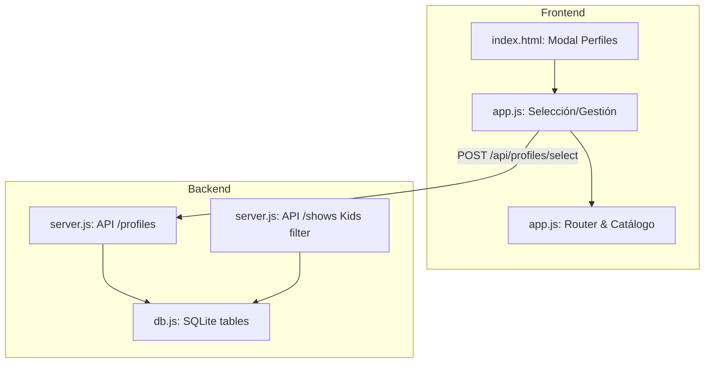

# KuraStream Multi-Profiles Implementation Plan

> **For agentic workers:** REQUIRED SUB-SKILL: Use superpowers:subagent-driven-development to implement this plan task-by-task. Steps use checkbox (`- [ ]`) syntax for tracking.

**Goal:** Implement a Netflix-style multi-profile selection screen and parental control system in KuraStream.

**Architecture:** We will create a `profiles` table in SQLite, migrate the `watch_history` and `favorites` tables to be composite-keyed by profile context, implement profile management endpoints in the backend with parental-control restrictions on the JWT tokens, and build a glassmorphic profile switcher in the frontend.

**Architecture Diagram:**



**Tech Stack:** SQLite, Node.js (HTTP Server), Vanilla CSS, Javascript (ES Modules).

## Global Constraints
- Target Node: >=22.0.0
- Avoid modern frameworks; keep vanilla JS and CSS structure.
- Parental control restricts TV-MA and R ratings for kids' profiles.
- Profiles can optionally have a 4-digit PIN lock.

---

### Task 1: Database Schema & Migration

**Files:**
- Modify: `backend/db.js`
- Test: `tests/db.test.js`

**Interfaces:**
- Consumes: Database connection
- Produces: Updated schema with `profiles` table and modified `watch_history`/`favorites` columns.

- [ ] **Step 1: Write test to verify database migrations**
  Create/modify `tests/db.test.js` to assert that the `profiles` table exists and `watch_history` has the `profile_name` column:
  ```javascript
  import assert from 'node:assert';
  import { db } from '../backend/db.js';

  export function testSchema() {
    const tables = db.prepare("SELECT name FROM sqlite_master WHERE type='table'").all();
    const hasProfiles = tables.some(t => t.name === 'profiles');
    assert.ok(hasProfiles, 'profiles table should exist');

    const historyCols = db.prepare("PRAGMA table_info(watch_history)").all();
    const hasProfileCol = historyCols.some(c => c.name === 'profile_name');
    assert.ok(hasProfileCol, 'watch_history should have profile_name column');
  }
  ```

- [ ] **Step 2: Run test and verify it fails**
  Run: `node --test tests/db.test.js`
  Expected: FAIL (table profiles does not exist)

- [ ] **Step 3: Modify `backend/db.js` schema definitions**
  Add schema modifications:
  ```javascript
  db.exec(`
    CREATE TABLE IF NOT EXISTS profiles (
      username TEXT NOT NULL,
      profile_name TEXT NOT NULL,
      avatar_color TEXT NOT NULL DEFAULT '#a855f7',
      is_kids INTEGER NOT NULL DEFAULT 0,
      pin TEXT,
      pref_audio_lang TEXT NOT NULL DEFAULT 'default',
      pref_sub_lang TEXT NOT NULL DEFAULT 'default',
      PRIMARY KEY (username, profile_name),
      FOREIGN KEY (username) REFERENCES users(username) ON DELETE CASCADE
    );
  `);
  try { db.exec("ALTER TABLE watch_history ADD COLUMN profile_name TEXT NOT NULL DEFAULT 'Principal'"); } catch (e) {}
  try { db.exec("ALTER TABLE favorites ADD COLUMN profile_name TEXT NOT NULL DEFAULT 'Principal'"); } catch (e) {}
  ```

- [ ] **Step 4: Run test and verify it passes**
  Run: `node --test tests/db.test.js`
  Expected: PASS

- [ ] **Step 5: Commit changes**
  Run: `git add backend/db.js tests/db.test.js && git commit -m "feat(db): implement profiles schema and migrate history/favorites"`

---

### Task 2: Backend Profiles API Endpoints

**Files:**
- Modify: `backend/server.js`
- Test: `tests/api_profiles.test.js`

**Interfaces:**
- Consumes: Express/HTTP router, Database helper
- Produces: API endpoints `/api/profiles` and JWT verification integrating `profile_name`.

- [ ] **Step 1: Write test for profile operations**
  Create `tests/api_profiles.test.js` requesting `GET` / `POST` on `/api/profiles`.

- [ ] **Step 2: Run test and verify it fails**
  Run: `node --test tests/api_profiles.test.js`
  Expected: FAIL (404/500 on endpoints)

- [ ] **Step 3: Implement endpoints in `backend/server.js`**
  Implement profile creation, deletion, listing, and JWT selection token generation.

- [ ] **Step 4: Run test and verify it passes**
  Run: `node --test tests/api_profiles.test.js`
  Expected: PASS

- [ ] **Step 5: Commit changes**
  Run: `git add backend/server.js tests/api_profiles.test.js && git commit -m "feat(api): add profiles CRUD and selection routes"`

---

### Task 3: Server-side Parental Control Filtration

**Files:**
- Modify: `backend/server.js`
- Test: `tests/api_kids_filter.test.js`

**Interfaces:**
- Consumes: active JWT profile payload
- Produces: filtered catalog responses for kids' profiles.

- [ ] **Step 1: Write test verifying TV-MA exclusion**
  Assert that requesting `/api/shows` as a kid profile does not return adult shows.

- [ ] **Step 2: Run test and verify it fails**
  Run: `node --test tests/api_kids_filter.test.js`
  Expected: FAIL (shows returned unfiltered)

- [ ] **Step 3: Add age rating check on `/api/shows` route**
  In `backend/server.js`, check if profile token is `is_kids` and filter shows with age rating `TV-MA` or `R`.

- [ ] **Step 4: Run test and verify it passes**
  Run: `node --test tests/api_kids_filter.test.js`
  Expected: PASS

- [ ] **Step 5: Commit changes**
  Run: `git add backend/server.js tests/api_kids_filter.test.js && git commit -m "feat(parental-control): filter adult shows for kids' profiles on server"`

---

### Task 4: Frontend Profile Switcher View & Flow

**Files:**
- Modify: `frontend/index.html`, `frontend/style.css`, `frontend/app.js`

**Interfaces:**
- Consumes: `/api/profiles` endpoints
- Produces: Glassmorphic profile selection screen and header menu profile toggles.

- [ ] **Step 1: Scaffold profiles view in HTML/CSS**
  Add the `.app-view` switcher view layout in `index.html` and glassmorphic card grids in `style.css`.

- [ ] **Step 2: Add interactive selection script**
  In `app.js`, show profile switcher on reload/login and fetch profile select on click.

- [ ] **Step 3: Test flow manually in browser**
  Restart the server and verify selection modal display.

- [ ] **Step 4: Commit changes**
  Run: `git add frontend/index.html frontend/style.css frontend/app.js && git commit -m "feat(frontend): implement profile switcher screen"`
