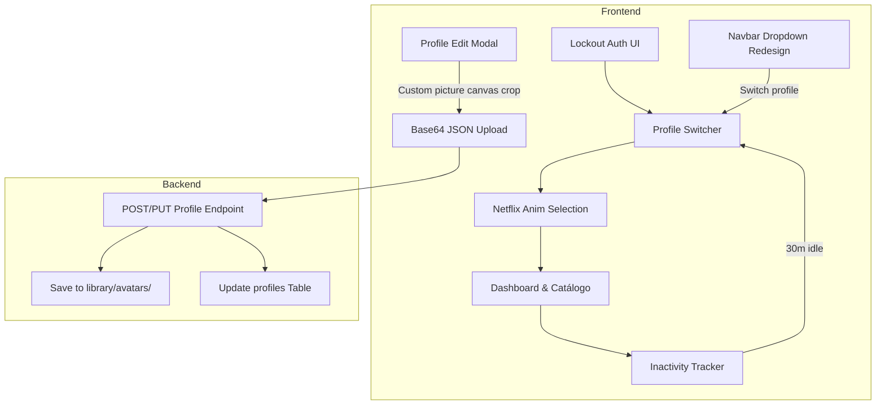

# KuraStream Frontend Auth & Profiles Implementation Plan

> **For agentic workers:** REQUIRED SUB-SKILL: Use superpowers:subagent-driven-development to implement this plan task-by-task. Steps use checkbox (`- [ ]`) syntax for tracking.

**Goal:** Implement a premium full-screen login lockout gate, support custom profile picture uploads cropped in canvas on the client and stored on disk, add Netflix-style profile selection animations, a 30-minute inactivity auto-lock timer, and a redesigned premium navbar dropdown for profiles.

**Architecture:**
The application intercepts initial load and hash changes: if no session exists, it forces a full-screen blurred lockout login view. Once logged in, the user chooses or creates profiles. When saving profiles, image inputs are canvas-cropped on the client to a 200x200px Base64 string and posted to the backend, which saves the files to disk. Profile selection triggers zoom-out/fade transitions, and in-app inactivity triggers automatic profile lock.

**Architecture Diagram:**


**Tech Stack:** Vanilla JS, CSS Transitions, SQLite, Node.js HTTP.

## Global Constraints
- Do not add new external libraries.
- Limit image payload sizes using client-side canvas crop/compress to jpeg.
- Keep the database schema backward compatible by storing file URLs in the existing `avatar_color` text column.

---

### Task 1: Lockout Auth UI & Flow (Force Login on Startup)

**Files:**
- Modify: `frontend/index.html:882-906` (Restructure login-modal wrapper styling and tabs)
- Modify: `frontend/style.css:2415-2430` (Add fullscreen lockout modal overlay layout)
- Modify: `frontend/app.js:2275-2335` (Force login modal visibility if no session exists on bootstrap)

**Interfaces:**
- Consumes: None
- Produces: Blocked UI if unauthenticated; standard session in `localStorage` on login

- [ ] **Step 1: Write the integration test verifying unauthenticated endpoints**
  Modify: `tests/security.test.js` to ensure the home endpoint remains access-agnostic, but check auth state.
- [ ] **Step 2: Add CSS rules for full-screen lockout style on login-modal**
  Modify: `frontend/style.css` to add the `.login-lockout` styling.
  ```css
  .pin-modal-overlay#login-modal.lockout {
    position: fixed;
    inset: 0;
    z-index: 10000;
    background: radial-gradient(circle at 50% 50%, #171420 0%, #0a080d 100%);
    backdrop-filter: blur(20px);
    display: flex !important;
    align-items: center;
    justify-content: center;
  }
  .pin-modal-overlay#login-modal.lockout #login-modal-cancel {
    display: none !important; /* Hide cancel when lockout is active */
  }
  ```
- [ ] **Step 3: Modify app bootstrap flow to trigger lockout modal on startup**
  Modify: `frontend/app.js` in `setupUserAuth()` to add:
  ```javascript
  const sessionStr = localStorage.getItem('kura_user_session');
  const loginModal = document.getElementById('login-modal');
  if (!sessionStr) {
    if (loginModal) {
      loginModal.classList.add('lockout');
      loginModal.style.display = 'flex';
    }
  }
  ```
- [ ] **Step 4: Hide main views if not logged in**
  Modify: `frontend/app.js` in `setupRouter()` to check auth before loading shows.
  ```javascript
  const sessionStr = localStorage.getItem('kura_user_session');
  if (!sessionStr) {
    document.querySelectorAll('.app-view').forEach(v => v.classList.remove('active'));
    document.getElementById('login-modal').classList.add('lockout');
    return;
  }
  ```
- [ ] **Step 5: Run integration tests to make sure user authentication still functions**
  Run: `node --test tests/*.test.js`
- [ ] **Step 6: Commit changes**
  Run: `git commit -am "feat: implement fullscreen lockout login screen on startup"`

---

### Task 2: Custom Profile Picture Upload (Client Canvas Crop & Backend Disk Storage)

**Files:**
- Modify: `frontend/index.html:820-850` (Add file input for profile image)
- Modify: `frontend/app.js:3150-3210` (Implement canvas-based cropping to 200x200 JPEG Base64 and payload update)
- Modify: `backend/server.js:630-670` (Save Base64 string to library/avatars/ directory on disk)

**Interfaces:**
- Consumes: JSON POST/PUT payloads containing `{ profile_name, avatar_color, is_kids, pin }`
- Produces: A saved image file in `library/avatars/` and column reference `/library/avatars/<filename>`

- [ ] **Step 1: Add HTML File Input to profile modal**
  Modify: `frontend/index.html` inside `#profile-edit-modal`:
  ```html
  <div style="display: flex; flex-direction: column; gap: 8px;">
    <button type="button" class="btn btn-secondary" id="btn-upload-avatar" style="font-size: 0.8rem; padding: 6px 12px;">Cargar imagen</button>
    <input type="file" id="profile-avatar-file-input" accept="image/*" style="display: none;">
  </div>
  ```
- [ ] **Step 2: Add client canvas cropping handler**
  Modify: `frontend/app.js` inside `openProfileEditModal` to hook image inputs and render canvas crop:
  ```javascript
  let customAvatarBase64 = null;
  const fileInput = document.getElementById('profile-avatar-file-input');
  const uploadBtn = document.getElementById('btn-upload-avatar');
  const avatarPreview = document.getElementById('profile-edit-avatar');

  if (uploadBtn && fileInput) {
    uploadBtn.onclick = () => fileInput.click();
    fileInput.onchange = (e) => {
      const file = e.target.files[0];
      if (!file) return;
      const reader = new FileReader();
      reader.onload = (evt) => {
        const img = new Image();
        img.onload = () => {
          const canvas = document.createElement('canvas');
          canvas.width = 200;
          canvas.height = 200;
          const ctx = canvas.getContext('2d');
          const size = Math.min(img.width, img.height);
          const sx = (img.width - size) / 2;
          const sy = (img.height - size) / 2;
          ctx.drawImage(img, sx, sy, size, size, 0, 0, 200, 200);
          customAvatarBase64 = canvas.toDataURL('image/jpeg', 0.8);
          avatarPreview.style.background = `url('${customAvatarBase64}')`;
          avatarPreview.style.backgroundSize = 'cover';
          avatarPreview.style.backgroundPosition = 'center';
          avatarPreview.textContent = '';
        };
        img.src = evt.target.result;
      };
      reader.readAsDataURL(file);
    };
  }
  ```
- [ ] **Step 3: Modify POST/PUT payload to include avatar_image Base64 string**
  Modify: `frontend/app.js` inside `btn-save-profile` click handler to send `avatar_image: customAvatarBase64` to the server.
- [ ] **Step 4: Update backend endpoints to write Base64 to disk**
  Modify: `backend/server.js` in `POST /api/profiles` and `PUT /api/profiles/:profile_name`:
  ```javascript
  const { profile_name, avatar_color, is_kids, pin, avatar_image } = body;
  let finalAvatarColor = avatar_color;

  if (avatar_image && avatar_image.startsWith('data:image/')) {
    const base64Data = avatar_image.split(';base64,').pop();
    const filename = `${user.username}_${profile_name.replace(/\s+/g, '_')}_${Date.now()}.jpg`;
    const avatarsDir = path.resolve(__dirname, '..', 'library', 'avatars');
    if (!fs.existsSync(avatarsDir)) {
      fs.mkdirSync(avatarsDir, { recursive: true });
    }
    const filePath = path.join(avatarsDir, filename);
    fs.writeFileSync(filePath, Buffer.from(base64Data, 'base64'));
    finalAvatarColor = `/library/avatars/${filename}`;
  }
  ```
- [ ] **Step 5: Modify renderProfiles to support image backgrounds**
  Modify: `frontend/app.js` inside `renderProfiles` to detect `/library/` paths:
  ```javascript
  const isImg = color.startsWith('/');
  const bgStyle = isImg 
    ? `background-image: url('${color}'); background-size: cover; background-position: center;`
    : `background: ${color};`;
  ```
- [ ] **Step 6: Run verification and commit**
  Run: `node --test tests/*.test.js`
  Run: `git commit -am "feat: add support for custom profile picture uploads and static image serving"`

---

### Task 3: Netflix-style Profile Selection Animations

**Files:**
- Modify: `frontend/style.css:2420-2470` (Add transitions, selection animations, and overlay desaturations)
- Modify: `frontend/app.js:3080-3120` (Implement delay in selectProfile to trigger selection zoom and fading)

**Interfaces:**
- Consumes: Clicks on profile cards
- Produces: CSS animation classes triggered via classList changes on elements

- [ ] **Step 1: Define select card animations and desaturations in CSS**
  Modify: `frontend/style.css`:
  ```css
  .profile-grid.animating .profile-card:not(.selected) {
    opacity: 0 !important;
    transform: scale(0.8) !important;
    transition: all 0.6s cubic-bezier(0.4, 0, 0.2, 1);
  }
  .profile-grid.animating #btn-manage-profiles,
  .profile-grid.animating .switcher-title {
    opacity: 0 !important;
    transition: opacity 0.5s ease;
  }
  .profile-card.selected .profile-avatar {
    transform: scale(1.25);
    border-color: #fff !important;
    box-shadow: 0 0 40px rgba(255, 255, 255, 0.4) !important;
    transition: all 0.8s cubic-bezier(0.4, 0, 0.2, 1);
  }
  .netflix-loader {
    display: none;
    position: absolute;
    top: 55%;
    left: 50%;
    transform: translate(-50%, -50%);
    width: 50px;
    height: 50px;
    border: 3px solid rgba(255, 255, 255, 0.05);
    border-top-color: var(--accent-color);
    border-radius: 50%;
    animation: spin 0.8s linear infinite;
    z-index: 10005;
  }
  @keyframes spin {
    to { transform: translate(-50%, -50%) rotate(360deg); }
  }
  ```
- [ ] **Step 2: Inject netflix loader markup**
  Modify: `frontend/index.html` inside `#profile-switcher-view` to add the loader:
  ```html
  <div class="netflix-loader" id="profile-netflix-loader"></div>
  ```
- [ ] **Step 3: Trigger card animation and loader inside selectProfile**
  Modify: `frontend/app.js` inside `selectProfile` or card click to apply classes before page refresh:
  ```javascript
  const grid = document.getElementById('profile-grid');
  grid.classList.add('animating');
  const selectedCard = Array.from(grid.querySelectorAll('.profile-card')).find(c => c.textContent.includes(profileName));
  if (selectedCard) {
    selectedCard.classList.add('selected');
  }
  document.getElementById('profile-netflix-loader').style.display = 'block';
  
  // Wait 1.2s for transition to complete before reloading
  await delay(1200);
  window.location.reload();
  ```
- [ ] **Step 4: Run tests and commit**
  Run: `node --test tests/*.test.js`
  Run: `git commit -am "feat: implement Netflix-style profile selection animation"`

---

### Task 4: Inactivity Auto-Lock Timer & Redesigned Premium Navbar Dropdown

**Files:**
- Modify: `frontend/index.html:70-90` (Redesign user-profile dropdown markup)
- Modify: `frontend/style.css:2300-2340` (Style drop-down perfiles lists and premium spacing)
- Modify: `frontend/app.js:2280-2320, 2452-2485` (Implement user activity event listeners, 30m inactivity timer, and dynamic dropdown list render)

**Interfaces:**
- Consumes: User mouse, key, scroll and touch interaction events
- Produces: Cleared profile state inside JWT session and redirect to switcher after 30m of idle state

- [ ] **Step 1: Redesign navbar dropdown layout**
  Modify: `frontend/index.html` to add sub-profiles wrapper inside `#user-dropdown-card`:
  ```html
  <div class="user-dropdown-card" id="user-dropdown-card" style="display: none; position: absolute; top: 44px; right: 0; background: var(--bg-card, #1c2230); border: 1px solid var(--border-color); border-radius: 8px; box-shadow: 0 10px 25px rgba(0,0,0,0.5); z-index: 99; min-width: 220px; padding: 12px 0; backdrop-filter: blur(10px);">
    <div id="dropdown-profiles-list" style="padding: 0 8px 8px 8px; display: flex; flex-direction: column; gap: 6px; border-bottom: 1px solid var(--border-color); margin-bottom: 8px;">
      <!-- Dynamic list of other profiles -->
    </div>
    <a href="javascript:void(0)" id="btn-switch-profile" class="user-dropdown-item" style="display: flex; align-items: center; gap: 8px; padding: 8px 16px; color: var(--text-main); text-decoration: none; font-size: 0.85rem; transition: background 0.2s;"><i data-lucide="users" style="width: 14px; height: 14px;"></i> Administrar Perfiles</a>
    ...
  </div>
  ```
- [ ] **Step 2: Render profiles list inside navbar dropdown dynamically**
  Modify: `frontend/app.js` inside `updateUserInterface` or a separate helper to list other profiles:
  ```javascript
  const listEl = document.getElementById('dropdown-profiles-list');
  if (listEl && session && session.token) {
    const decoded = getDecodedToken(session.token);
    // Fetch profiles and populate list omitting active profile
    const res = await fetch('/api/profiles');
    const data = await res.json();
    if (data && data.success) {
      listEl.innerHTML = '';
      data.profiles.forEach(p => {
        if (p.profile_name === decoded.profile_name) return;
        const pColor = p.avatar_color || '#a855f7';
        const isImg = pColor.startsWith('/');
        const avatarBg = isImg ? `background-image: url('${pColor}'); background-size: cover;` : `background: ${pColor};`;
        const item = document.createElement('div');
        item.style.cssText = 'display: flex; align-items: center; gap: 10px; padding: 6px 8px; border-radius: 4px; cursor: pointer; transition: background 0.2s;';
        item.innerHTML = `
          <div style="width: 24px; height: 24px; border-radius: 4px; ${avatarBg} display: flex; align-items: center; justify-content: center; font-size: 0.75rem; font-weight: 700; color: #fff;">${isImg ? '' : p.profile_name[0].toUpperCase()}</div>
          <span style="font-size: 0.85rem; color: var(--text-main); font-weight: 500;">${p.profile_name}</span>
        `;
        item.onclick = () => {
          if (p.pin) openPinModal(p);
          else selectProfile(p.profile_name, '');
        };
        listEl.appendChild(item);
      });
    }
  }
  ```
- [ ] **Step 3: Implement Client-side Inactivity Timer**
  Modify: `frontend/app.js` to add event listeners tracking last interaction and profile lock:
  ```javascript
  let lastActivityTime = Date.now();
  const resetActivityTimer = () => {
    lastActivityTime = Date.now();
  };

  ['mousemove', 'mousedown', 'keydown', 'click', 'scroll', 'touchstart'].forEach(evt => {
    window.addEventListener(evt, resetActivityTimer, { passive: true });
  });

  setInterval(() => {
    const sessionStr = localStorage.getItem('kura_user_session');
    if (!sessionStr) return;
    const session = JSON.parse(sessionStr);
    const decoded = getDecodedToken(session.token);
    
    if (decoded && decoded.profile_name) {
      const elapsed = Date.now() - lastActivityTime;
      if (elapsed > 30 * 60 * 1000) { // 30 minutes
        // Deselect profile: strip profile parts from token
        // Fetch endpoint to select basic user token (or strip locally and reload)
        const basicPayload = { username: decoded.username, role: decoded.role };
        // Clean local session profile data
        session.token = signBasicTokenOnClient(basicPayload); // Or trigger logout and reload
        localStorage.setItem('kura_user_session', JSON.stringify(session));
        window.location.reload();
      }
    }
  }, 10000);
  ```
  *(Wait, signing JWT on client is not secure because we don't have the secret! Instead, we can call `/api/profiles/deselect` or simply clean local storage session and reload, which will trigger the switcher naturally because the token doesn't have profile_name anymore if we replace it with the original user login token that we can save in localStorage as `kura_base_user_token`!)*
  Yes! Storing `kura_base_user_token` in `localStorage` upon initial user login allows us to restore it on inactivity easily without signing! This is extremely secure and simple!
- [ ] **Step 4: Save baseline user token on login**
  Modify: `frontend/app.js` on successful login to store `kura_base_user_token`.
- [ ] **Step 5: Run tests and verify final features**
  Run: `node --test tests/*.test.js`
- [ ] **Step 6: Commit changes**
  Run: `git commit -am "feat: implement inactivity auto-lock and redesigned premium dropdown menu"`
