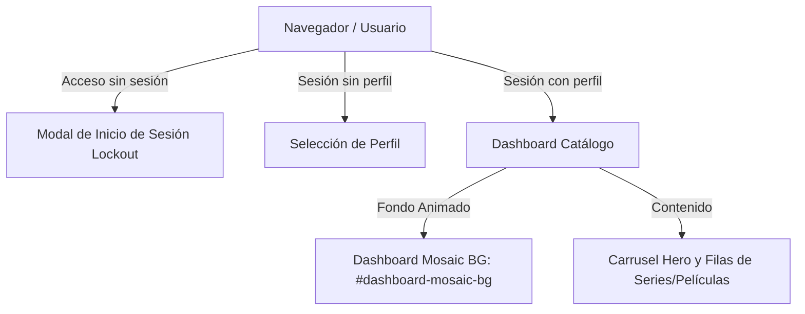

# Plan de Implementación: Mosaico en Dashboard y Reorganización del Proyecto

> **For agentic workers:** REQUIRED SUB-SKILL: Use superpowers:subagent-driven-development to implement this plan task-by-task. Steps use checkbox (`- [ ]`) syntax for tracking.

**Goal:** Eliminar la Landing Page de introducción anterior, trasladar la animación del mosaico de animes al fondo del Dashboard (donde el usuario selecciona series y películas) y reorganizar los scripts del proyecto en `backend/scripts/`.

**Architecture:** 
Se simplifica el flujo de navegación (`setupRouter`) para eliminar `#landing-view`. La vista `#dashboard-view` ahora aloja el fondo de mosaico animado en cuadrícula infinita (`#dashboard-mosaic-bg`). Los scripts auxiliares y de despliegue se mueven a `backend/scripts/`.

**Architecture Diagram:**



**Tech Stack:** JavaScript ES6, HTML5, Vanilla CSS (Electric Violet `#a855f7`), Node.js native `http` & `node:sqlite`.

## Global Constraints
- Paleta unificada: Electric Violet `#a855f7`
- Cero archivos de introducción/marketing al iniciar sesión
- Ejecutar tests con: `node --test --test-concurrency=1 tests/*.test.js`

---

### Task 1: Actualización de Interfaz y Router (Mosaico en Dashboard)

**Files:**
- Modify: [frontend/index.html](file:///home/carlossgr/Escritorio/KuraStream/frontend/index.html)
- Modify: [frontend/style.css](file:///home/carlossgr/Escritorio/KuraStream/frontend/style.css)
- Modify: [frontend/app.js](file:///home/carlossgr/Escritorio/KuraStream/frontend/app.js)

- [ ] **Step 1: Eliminar `#landing-view` de `frontend/index.html` e insertar mosaico en `#dashboard-view`**

```html
<!-- En index.html: Eliminar la sección <section id="landing-view"> completa -->
<!-- En <section id="dashboard-view" class="app-view active">: Insertar al inicio: -->
<div class="dashboard-mosaic-bg" id="dashboard-mosaic-bg"></div>
<div class="dashboard-gradient-overlay"></div>
```

- [ ] **Step 2: Actualizar estilos en `frontend/style.css`**

```css
/* Reemplazar estilos de .landing-mosaic-bg por .dashboard-mosaic-bg */
.dashboard-mosaic-bg {
  position: absolute;
  inset: 0;
  z-index: 0;
  overflow: hidden;
  opacity: 0.12;
  display: flex;
  gap: 20px;
  pointer-events: none;
}
.dashboard-gradient-overlay {
  position: absolute;
  inset: 0;
  background: radial-gradient(circle at 50% 50%, rgba(11,12,14,0.5) 0%, rgba(11,12,14,0.95) 100%),
              linear-gradient(to bottom, rgba(11,12,14,0.7) 0%, rgba(11,12,14,1) 100%);
  z-index: 1;
  pointer-events: none;
}
#dashboard-view {
  position: relative;
}
#dashboard-view > *:not(.dashboard-mosaic-bg):not(.dashboard-gradient-overlay) {
  position: relative;
  z-index: 2;
}
```

- [ ] **Step 3: Actualizar la lógica del Router e Inicializador de Mosaico en `frontend/app.js`**

```javascript
// Reemplazar initLandingView() con initDashboardMosaic()
async function initDashboardMosaic() {
  const mosaicBg = document.getElementById('dashboard-mosaic-bg');
  if (!mosaicBg) return;
  if (mosaicBg.children.length > 0) return;
  
  let shows = [];
  try {
    const res = await fetch('/api/shows');
    if (res.ok) shows = await res.json();
  } catch (err) {}
  
  const defaultPosters = [
    'https://images.unsplash.com/photo-1578632767115-351597cf2477?w=500&q=80',
    'https://images.unsplash.com/photo-1607604276583-eef5d076aa5f?w=500&q=80',
    'https://images.unsplash.com/photo-1580477667995-2b94f01c9516?w=500&q=80',
    'https://images.unsplash.com/photo-1528360983277-13d401cdc186?w=500&q=80'
  ];
  
  let posterUrls = shows.map(s => s.poster_path).filter(Boolean);
  if (posterUrls.length < 8) posterUrls = [...posterUrls, ...defaultPosters];
  
  const colsData = [[], [], [], []];
  for (let i = 0; i < 24; i++) {
    colsData[i % 4].push(posterUrls[i % posterUrls.length]);
  }
  
  mosaicBg.innerHTML = colsData.map((col, idx) => {
    const colClass = idx % 2 === 0 ? 'col-up' : 'col-down';
    const imgs = [...col, ...col].map(url => ``).join('');
    return `<div class="landing-mosaic-column ${colClass}">${imgs}</div>`;
  }).join('');
}

// En setupRouter(), al cargar el dashboard:
initDashboardMosaic();
```

- [ ] **Step 4: Verificar la vista en navegador / pruebas básicas**

- [ ] **Step 5: Commit de Task 1**

```bash
git add frontend/index.html frontend/style.css frontend/app.js
git commit -m "feat: move anime mosaic background to dashboard view and remove landing page intro"
```

---

### Task 2: Reorganización Limpia de Carpetas y Scripts

**Files:**
- Move: `backend/deploy.py` -> `backend/scripts/deploy.py`
- Move: `backend/watch_sync.js` -> `backend/scripts/watch_sync.js`
- Move: `backend/setup_ssh_key.py` -> `backend/scripts/setup_ssh_key.py`
- Move: `backend/clean_demos.js` -> `backend/scripts/clean_demos.js`
- Move: `backend/auto_import_oshi_no_ko.js` -> `backend/scripts/auto_import_oshi_no_ko.js`
- Move: `backend/dump_db.js` -> `backend/scripts/dump_db.js`
- Move: `backend/generate_existing_thumbs.js` -> `backend/scripts/generate_existing_thumbs.js`
- Move: `backend/restore_local_episodes.js` -> `backend/scripts/restore_local_episodes.js`

- [ ] **Step 1: Crear directorio `backend/scripts` y mover scripts**

```bash
mkdir -p backend/scripts
mv backend/deploy.py backend/scripts/
mv backend/watch_sync.js backend/scripts/
mv backend/setup_ssh_key.py backend/scripts/
mv backend/clean_demos.js backend/scripts/
mv backend/auto_import_oshi_no_ko.js backend/scripts/
mv backend/dump_db.js backend/scripts/
mv backend/generate_existing_thumbs.js backend/scripts/
mv backend/restore_local_episodes.js backend/scripts/
rm -f test.webm browser_errors.log
```

- [ ] **Step 2: Actualizar rutas relativas en `backend/scripts/watch_sync.js` y `backend/scripts/deploy.py`**

Asegurar que los scripts apunten a la raíz del repositorio (`path.resolve(__dirname, '../..')` en JS y `path.join(__file__, '../../..')` en Python).

- [ ] **Step 3: Commit de Task 2**

```bash
git add backend/scripts/
git rm -f backend/deploy.py backend/watch_sync.js backend/setup_ssh_key.py backend/clean_demos.js backend/auto_import_oshi_no_ko.js backend/dump_db.js backend/generate_existing_thumbs.js backend/restore_local_episodes.js 2>/dev/null || true
git commit -m "refactor: organize backend scripts into backend/scripts/ directory"
```

---

### Task 3: Actualización del Suite de Pruebas y Verificación del Sistema

**Files:**
- Modify: [tests/landing.test.js](file:///home/carlossgr/Escritorio/KuraStream/tests/landing.test.js)

- [ ] **Step 1: Actualizar `tests/landing.test.js` para validar la navegación directa y el mosaico del Dashboard**

- [ ] **Step 2: Ejecutar la suite completa de pruebas**

Run: `node --test --test-concurrency=1 tests/*.test.js`
Expected: PASS en las 32 pruebas integradas.

- [ ] **Step 3: Commit de Task 3**

```bash
git add tests/landing.test.js
git commit -m "test: update integration tests for direct dashboard navigation and mosaic background"
```
