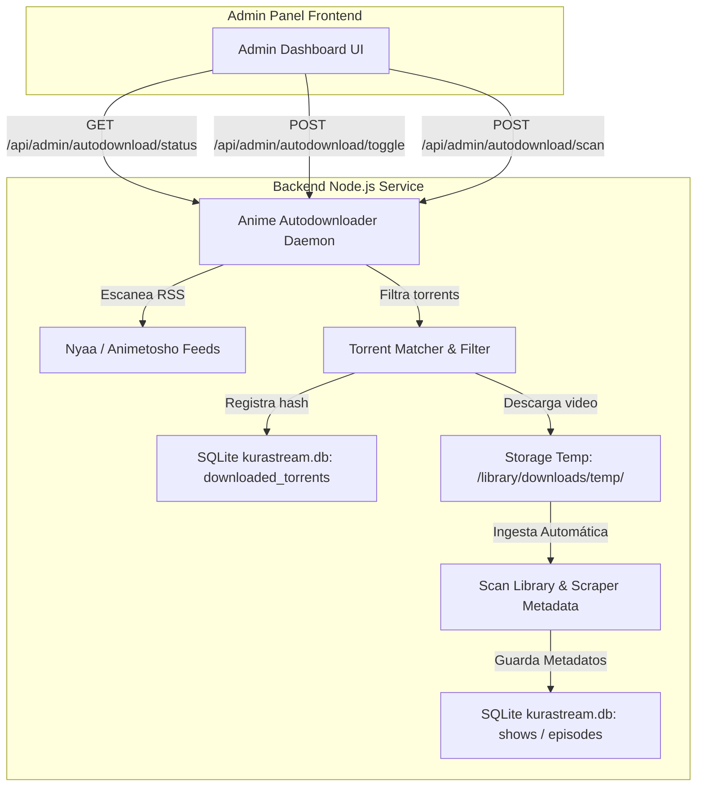

# Motor Automatizado de Descarga de Anime por Torrent Implementation Plan

> **For agentic workers:** REQUIRED SUB-SKILL: Use superpowers:subagent-driven-development to implement this plan task-by-task. Steps use checkbox (`- [ ]`) syntax for tracking.

**Goal:** Automatizar el escaneo RSS, descarga mediante torrent e ingesta automática de animes en Español Latino y Subtitulado en Español en KuraStream, con controles desde el Panel de Administración.

**Architecture:** Un servicio daemon en Node.js escanea periódicamente RSS de Nyaa/Animetosho filtrando por calidad y lenguaje (Latino / Sub Español). Al completar la descarga de los torrents, llama al pipeline de ingesta de KuraStream (`backend/db.js` y `backend/scan_library.js`), enriqueciendo metadatos con TMDB/Jikan API y exponiendo el estado y control en el Admin Panel.

**Architecture Diagram:**



**Tech Stack:** Node.js v22 (ESM), SQLite (`better-sqlite3`), `ffprobe`/`ffmpeg`, Vanilla JS frontend (HTML/CSS).

## Global Constraints

- Backend debe ser Node.js ESM nativo con `fetch` nativo de Node v22.
- No depender de binarios externos complejos más allá de `node`, `ffprobe` y `ffmpeg` ya configurados.
- Filtros estrictos de calidad (1080p / 720p) y idioma (Español Latino / Subtitulado en Español).

---

### Task 1: SQLite Schema Migration & Helpers for Downloaded Torrents

**Files:**
- Modify: `backend/db.js`
- Test: `tests/db_autodownload.test.js`

- [ ] **Step 1: Write failing test for downloaded_torrents table and dbHelper functions**

```javascript
import test from 'node:test';
import assert from 'node:assert/strict';
import { dbHelper } from '../backend/db.js';

test('dbHelper supports downloaded_torrents operations', () => {
  const testTorrent = {
    info_hash: 'abc123hash',
    title: '[Fansub] Oshi no Ko - 01 [1080p Latino].mkv',
    anime_title: 'Oshi no Ko',
    season: 1,
    episode: 1,
    source_url: 'https://nyaa.si/download/123.torrent'
  };

  dbHelper.saveDownloadedTorrent(testTorrent);
  const isDownloaded = dbHelper.isTorrentDownloaded('abc123hash');
  assert.equal(isDownloaded, true);

  const history = dbHelper.getDownloadedTorrents();
  assert.ok(history.length > 0);
  assert.equal(history[0].info_hash, 'abc123hash');
});
```

- [ ] **Step 2: Run test to verify failure**

Run: `node --env-file=.env --test tests/db_autodownload.test.js`  
Expected: FAIL with `saveDownloadedTorrent is not a function`

- [ ] **Step 3: Add `downloaded_torrents` table schema and helper methods to `backend/db.js`**

Add table creation SQL in `initDatabase()`:
```sql
CREATE TABLE IF NOT EXISTS downloaded_torrents (
  info_hash TEXT PRIMARY KEY,
  title TEXT NOT NULL,
  anime_title TEXT,
  season INTEGER DEFAULT 1,
  episode INTEGER,
  source_url TEXT,
  downloaded_at DATETIME DEFAULT CURRENT_TIMESTAMP
);
```
And add methods:
```javascript
saveDownloadedTorrent(torrent) { ... },
isTorrentDownloaded(infoHash) { ... },
getDownloadedTorrents(limit = 50) { ... }
```

- [ ] **Step 4: Run test to verify it passes**

Run: `node --env-file=.env --test tests/db_autodownload.test.js`  
Expected: PASS

- [ ] **Step 5: Commit**

```bash
git add backend/db.js tests/db_autodownload.test.js
git commit -m "feat: add downloaded_torrents table and db helper methods"
```

---

### Task 2: RSS Feed Parser & Torrent Matcher Daemon Module

**Files:**
- Create: `backend/scripts/anime_autodownloader.js`
- Test: `tests/anime_autodownloader.test.js`

- [ ] **Step 1: Write unit tests for RSS parsing and title/episode extraction**

```javascript
import test from 'node:test';
import assert from 'node:assert/strict';
import { parseAnimeFilename, filterSpanishAnimeTorrents } from '../backend/scripts/anime_autodownloader.js';

test('parseAnimeFilename correctly extracts anime name, season, and episode', () => {
  const result = parseAnimeFilename('[Fansub] Oshi no Ko - S02E05 [1080p Latino].mkv');
  assert.equal(result.animeTitle, 'Oshi no Ko');
  assert.equal(result.season, 2);
  assert.equal(result.episode, 5);
});

test('filterSpanishAnimeTorrents correctly filters torrent items with Spanish audio or sub', () => {
  const items = [
    { title: 'Random Anime - 01 [1080p Eng Sub].mkv', link: 'http://example.com/1' },
    { title: 'Solo Leveling - 05 [1080p Latino].mkv', link: 'http://example.com/2' }
  ];
  const filtered = filterSpanishAnimeTorrents(items);
  assert.equal(filtered.length, 1);
  assert.equal(filtered[0].title, 'Solo Leveling - 05 [1080p Latino].mkv');
});
```

- [ ] **Step 2: Run test to verify failure**

Run: `node --env-file=.env --test tests/anime_autodownloader.test.js`  
Expected: FAIL (module not found)

- [ ] **Step 3: Implement `anime_autodownloader.js` module**

Implement regex title parser, RSS scraper using native `fetch` XML parsing, and download executor loop.

- [ ] **Step 4: Run test to verify it passes**

Run: `node --env-file=.env --test tests/anime_autodownloader.test.js`  
Expected: PASS

- [ ] **Step 5: Commit**

```bash
git add backend/scripts/anime_autodownloader.js tests/anime_autodownloader.test.js
git commit -m "feat: implement anime RSS autodownloader and parser module"
```

---

### Task 3: Admin API Endpoints for Autodownloader Control

**Files:**
- Modify: `backend/server.js`
- Test: `tests/autodownloader_api.test.js`

- [ ] **Step 1: Write API tests for status, toggle, and manual scan endpoints**

```javascript
import test from 'node:test';
import assert from 'node:assert/strict';

test('GET /api/admin/autodownload/status returns auto-downloader state', async () => {
  const res = await fetch('http://localhost:3099/api/admin/autodownload/status');
  assert.equal(res.status, 401); // Requires auth or 200 with admin token
});
```

- [ ] **Step 2: Run test to verify failure**

Run: `node --env-file=.env --test tests/autodownloader_api.test.js`  
Expected: FAIL (404 Not Found)

- [ ] **Step 3: Implement API endpoints in `backend/server.js`**

Add routes:
- `GET /api/admin/autodownload/status`
- `POST /api/admin/autodownload/toggle`
- `POST /api/admin/autodownload/scan`

- [ ] **Step 4: Run test to verify it passes**

Run: `node --env-file=.env --test tests/autodownloader_api.test.js`  
Expected: PASS

- [ ] **Step 5: Commit**

```bash
git add backend/server.js tests/autodownloader_api.test.js
git commit -m "feat: add backend API routes for anime autodownloader management"
```

---

### Task 4: Admin Panel UI Dashboard Controls

**Files:**
- Modify: `frontend/index.html`
- Modify: `frontend/app.js`
- Modify: `frontend/style.css`

- [ ] **Step 1: Add HTML markup for "Auto-Downloader Anime" in Admin Panel**

Add a card in `#view-admin` with toggle switch, status badge, active downloads table, and scan button.

- [ ] **Step 2: Add JS event handlers and state poller in `frontend/app.js`**

Connect status fetch, toggle button, and manual scan button to backend APIs.

- [ ] **Step 3: Add CSS styling in `frontend/style.css`**

Add status badges, toggle switches, and list card styles.

- [ ] **Step 4: Run unit tests to verify no regressions**

Run: `node --env-file=.env --test tests/db.test.js tests/backend.test.js`  
Expected: PASS

- [ ] **Step 5: Commit**

```bash
git add frontend/index.html frontend/app.js frontend/style.css
git commit -m "feat: add UI controls for automated anime downloader in admin panel"
```

---

## Verification Plan

### Automated Tests
- Run all unit tests: `node --env-file=.env --test tests/*.test.js`

### Manual Verification
- Test toggling auto-downloader ON/OFF from Admin Panel.
- Trigger manual scan and verify RSS feed parsing.
- Deploy to remote server `dserver-calos@192.168.18.4` and verify daemon status.
