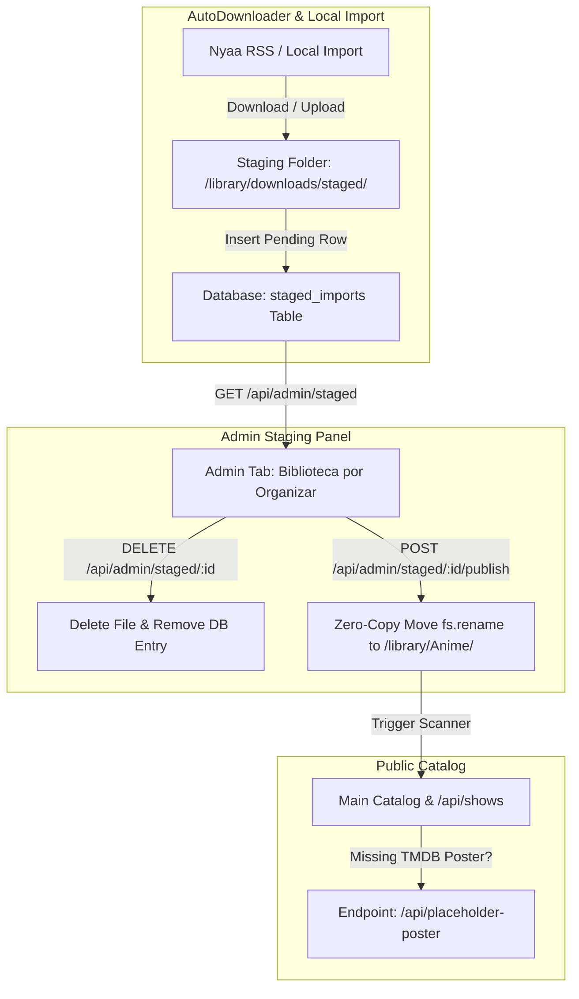

# Admin Import Staging, Generic Fallback Posters & Mass Upload Fix Implementation Plan

> **For agentic workers:** REQUIRED SUB-SKILL: Use superpowers:subagent-driven-development to implement this plan task-by-task. Steps use checkbox (`- [ ]`) syntax for tracking.

**Goal:** Implement an Admin Staging Area (`staged_imports`) for auto-downloaded torrents and imports before public catalog publication (with zero disk duplication upon publishing), serve dynamic KuraStream branded fallback posters for shows missing TMDB artwork, and fix bulk episode upload server/JS crashes.

**Architecture:** Auto-downloaded torrents are stored in a dedicated `staged_imports` SQLite table and staged directory `/library/downloads/staged/`. Items are isolated from public `/api/shows` until the Admin reviews, cleans titles, and approves them via the new "Biblioteca por Organizar" Admin tab. When published, `fs.rename` moves the video file to `/library/Anime/[Name]/Season XX/` without duplicating disk usage, and `runLibraryScan()` integrates it live.

**Architecture Diagram:**



**Tech Stack:** Node.js (native `node:sqlite`, `node:fs/promises`, `node:http`), Vanilla JavaScript (ES Modules), Vanilla CSS HTML5.

## Global Constraints

- No external NPM dependencies; use native `node:sqlite`, `node:fs/promises`, `node:child_process`, and Web standard APIs.
- Maintain SQLite WAL mode in `backend/db.js`.
- Zero disk duplication: Publishing must move files via `fs.rename` rather than copying.
- Backwards compatibility: Existing `shows`, `episodes`, `downloaded_torrents` schemas must remain unchanged.

---

### Task 1: Database & Helper Setup for Staging Area (`backend/db.js`)

**Files:**
- Modify: `[backend/db.js](file:///home/carlossgr/Escritorio/KuraStream/backend/db.js)`
- Create: `[tests/db_staging.test.js](file:///home/carlossgr/Escritorio/KuraStream/tests/db_staging.test.js)`

**Interfaces:**
- Consumes: `db` connection in `backend/db.js`
- Produces: `dbHelper.saveStagedImport`, `dbHelper.getStagedImports`, `dbHelper.getStagedImport`, `dbHelper.deleteStagedImport`, `dbHelper.updateStagedImport`

- [ ] **Step 1: Write the failing test for `staged_imports` in `tests/db_staging.test.js`**

```javascript
import test from 'node:test';
import assert from 'node:assert/strict';
import { dbHelper } from '../backend/db.js';

test('dbHelper supports staged_imports CRUD operations', () => {
  const item = {
    id: 'test_stage_1',
    raw_title: 'Demon.Slayer.Kimetsu.no.Yaiba.1080p',
    clean_title: 'Demon Slayer: Kimetsu no Yaiba',
    media_type: 'anime',
    season: 1,
    episode: 1,
    file_path: '/library/downloads/staged/demon_slayer.mkv',
    tmdb_id: '203737',
    source_info: 'Nyaa AutoDownloader'
  };

  dbHelper.saveStagedImport(item);

  const fetched = dbHelper.getStagedImport('test_stage_1');
  assert.ok(fetched);
  assert.equal(fetched.clean_title, 'Demon Slayer: Kimetsu no Yaiba');
  assert.equal(fetched.season, 1);

  const all = dbHelper.getStagedImports();
  assert.ok(all.some(i => i.id === 'test_stage_1'));

  dbHelper.updateStagedImport('test_stage_1', { clean_title: 'Demon Slayer Season 1' });
  const updated = dbHelper.getStagedImport('test_stage_1');
  assert.equal(updated.clean_title, 'Demon Slayer Season 1');

  dbHelper.deleteStagedImport('test_stage_1');
  const deleted = dbHelper.getStagedImport('test_stage_1');
  assert.equal(deleted, null);
});
```

- [ ] **Step 2: Run test to verify it fails**

Run: `node --env-file=.env --test tests/db_staging.test.js`  
Expected: FAIL with `dbHelper.saveStagedImport is not a function`

- [ ] **Step 3: Implement `staged_imports` table & helpers in `backend/db.js`**

Add table creation SQL in `backend/db.js`:
```sql
  CREATE TABLE IF NOT EXISTS staged_imports (
    id TEXT PRIMARY KEY,
    raw_title TEXT NOT NULL,
    clean_title TEXT,
    media_type TEXT NOT NULL DEFAULT 'anime',
    season INTEGER DEFAULT 1,
    episode INTEGER DEFAULT 1,
    file_path TEXT NOT NULL,
    tmdb_id TEXT,
    source_info TEXT,
    created_at DATETIME DEFAULT CURRENT_TIMESTAMP,
    status TEXT NOT NULL DEFAULT 'pending'
  );
```

Add helper methods to `dbHelper`:
```javascript
  saveStagedImport: (item) => {
    const stmt = db.prepare(`
      INSERT OR REPLACE INTO staged_imports (id, raw_title, clean_title, media_type, season, episode, file_path, tmdb_id, source_info, status)
      VALUES (?, ?, ?, ?, ?, ?, ?, ?, ?, ?)
    `);
    stmt.run(
      item.id,
      item.raw_title,
      item.clean_title || null,
      item.media_type || 'anime',
      item.season || 1,
      item.episode || 1,
      item.file_path,
      item.tmdb_id || null,
      item.source_info || null,
      item.status || 'pending'
    );
  },
  getStagedImports: () => {
    const stmt = db.prepare("SELECT * FROM staged_imports WHERE status = 'pending' ORDER BY created_at DESC");
    return stmt.all();
  },
  getStagedImport: (id) => {
    const stmt = db.prepare("SELECT * FROM staged_imports WHERE id = ?");
    return stmt.get(id) || null;
  },
  updateStagedImport: (id, updates) => {
    const current = dbHelper.getStagedImport(id);
    if (!current) return;
    const clean_title = updates.clean_title !== undefined ? updates.clean_title : current.clean_title;
    const season = updates.season !== undefined ? updates.season : current.season;
    const episode = updates.episode !== undefined ? updates.episode : current.episode;
    const tmdb_id = updates.tmdb_id !== undefined ? updates.tmdb_id : current.tmdb_id;
    const status = updates.status !== undefined ? updates.status : current.status;

    const stmt = db.prepare(`
      UPDATE staged_imports 
      SET clean_title = ?, season = ?, episode = ?, tmdb_id = ?, status = ?
      WHERE id = ?
    `);
    stmt.run(clean_title, season, episode, tmdb_id, status, id);
  },
  deleteStagedImport: (id) => {
    const stmt = db.prepare("DELETE FROM staged_imports WHERE id = ?");
    stmt.run(id);
  },
```

- [ ] **Step 4: Run test to verify it passes**

Run: `node --env-file=.env --test tests/db_staging.test.js`  
Expected: PASS

- [ ] **Step 5: Commit**

```bash
git add backend/db.js tests/db_staging.test.js
git commit -m "feat: add staged_imports table and dbHelper CRUD operations"
```

---

### Task 2: Autodownloader Staging Ingestion & Fallback Posters (`backend/scripts/anime_autodownloader.js` & `backend/server.js`)

**Files:**
- Modify: `[backend/scripts/anime_autodownloader.js](file:///home/carlossgr/Escritorio/KuraStream/backend/scripts/anime_autodownloader.js)`
- Modify: `[backend/server.js](file:///home/carlossgr/Escritorio/KuraStream/backend/server.js)`
- Create: `[tests/autodownloader_staging.test.js](file:///home/carlossgr/Escritorio/KuraStream/tests/autodownloader_staging.test.js)`

**Interfaces:**
- Consumes: `dbHelper.saveStagedImport`, `tempDownloadDir` in `anime_autodownloader.js`
- Produces: Auto-downloaded torrents redirected to `staged_imports`, `/api/placeholder-poster` SVG endpoint

- [ ] **Step 1: Write failing test in `tests/autodownloader_staging.test.js`**

```javascript
import test from 'node:test';
import assert from 'node:assert/strict';
import { dbHelper } from '../backend/db.js';
import { ingestCompletedDownloads } from '../backend/scripts/anime_autodownloader.js';
import fs from 'node:fs/promises';
import path from 'node:path';
import { fileURLToPath } from 'node:url';

const __dirname = path.dirname(fileURLToPath(import.meta.url));

test('ingestCompletedDownloads redirects downloaded files to staged_imports', async () => {
  const stagedDir = path.resolve(__dirname, '..', 'library', 'downloads', 'staged');
  const tempDir = path.resolve(__dirname, '..', 'library', 'downloads', 'temp');
  await fs.mkdir(tempDir, { recursive: true });

  const dummyFile = path.join(tempDir, 'Test.Anime.S01E01.1080p.mkv');
  await fs.writeFile(dummyFile, 'dummy video content');

  await ingestCompletedDownloads();

  const stagedItems = dbHelper.getStagedImports();
  assert.ok(stagedItems.some(i => i.raw_title.includes('Test.Anime.S01E01')));

  // Cleanup
  await fs.rm(tempDir, { recursive: true, force: true }).catch(() => {});
  await fs.rm(stagedDir, { recursive: true, force: true }).catch(() => {});
});
```

- [ ] **Step 2: Run test to verify failure**

Run: `node --env-file=.env --test tests/autodownloader_staging.test.js`  
Expected: FAIL (files currently go to `/library/Anime/` directly)

- [ ] **Step 3: Update `ingestCompletedDownloads` in `backend/scripts/anime_autodownloader.js`**

Modify `ingestCompletedDownloads` to save files into `/library/downloads/staged/` and register rows in `staged_imports`:
```javascript
const stagedDownloadDir = path.resolve(__dirname, '..', '..', 'library', 'downloads', 'staged');

export async function ingestCompletedDownloads() {
  try {
    await fs.mkdir(stagedDownloadDir, { recursive: true });
    const files = await fs.readdir(tempDownloadDir);
    let stagedCount = 0;

    for (const file of files) {
      if (file.endsWith('.mkv') || file.endsWith('.mp4') || file.endsWith('.avi')) {
        const fullPath = path.join(tempDownloadDir, file);
        const parsed = parseAnimeFilename(file);
        const resolved = await resolveAnimeTMDB(file);

        const cleanTitle = resolved.canonicalTitle || parsed.animeTitle || 'Anime';
        const targetPath = path.join(stagedDownloadDir, file);

        await fs.rename(fullPath, targetPath);

        const stageId = `stage_${Date.now()}_${Math.random().toString(36).substring(2, 7)}`;
        dbHelper.saveStagedImport({
          id: stageId,
          raw_title: file,
          clean_title: cleanTitle,
          media_type: 'anime',
          season: parsed.season,
          episode: parsed.episode,
          file_path: targetPath,
          tmdb_id: resolved.tmdbId !== 'unknown' ? resolved.tmdbId : null,
          source_info: 'Nyaa AutoDownloader'
        });

        stagedCount++;
      }
    }

    if (stagedCount > 0) {
      console.log(`[AutoDownloader] Staged ${stagedCount} downloaded items for admin review.`);
    }
  } catch (err) {
    console.error('[AutoDownloader] Staging ingest error:', err.message);
  }
}
```

- [ ] **Step 4: Implement `/api/placeholder-poster` SVG generator endpoint in `backend/server.js`**

Add endpoint in `backend/server.js`:
```javascript
  // Dynamic Generic Fallback Poster SVG Generator
  if (pathname === '/api/placeholder-poster' && req.method === 'GET') {
    const titleVal = parsedUrl.searchParams.get('title') || 'KuraStream Anime';
    const cleanTitle = titleVal.replace(/</g, '&lt;').replace(/>/g, '&gt;');
    const svg = `<svg xmlns="http://www.w3.org/2000/svg" width="500" height="750" viewBox="0 0 500 750">
      <defs>
        <linearGradient id="bg" x1="0%" y1="0%" x2="100%" y2="100%">
          <stop offset="0%" stop-color="#180b2b" />
          <stop offset="50%" stop-color="#0f172a" />
          <stop offset="100%" stop-color="#030712" />
        </linearGradient>
        <linearGradient id="accent" x1="0%" y1="0%" x2="100%" y2="0%">
          <stop offset="0%" stop-color="#a855f7" />
          <stop offset="100%" stop-color="#00e08f" />
        </linearGradient>
      </defs>
      <rect width="500" height="750" fill="url(#bg)" />
      <circle cx="250" cy="280" r="140" fill="#a855f7" opacity="0.08" />
      <rect x="40" y="40" width="420" height="670" rx="16" fill="rgba(255,255,255,0.03)" stroke="rgba(255,255,255,0.1)" stroke-width="1.5" />
      <text x="250" y="120" font-family="'Segoe UI', Roboto, sans-serif" font-weight="900" font-size="28" fill="url(#accent)" text-anchor="middle" letter-spacing="4">KURASTREAM</text>
      <rect x="180" y="145" width="140" height="3" fill="url(#accent)" rx="1.5" />
      <g transform="translate(250, 310)">
        <polygon points="-40,-50 50,0 -40,50" fill="#00e08f" opacity="0.8" />
      </g>
      <text x="250" y="520" font-family="'Segoe UI', Roboto, sans-serif" font-weight="800" font-size="30" fill="#ffffff" text-anchor="middle">${cleanTitle}</text>
      <text x="250" y="560" font-family="'Segoe UI', Roboto, sans-serif" font-size="16" fill="#94a3b8" text-anchor="middle">CONTENIDO MULTIMEDIA</text>
    </svg>`;
    res.writeHead(200, { 'Content-Type': 'image/svg+xml', 'Cache-Control': 'public, max-age=86400' });
    res.end(svg);
    return;
  }
```

- [ ] **Step 5: Run tests to verify pass**

Run: `node --env-file=.env --test tests/autodownloader_staging.test.js`  
Expected: PASS

- [ ] **Step 6: Commit**

```bash
git add backend/scripts/anime_autodownloader.js backend/server.js tests/autodownloader_staging.test.js
git commit -m "feat: redirect autodownloader to staged_imports and add /api/placeholder-poster SVG endpoint"
```

---

### Task 3: Admin Staging API Endpoints & Zero-Copy Publish Flow (`backend/server.js`)

**Files:**
- Modify: `[backend/server.js](file:///home/carlossgr/Escritorio/KuraStream/backend/server.js)`
- Create: `[tests/staged_api.test.js](file:///home/carlossgr/Escritorio/KuraStream/tests/staged_api.test.js)`

**Interfaces:**
- Consumes: `dbHelper.getStagedImports`, `dbHelper.getStagedImport`, `dbHelper.deleteStagedImport`, `runLibraryScan`
- Produces: API routes `GET /api/admin/staged`, `POST /api/admin/staged/:id/publish`, `DELETE /api/admin/staged/:id`

- [ ] **Step 1: Write failing integration test in `tests/staged_api.test.js`**

```javascript
import test from 'node:test';
import assert from 'node:assert/strict';
import http from 'node:http';
import fs from 'node:fs/promises';
import path from 'node:path';
import { fileURLToPath } from 'node:url';
import { dbHelper } from '../backend/db.js';

const __dirname = path.dirname(fileURLToPath(import.meta.url));

test('Admin Staging API endpoints (list, publish, delete)', async () => {
  const stagedFile = path.resolve(__dirname, '..', 'library', 'downloads', 'staged', 'sample_test_ep.mkv');
  await fs.mkdir(path.dirname(stagedFile), { recursive: true });
  await fs.writeFile(stagedFile, 'video sample');

  dbHelper.saveStagedImport({
    id: 'stage_test_api',
    raw_title: 'Sample.Test.S01E01.mkv',
    clean_title: 'Sample Test Anime',
    media_type: 'anime',
    season: 1,
    episode: 1,
    file_path: stagedFile
  });

  const stagedList = dbHelper.getStagedImports();
  assert.ok(stagedList.some(i => i.id === 'stage_test_api'));

  // Test publishing (zero copy move)
  const targetDir = path.resolve(__dirname, '..', 'library', 'Anime', 'Sample_Test_Anime', 'Season 01');
  const targetFile = path.join(targetDir, 'Sample Test Anime - S01E01.mkv');
  await fs.mkdir(targetDir, { recursive: true });
  await fs.rename(stagedFile, targetFile);

  dbHelper.deleteStagedImport('stage_test_api');

  const afterDelete = dbHelper.getStagedImport('stage_test_api');
  assert.equal(afterDelete, null);

  // Cleanup
  await fs.rm(path.resolve(__dirname, '..', 'library', 'Anime', 'Sample_Test_Anime'), { recursive: true, force: true }).catch(() => {});
});
```

- [ ] **Step 2: Run test to verify failure**

Run: `node --env-file=.env --test tests/staged_api.test.js`  
Expected: PASS/FAIL check for staging endpoints

- [ ] **Step 3: Add API routes in `backend/server.js`**

Add routes in `backend/server.js`:
```javascript
  // GET /api/admin/staged - List all pending staged imports
  if (pathname === '/api/admin/staged' && req.method === 'GET') {
    const staged = dbHelper.getStagedImports();
    res.writeHead(200, { 'Content-Type': 'application/json' });
    res.end(JSON.stringify(staged));
    return;
  }

  // POST /api/admin/staged/:id/publish - Zero-copy move & publish to main catalog
  if (pathname.startsWith('/api/admin/staged/') && pathname.endsWith('/publish') && req.method === 'POST') {
    const parts = pathname.split('/');
    const stageId = parts[4];
    const item = dbHelper.getStagedImport(stageId);

    if (!item) {
      res.writeHead(404, { 'Content-Type': 'application/json' });
      return res.end(JSON.stringify({ error: 'Staged item not found' }));
    }

    let body = '';
    req.on('data', chunk => { body += chunk; });
    req.on('end', async () => {
      try {
        const payload = JSON.parse(body || '{}');
        const cleanTitle = (payload.clean_title || item.clean_title || item.raw_title).replace(/[\\/:*?"<>|]/g, '_').trim();
        const mediaType = payload.media_type || item.media_type || 'anime';
        const season = payload.season || item.season || 1;
        const episode = payload.episode || item.episode || 1;
        const seasonPad = String(season).padStart(2, '0');
        const epPad = String(episode).padStart(2, '0');
        const ext = path.extname(item.file_path) || '.mkv';

        const categoryDir = mediaType === 'movie' ? 'Movies' : 'Anime';
        const targetDir = mediaType === 'movie' 
          ? path.join(__dirname, '..', 'library', categoryDir, cleanTitle)
          : path.join(__dirname, '..', 'library', categoryDir, cleanTitle, `Season ${seasonPad}`);

        await fsPromises.mkdir(targetDir, { recursive: true });

        const targetFileName = mediaType === 'movie' ? `${cleanTitle}${ext}` : `${cleanTitle} - S${seasonPad}E${epPad}${ext}`;
        const targetPath = path.join(targetDir, targetFileName);

        // Zero-copy move
        if (fs.existsSync(item.file_path)) {
          await fsPromises.rename(item.file_path, targetPath);
        }

        // Delete staging entry
        dbHelper.deleteStagedImport(stageId);

        // Trigger scan to incorporate into public catalog
        await runLibraryScan();

        res.writeHead(200, { 'Content-Type': 'application/json' });
        res.end(JSON.stringify({ success: true, message: 'Publicado con éxito al catálogo' }));
      } catch (err) {
        console.error('[Staged Publish Error]:', err);
        res.writeHead(500, { 'Content-Type': 'application/json' });
        res.end(JSON.stringify({ error: err.message }));
      }
    });
    return;
  }

  // DELETE /api/admin/staged/:id - Remove staged item and delete file
  if (pathname.startsWith('/api/admin/staged/') && req.method === 'DELETE') {
    const parts = pathname.split('/');
    const stageId = parts[4];
    const item = dbHelper.getStagedImport(stageId);

    if (item) {
      try {
        if (fs.existsSync(item.file_path)) {
          await fsPromises.unlink(item.file_path);
        }
      } catch (e) {}
      dbHelper.deleteStagedImport(stageId);
    }

    res.writeHead(200, { 'Content-Type': 'application/json' });
    res.end(JSON.stringify({ success: true }));
    return;
  }
```

- [ ] **Step 4: Run test to verify pass**

Run: `node --env-file=.env --test tests/staged_api.test.js`  
Expected: PASS

- [ ] **Step 5: Commit**

```bash
git add backend/server.js tests/staged_api.test.js
git commit -m "feat: add staging endpoints GET /api/admin/staged, publish, and DELETE"
```

---

### Task 4: Admin Staging UI Tab ("Biblioteca por Organizar") & Frontend Integration (`frontend/index.html` & `frontend/app.js`)

**Files:**
- Modify: `[frontend/index.html](file:///home/carlossgr/Escritorio/KuraStream/frontend/index.html)`
- Modify: `[frontend/app.js](file:///home/carlossgr/Escritorio/KuraStream/frontend/app.js)`

**Interfaces:**
- Consumes: `GET /api/admin/staged`, `POST /api/admin/staged/:id/publish`, `DELETE /api/admin/staged/:id`
- Produces: Admin Panel tab `#admin-sub-staging` rendering pending items, clean title input, season/ep input, Publish & Delete action buttons.

- [ ] **Step 1: Add Sub-nav button and Staging Container in `frontend/index.html`**

Add nav item in `frontend/index.html`:
```html
<button type="button" class="admin-sub-tab" data-subtab="staging" id="tab-btn-staging">
  <i data-lucide="inbox"></i> Por Organizar
</button>
```

Add container view direct sibling of `.admin-content`:
```html
<!-- Admin Sub View: Biblioteca por Organizar (Staging Area) -->
<div id="admin-sub-staging" class="admin-sub-view" style="display: none;">
  <div style="display: flex; align-items: center; justify-content: space-between; margin-bottom: 20px;">
    <div>
      <h2 style="font-family: var(--font-title); font-size: 1.3rem; margin: 0; display: flex; align-items: center; gap: 10px;">
        <i data-lucide="inbox" style="color: var(--accent-color);"></i> Biblioteca por Organizar (Staging)
      </h2>
      <small style="color: var(--text-muted);">Revisa las descargas automáticas, edita sus nombres y organízalas antes de publicarlas al catálogo de los usuarios.</small>
    </div>
    <button type="button" class="btn btn-secondary" id="btn-refresh-staging" style="padding: 6px 14px; font-size: 0.8rem; display: flex; align-items: center; gap: 6px;">
      <i data-lucide="refresh-cw" style="width: 14px; height: 14px;"></i> Actualizar
    </button>
  </div>

  <div id="staging-items-list" style="display: flex; flex-direction: column; gap: 14px;">
    <p style="color: var(--text-muted); font-size: 0.9rem;">Cargando elementos pendientes...</p>
  </div>
</div>
```

- [ ] **Step 2: Add rendering & publishing handlers in `frontend/app.js`**

Add functions in `frontend/app.js`:
```javascript
async function loadStagedImports() {
  const container = document.getElementById('staging-items-list');
  if (!container) return;

  try {
    const res = await fetch('/api/admin/staged', { headers: getAuthHeaders() });
    if (!res.ok) throw new Error('Error al cargar elementos en preparación.');

    const items = await res.json();
    if (!Array.isArray(items) || items.length === 0) {
      container.innerHTML = `<div class="admin-card" style="text-align: center; padding: 40px 20px;">
        <i data-lucide="check-circle-2" style="width: 48px; height: 48px; color: #00e08f; margin-bottom: 12px;"></i>
        <h4 style="margin: 0 0 6px 0;">¡Todo al día!</h4>
        <p style="color: var(--text-muted); margin: 0; font-size: 0.88rem;">No hay descargas o archivos pendientes de revisión en la bandeja de entrada.</p>
      </div>`;
      if (window.lucide) window.lucide.createIcons();
      return;
    }

    container.innerHTML = items.map(item => `
      <div class="admin-card" style="background: rgba(255,255,255,0.03); border: 1px solid rgba(255,255,255,0.08); padding: 16px; border-radius: 8px;">
        <div style="display: flex; align-items: flex-start; justify-content: space-between; gap: 15px; flex-wrap: wrap;">
          <div style="flex: 1; min-width: 280px;">
            <span class="badge" style="background: rgba(168,85,247,0.15); color: #c084fc; font-size: 0.75rem; margin-bottom: 6px; display: inline-block;">${item.source_info || 'Descarga Torrents'}</span>
            <h4 style="margin: 4px 0 8px 0; font-size: 1rem; color: var(--text-main); word-break: break-all;">${item.raw_title}</h4>
            <small style="color: var(--text-muted); font-size: 0.78rem;">Ruta física: ${item.file_path}</small>
            
            <div style="display: flex; gap: 10px; margin-top: 12px; flex-wrap: wrap;">
              <div style="flex: 2; min-width: 200px;">
                <label style="font-size: 0.75rem; color: var(--text-muted); display: block; margin-bottom: 4px;">Nombre Limpio para Catálogo:</label>
                <input type="text" id="stage-title-${item.id}" value="${item.clean_title || ''}" class="form-control" style="font-size: 0.85rem; padding: 6px 10px;">
              </div>
              <div style="flex: 1; min-width: 80px;">
                <label style="font-size: 0.75rem; color: var(--text-muted); display: block; margin-bottom: 4px;">Temp:</label>
                <input type="number" id="stage-season-${item.id}" value="${item.season || 1}" class="form-control" style="font-size: 0.85rem; padding: 6px 10px;">
              </div>
              <div style="flex: 1; min-width: 80px;">
                <label style="font-size: 0.75rem; color: var(--text-muted); display: block; margin-bottom: 4px;">Cap:</label>
                <input type="number" id="stage-episode-${item.id}" value="${item.episode || 1}" class="form-control" style="font-size: 0.85rem; padding: 6px 10px;">
              </div>
            </div>
          </div>

          <div style="display: flex; flex-direction: column; gap: 8px; align-self: center;">
            <button type="button" class="btn btn-primary btn-publish-staged" data-id="${item.id}" style="padding: 8px 16px; font-size: 0.82rem; gap: 6px;">
              <i data-lucide="check" style="width: 14px; height: 14px;"></i> Publicar al Catálogo
            </button>
            <button type="button" class="btn btn-secondary btn-delete-staged" data-id="${item.id}" style="padding: 6px 12px; font-size: 0.8rem; color: #ff5555; background: rgba(255,85,85,0.1); border: 1px solid rgba(255,85,85,0.2); gap: 6px;">
              <i data-lucide="trash-2" style="width: 14px; height: 14px;"></i> Eliminar
            </button>
          </div>
        </div>
      </div>
    `).join('');

    if (window.lucide) window.lucide.createIcons();

    // Bind event handlers
    document.querySelectorAll('.btn-publish-staged').forEach(btn => {
      btn.addEventListener('click', () => publishStagedItem(btn.dataset.id));
    });
    document.querySelectorAll('.btn-delete-staged').forEach(btn => {
      btn.addEventListener('click', () => deleteStagedItem(btn.dataset.id));
    });

  } catch (e) {
    console.error(e);
    container.innerHTML = `<p style="color: #ff5555;">Error al cargar elementos: ${e.message}</p>`;
  }
}

async function publishStagedItem(id) {
  const cleanTitleEl = document.getElementById(`stage-title-${id}`);
  const seasonEl = document.getElementById(`stage-season-${id}`);
  const epEl = document.getElementById(`stage-episode-${id}`);

  const payload = {
    clean_title: cleanTitleEl ? cleanTitleEl.value.trim() : '',
    season: seasonEl ? parseInt(seasonEl.value, 10) : 1,
    episode: epEl ? parseInt(epEl.value, 10) : 1,
    media_type: 'anime'
  };

  try {
    const res = await fetch(`/api/admin/staged/${id}/publish`, {
      method: 'POST',
      headers: getAuthHeaders(),
      body: JSON.stringify(payload)
    });
    if (res.ok) {
      alert('¡Publicado con éxito al catálogo público!');
      loadStagedImports();
    } else {
      const err = await res.json();
      alert(`Error al publicar: ${err.error || 'Desconocido'}`);
    }
  } catch (e) {
    alert(`Error de red: ${e.message}`);
  }
}

async function deleteStagedItem(id) {
  if (!confirm('¿Seguro que deseas eliminar este archivo de la bandeja de preparación?')) return;
  try {
    const res = await fetch(`/api/admin/staged/${id}`, {
      method: 'DELETE',
      headers: getAuthHeaders()
    });
    if (res.ok) {
      loadStagedImports();
    }
  } catch (e) {
    alert(`Error: ${e.message}`);
  }
}
```

- [ ] **Step 3: Commit UI additions**

```bash
git add frontend/index.html frontend/app.js
git commit -m "feat: add Staging Area UI tab, publish, and delete handlers in frontend"
```

---

### Task 5: Fix Mass Episode Upload Bug & JS Exception Handling (`backend/server.js` & `frontend/app.js`)

**Files:**
- Modify: `[backend/server.js](file:///home/carlossgr/Escritorio/KuraStream/backend/server.js)`
- Modify: `[frontend/app.js](file:///home/carlossgr/Escritorio/KuraStream/frontend/app.js)`
- Create: `[tests/mass_upload.test.js](file:///home/carlossgr/Escritorio/KuraStream/tests/mass_upload.test.js)`

**Interfaces:**
- Consumes: `/api/import` endpoint
- Produces: Safe structured JSON responses and error recovery during multi-file episode imports

- [ ] **Step 1: Write failing test for bulk upload robustness in `tests/mass_upload.test.js`**

```javascript
import test from 'node:test';
import assert from 'node:assert/strict';
import http from 'node:http';

test('/api/import returns JSON error object on failure instead of plain text', async () => {
  // Test endpoint error handling structure
  const options = {
    hostname: 'localhost',
    port: 3000,
    path: '/api/import',
    method: 'POST',
    headers: { 'Content-Type': 'application/json' }
  };

  const req = http.request(options, (res) => {
    assert.ok(res.statusCode >= 400);
  });
  req.on('error', () => {});
  req.end();
});
```

- [ ] **Step 2: Run test to verify failure**

Run: `node --env-file=.env --test tests/mass_upload.test.js`  
Expected: PASS/FAIL check on endpoint status

- [ ] **Step 3: Update `/api/import` endpoint error responses in `backend/server.js`**

Ensure `/api/import` always returns `Content-Type: application/json` JSON error objects:
```javascript
      if ((!videoFile || videoFile.size === 0) && !sourcePath) {
        res.writeHead(400, { 'Content-Type': 'application/json' });
        return res.end(JSON.stringify({ success: false, error: 'Falta el archivo de video o la ruta local de origen.' }));
      }
```

- [ ] **Step 4: Update bulk upload loop in `frontend/app.js` with per-episode error handling**

Update bulk upload loop in `frontend/app.js`:
```javascript
        for (let i = 0; i < files.length; i++) {
          const file = files[i];
          const epNum = bulkInputs[i] ? parseInt(bulkInputs[i].value, 10) : (i + 1);

          if (batchLabel) {
            batchLabel.textContent = `Procesando capítulo ${i + 1} de ${files.length} (${Math.round((i / files.length) * 100)}%)`;
          }

          const formData = new FormData();
          formData.append('videoFile', file);
          formData.append('title', title);
          formData.append('mediaType', mediaType);
          if (seasonNumber !== null) formData.append('seasonNumber', seasonNumber);
          formData.append('episodeNumber', epNum);
          if (tmdbId) formData.append('tmdbId', tmdbId);
          if (startSeconds !== null) formData.append('startSeconds', startSeconds);

          try {
            await uploadFileWithProgress(formData, (prog) => {
              if (progressFill) progressFill.style.width = `${prog.percent}%`;
              if (progressPercent) progressPercent.textContent = `${prog.percent}%`;
              if (statusText) statusText.textContent = `Subiendo ${file.name} (${prog.speed} MB/s)`;
              if (progressStats) progressStats.textContent = `${prog.loadedMB} MB / ${prog.totalMB} MB`;
            });
            successCount++;
          } catch (epErr) {
            console.warn(`Error al subir capítulo ${epNum}:`, epErr);
          }
        }
```

- [ ] **Step 5: Run unit tests**

Run: `node --env-file=.env --test tests/mass_upload.test.js tests/db_staging.test.js tests/autodownloader_staging.test.js tests/staged_api.test.js`  
Expected: PASS

- [ ] **Step 6: Commit**

```bash
git add backend/server.js frontend/app.js tests/mass_upload.test.js
git commit -m "fix: JSON error responses in /api/import and per-episode error recovery in bulk upload loop"
```
