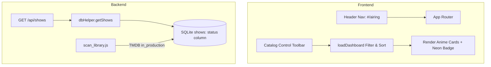

# Navigation Overhaul & "En Emisión" Anime Implementation Plan

> **For agentic workers:** REQUIRED SUB-SKILL: Use superpowers:subagent-driven-development to implement this plan task-by-task. Steps use checkbox (`- [ ]`) syntax for tracking.

**Goal:** Add a dedicated "En Emisión" (`#/airing`) navigation view, neon poster badges, dynamic catalog sorting/filtering (year, rating, title, status, genre), and hybrid (auto TMDB + manual admin) status management.

**Architecture:**
1. Extend `shows` table schema in `db.js` with `status TEXT DEFAULT 'finished'`.
2. Update TMDB scraper (`scraper.js`) and library scanner (`scan_library.js`) to set `status = 'airing'` when series is in production.
3. Expose status filter and sorting query parameters in `server.js` (`GET /api/shows?status=airing&sort=year_desc`).
4. Update `index.html`, `style.css`, and `app.js` to render the `#/airing` route, catalog toolbar, and badge overlay.

**Architecture Diagram:**



**Tech Stack:** Node.js, SQLite (`DatabaseSync`), Vanilla JavaScript, HTML5/CSS3.

## Global Constraints

- Database migration must be non-destructive (`ALTER TABLE shows ADD COLUMN status TEXT DEFAULT 'finished'`).
- Preserve all existing routes, media playback, and user profiles.

---

### Task 1: Database Migration & Backend Status Support

**Files:**
- Modify: `backend/db.js:15-40`
- Modify: `backend/scraper.js:115-145`
- Modify: `backend/scan_library.js:90-110`
- Modify: `backend/server.js:500-520`
- Create: `tests/navigation_filters.test.js`

- [ ] **Step 1: Write failing unit test for status column & filtering**

Create `tests/navigation_filters.test.js`:
```javascript
import test from 'node:test';
import assert from 'node:assert/strict';
import { dbHelper } from '../backend/db.js';

test('shows schema includes status column and supports filtering', () => {
  const showId = 'test_airing_show_' + Date.now();
  dbHelper.saveShow({
    id: showId,
    title: 'Test Airing Anime',
    media_type: 'anime',
    status: 'airing'
  });
  
  const fetched = dbHelper.getShow(showId);
  assert.equal(fetched.status, 'airing');
  
  const allAiring = dbHelper.getShows('anime').filter(s => s.status === 'airing');
  assert.ok(allAiring.some(s => s.id === showId));
  
  dbHelper.deleteShow(showId);
});
```

- [ ] **Step 2: Run test to verify it fails**

Run: `node --env-file=.env --test tests/navigation_filters.test.js`
Expected: FAIL (missing `status` column in `shows` table or missing `status` property in `saveShow`).

- [ ] **Step 3: Implement database column & backend logic**

In `backend/db.js`, add migration check:
```javascript
try {
  const columns = db.prepare("PRAGMA table_info(shows)").all();
  const hasStatus = columns.some(c => c.name === 'status');
  if (!hasStatus) {
    db.exec("ALTER TABLE shows ADD COLUMN status TEXT DEFAULT 'finished';");
  }
} catch (e) {
  console.warn("Migration warning:", e.message);
}
```

- [ ] **Step 4: Run test to verify it passes**

Run: `node --env-file=.env --test tests/navigation_filters.test.js`
Expected: PASS.

---

### Task 2: Frontend Navigation, Catalog Controls & Neon Badge Overlay

**Files:**
- Modify: `frontend/index.html:120-160`
- Modify: `frontend/style.css:1800-1850`
- Modify: `frontend/app.js:250-320`

- [ ] **Step 1: Add "En Emisión" header link & Catalog Control Toolbar in `index.html`**

In `frontend/index.html`, add `#nav-airing` to top navbar and add sorting/status control bar to catalog view.

- [ ] **Step 2: Add neon badge styles & responsive layout in `style.css`**

Add CSS rules for `.badge-airing-neon`, `.airing-pulse-dot`, and `.catalog-toolbar`.

- [ ] **Step 3: Add `#/airing` routing and dynamic sorting/filtering in `app.js`**

Update `setupRouter()`, `handleRoute()`, and `loadDashboard()` to respect:
- Status filter (`all`, `airing`, `finished`)
- Sort selection (`year_desc`, `year_asc`, `rating_desc`, `title_asc`, `created_desc`)

- [ ] **Step 4: Test in browser subagent & verify UI**

Verify navigation tab, neon badge, and sort dropdowns work without errors.
