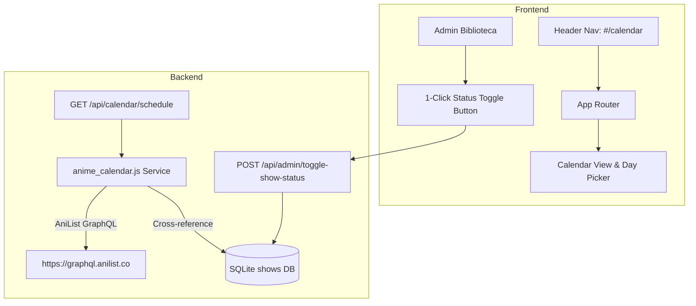

# Simulcast Anime Calendar & Admin Status Control Implementation Plan

> **For agentic workers:** REQUIRED SUB-SKILL: Use superpowers:subagent-driven-development to implement this plan task-by-task. Steps use checkbox (`- [ ]`) syntax for tracking.

**Goal:** Add a live weekly Simulcast Anime Calendar (`#/calendar`) with AniList GraphQL integration and local library matching badges, plus 1-click status control buttons in the Admin Panel -> Biblioteca.

**Architecture:**
1. Create `backend/anime_calendar.js` service that fetches weekly airing schedules from AniList GraphQL API and caches results in memory for 6 hours.
2. Add `GET /api/calendar/schedule` and `POST /api/admin/toggle-show-status` endpoints in `backend/server.js`.
3. Create `#calendar-view` and `#nav-calendar` link in `frontend/index.html`.
4. Implement Day Picker tabs (Lunes - Domingo), countdown timer, and 1-click status toggle in `frontend/app.js` and `frontend/style.css`.

**Architecture Diagram:**



**Tech Stack:** Node.js, AniList GraphQL API, Vanilla JavaScript, HTML5/CSS3.

## Global Constraints
- Infinite/free API querying without API keys using AniList GraphQL API.
- Cache schedule for 6 hours to eliminate external latency and rate limits.
- Non-destructive DB updates.

---

### Task 1: Backend AniList Calendar Proxy & Status Toggle Endpoint

**Files:**
- Create: `backend/anime_calendar.js`
- Modify: `backend/server.js:530-580`
- Create: `tests/anime_calendar.test.js`

- [ ] **Step 1: Write failing unit test for calendar schedule API**

Create `tests/anime_calendar.test.js`:
```javascript
import test from 'node:test';
import assert from 'node:assert/strict';
import { fetchWeeklyCalendar } from '../backend/anime_calendar.js';

test('fetchWeeklyCalendar returns grouped days schedule', async () => {
  const schedule = await fetchWeeklyCalendar();
  assert.ok(schedule);
  assert.ok(Array.isArray(schedule.Monday) || Array.isArray(schedule.monday) || Object.keys(schedule).length > 0);
});
```

- [ ] **Step 2: Run test to verify it fails**

Run: `node --env-file=.env --test tests/anime_calendar.test.js`
Expected: FAIL (missing module `backend/anime_calendar.js`).

- [ ] **Step 3: Implement `backend/anime_calendar.js`**

Create `backend/anime_calendar.js` to query AniList GraphQL API, parse weekly schedules into day buckets (Lunes, Martes, etc.), and cross-reference with local shows from `dbHelper.getShows()`.

- [ ] **Step 4: Add `/api/calendar/schedule` & `/api/admin/toggle-show-status` in `server.js`**

Add endpoint routing in `backend/server.js`.

- [ ] **Step 5: Run test to verify it passes**

Run: `node --env-file=.env --test tests/anime_calendar.test.js`
Expected: PASS.

---

### Task 2: Frontend Calendar View, Day Picker & Admin 1-Click Status Switches

**Files:**
- Modify: `frontend/index.html:50-80, 140-180`
- Modify: `frontend/style.css:1850-1950`
- Modify: `frontend/app.js:250-320, 1400-1550`

- [ ] **Step 1: Add `#nav-calendar` link & `#calendar-view` container in `index.html`**

Add header link and calendar view section with day picker buttons (`Lunes` to `Domingo`).

- [ ] **Step 2: Add Calendar grid & Admin status toggle styles in `style.css`**

Style calendar cards, countdown timers, "EN TU BIBLIOTECA" badges, and status toggle buttons.

- [ ] **Step 3: Add `#/calendar` routing, day filtering, and admin toggle logic in `app.js`**

Implement `loadCalendarView()`, day tab click handlers, and `toggleShowStatus(showId, currentStatus)`.

- [ ] **Step 4: Test in browser & verify live functionality**

Verify calendar rendering, day switching, and admin status toggle.
