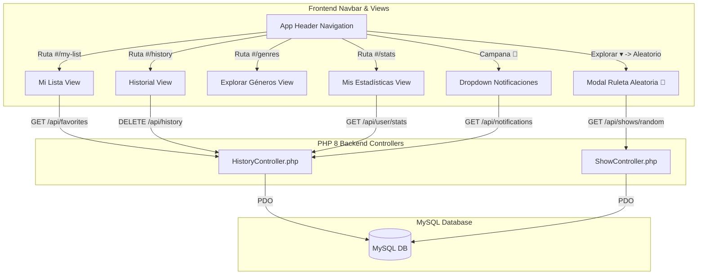

# Navigation Reorganization & 6 New Features Implementation Plan

> **For agentic workers:** REQUIRED SUB-SKILL: Use superpowers:subagent-driven-development to implement this plan task-by-task. Steps use checkbox (`- [ ]`) syntax for tracking.

**Goal:** Reorganize KuraStream's header navigation bar into a modern icon+text layout with an "Explorar" dropdown, notification bell, and build 6 new features: Mi Lista (`#/my-list`), Full History (`#/history`), Explore Genres (`#/genres`), Profile Stats (`#/stats`), Random Anime Roulette (`#random-modal`), and Episode Release Notifications (`#notifications-dropdown`).

**Architecture:** Extend PHP 8 backend with PDO MySQL methods for random shows, user stats, history deletion, and release notifications. Update `frontend/index.html`, `frontend/style.css`, `frontend/app.js`, and `frontend/js/modules/navigation.js` to implement the new header navigation, 4 new SPA hash routes, and 2 interactive popups/modals.

**Architecture Diagram:**



**Tech Stack:** PHP 8.x, PDO MySQL, HTML5 / Vanilla JavaScript, Lucide Icons, Custom Glassmorphic CSS.

## Global Constraints

- Navbar must follow **Enfoque A**: Icons + Text for main items, dropdown for "Explorar" (Películas, Géneros, Aleatorio), direct links for Mi Lista and Historial, Notification Bell in header right, and Mis Estadísticas inside User Profile menu.
- All new routes (`#/my-list`, `#/history`, `#/genres`, `#/stats`) must integrate cleanly into `app.js` hash routing.
- Lucide icons must be used consistently across all new navigation items and UI elements.

---

### Task 1: Backend PHP 8 API Endpoints & MySQL Helpers

**Files:**
- Modify: [php_backend/db.php](file:///home/carlossgr/Escritorio/KuraStream/php_backend/db.php)
- Modify: [php_backend/controllers/ShowController.php](file:///home/carlossgr/Escritorio/KuraStream/php_backend/controllers/ShowController.php)
- Modify: [php_backend/controllers/HistoryController.php](file:///home/carlossgr/Escritorio/KuraStream/php_backend/controllers/HistoryController.php)
- Modify: [php_backend/router.php](file:///home/carlossgr/Escritorio/KuraStream/php_backend/router.php)
- Create: `tests/test_new_features_db.php`

**Interfaces:**
- Consumes: MySQL PDO database connection
- Produces:
  - `DbHelper::getRandomShow()` -> random show array or null
  - `DbHelper::getUserStats($username, $profile)` -> `{ total_time_seconds: int, completed_shows: int, watched_episodes: int, genres_breakdown: array }`
  - `DbHelper::deleteHistoryItem($username, $profile, $episodeId)` / `clearUserHistory($username, $profile)`
  - `DbHelper::getNotifications($username, $profile)` -> array of recent episode releases for favorited shows
- REST API Endpoints:
  - `GET /api/shows/random` -> `{ success: true, show: {...} }`
  - `GET /api/user/stats` -> `{ success: true, stats: {...} }`
  - `DELETE /api/history?episode_id=X` or `DELETE /api/history?clear=all` -> `{ success: true }`
  - `GET /api/notifications` -> `{ success: true, notifications: [...] }`

- [ ] **Step 1: Write database test script `tests/test_new_features_db.php`**

```php
<?php
require_once __DIR__ . '/../php_backend/config.php';
require_once __DIR__ . '/../php_backend/db.php';

try {
    $db = Database::getConnection();
    echo "DB Connection OK\n";

    // Test getRandomShow
    $random = DbHelper::getRandomShow();
    echo "getRandomShow OK: " . ($random ? $random['title'] : 'no shows') . "\n";

    // Test getUserStats
    $stats = DbHelper::getUserStats('test_user', 'Principal');
    assert(isset($stats['total_time_seconds']), "stats should have total_time_seconds");
    echo "getUserStats OK: " . $stats['total_time_seconds'] . "s watched\n";

    // Test getNotifications
    $notifs = DbHelper::getNotifications('test_user', 'Principal');
    assert(is_array($notifs), "getNotifications should return array");
    echo "getNotifications OK: " . count($notifs) . " notifications\n";

    echo "ALL TESTS PASSED\n";
} catch (Throwable $e) {
    echo "TEST FAILED: " . $e->getMessage() . "\n";
    exit(1);
}
```

- [ ] **Step 2: Run test to verify failure before implementation**

Run: `php tests/test_new_features_db.php`
Expected: Failure due to missing methods.

- [ ] **Step 3: Add database helper methods in `php_backend/db.php`**

Implement `getRandomShow()`, `getUserStats($username, $profile)`, `deleteHistoryItem($username, $profile, $episodeId)`, `clearUserHistory($username, $profile)`, and `getNotifications($username, $profile)`.

- [ ] **Step 4: Update controllers and router**

Update `ShowController.php` (add `getRandomShow()`), `HistoryController.php` (add `getUserStats()`, `deleteHistory()`, `getNotifications()`), and `router.php` (route endpoints).

- [ ] **Step 5: Run DB test to verify pass**

Run: `php tests/test_new_features_db.php`
Expected: `ALL TESTS PASSED`

- [ ] **Step 6: Commit Task 1**

```bash
git add php_backend/db.php php_backend/controllers/ShowController.php php_backend/controllers/HistoryController.php php_backend/router.php tests/test_new_features_db.php
git commit -m "feat(backend): add API endpoints for random show, user stats, history deletion, and notifications"
```

---

### Task 2: Header Navbar Reorganization & Styling

**Files:**
- Modify: [frontend/index.html](file:///home/carlossgr/Escritorio/KuraStream/frontend/index.html)
- Modify: [frontend/style.css](file:///home/carlossgr/Escritorio/KuraStream/frontend/style.css)
- Modify: [frontend/js/modules/navigation.js](file:///home/carlossgr/Escritorio/KuraStream/frontend/js/modules/navigation.js)

**Interfaces:**
- Consumes: Lucide icons library
- Produces: Reorganized header navbar HTML structure, CSS dropdowns & badge styles, active route state updating.

- [ ] **Step 1: Update `<header class="app-header">` HTML in `frontend/index.html`**

Update `frontend/index.html`:
- Add icons + text to `nav-home` (`<i data-lucide="home"></i> Inicio`), `nav-airing` (`<i data-lucide="flame"></i> En Emisión`), `nav-calendar` (`<i data-lucide="calendar"></i> Calendario`).
- Add "Explorar" dropdown (`.nav-dropdown` containing `Películas`, `Géneros`, `Descubrimiento Aleatorio`).
- Add `nav-mylist` (`<i data-lucide="heart"></i> Mi Lista`) and `nav-history` (`<i data-lucide="history"></i> Historial`).
- Add `#notifications-container` bell icon button and dropdown card in `.header-right`.
- Add `#btn-user-stats` (`<i data-lucide="bar-chart-2"></i> Mis Estadísticas`) in user profile dropdown menu.

- [ ] **Step 2: Add CSS rules for new navbar components in `frontend/style.css`**

Add CSS for:
- `.nav-dropdown`, `.nav-dropdown-menu`, `.dropdown-item`: Glassmorphic popover menu for "Explorar".
- `.notifications-container`, `.nav-icon-btn`, `.notification-badge`, `.notifications-dropdown`: Bell icon with red count badge and notifications list popover.
- Responsive styles for compact screens.

- [ ] **Step 3: Update `frontend/js/modules/navigation.js`**

Handle active link highlighting for `#/my-list`, `#/history`, `#/genres`, `#/stats`, and toggle behavior for dropdown menus on click/hover.

- [ ] **Step 4: Commit Task 2**

```bash
git add frontend/index.html frontend/style.css frontend/js/modules/navigation.js
git commit -m "feat(frontend): reorganize app header navbar with icons, explore dropdown, and notification bell"
```

---

### Task 3: Dedicated SPA Views & Routing (`#/my-list`, `#/history`, `#/genres`, `#/stats`)

**Files:**
- Modify: [frontend/index.html](file:///home/carlossgr/Escritorio/KuraStream/frontend/index.html)
- Modify: [frontend/app.js](file:///home/carlossgr/Escritorio/KuraStream/frontend/app.js)

**Interfaces:**
- Consumes: REST endpoints `GET /api/favorites`, `GET /api/history`, `GET /api/shows`, `GET /api/user/stats`
- Produces: Renders view containers `#mylist-view`, `#history-view`, `#genres-view`, `#stats-view`.

- [ ] **Step 1: Add view containers in `frontend/index.html`**

Add sections inside `<main>`:
- `<section id="mylist-view" class="view-section" style="display: none;">`
- `<section id="history-view" class="view-section" style="display: none;">`
- `<section id="genres-view" class="view-section" style="display: none;">`
- `<section id="stats-view" class="view-section" style="display: none;">`

- [ ] **Step 2: Implement route handlers in `frontend/app.js`**

In `handleRoute()`:
- Match `#/my-list` -> call `renderMyListView()`
- Match `#/history` -> call `renderHistoryView()`
- Match `#/genres` -> call `renderGenresView()`
- Match `#/stats` -> call `renderStatsView()`

- [ ] **Step 3: Implement render functions in `frontend/app.js`**

- `renderMyListView()`: Fetch `GET /api/favorites`, render poster grid with sort controls (Recientes, Título, Rating).
- `renderHistoryView()`: Fetch `GET /api/history`, render watch history cards with progress bar, delete item button, and clear history button.
- `renderGenresView()`: Render interactive category cards (Acción, Isekai, Romance, Shonen, etc.) with icons & show counters. Clicking a card filters catalog.
- `renderStatsView()`: Fetch `GET /api/user/stats`, render stats cards (total time in days/hours, completed shows, top genre) and CSS bar chart of genre distribution.

- [ ] **Step 4: Commit Task 3**

```bash
git add frontend/index.html frontend/app.js
git commit -m "feat(frontend): add SPA views for Mi Lista, History, Genres, and User Stats"
```

---

### Task 4: Interactive Modals & Notification Popover (Random Anime 🎲 & Notifications 🔔)

**Files:**
- Modify: [frontend/index.html](file:///home/carlossgr/Escritorio/KuraStream/frontend/index.html)
- Modify: [frontend/app.js](file:///home/carlossgr/Escritorio/KuraStream/frontend/app.js)
- Modify: [frontend/style.css](file:///home/carlossgr/Escritorio/KuraStream/frontend/style.css)
- Create: `tests/navigation_new_views.test.js`

**Interfaces:**
- Consumes: `GET /api/shows/random`, `GET /api/notifications`
- Produces: `#random-modal` roulette popup, notification bell badge & list popover.

- [ ] **Step 1: Add Random Modal HTML in `frontend/index.html`**

```html
<div class="modal" id="random-modal" style="display: none;">
  <div class="modal-content random-modal-content">
    <button class="modal-close" id="btn-close-random">&times;</button>
    <div class="random-card" id="random-card-body">
      <!-- Dynamic random show content -->
    </div>
  </div>
</div>
```

- [ ] **Step 2: Implement Random Modal & Notifications logic in `frontend/app.js`**

- `openRandomAnimeModal()`: Fetch `GET /api/shows/random`, trigger slot machine / spinner animation, render poster, title, synopsis, rating, and `[▶️ Ver Ahora]` + `[🎲 Otro Anime]` buttons.
- `loadNotifications()`: Fetch `GET /api/notifications`, update `#notification-badge` count and populate `#notifications-list`.
- Event listeners for `#btn-random-anime`, `#btn-notifications-trigger`, `#btn-mark-notifications-read`.

- [ ] **Step 3: Add CSS for Random Modal & Stats Charts in `frontend/style.css`**

Add CSS for `#random-modal`, `.random-card`, `.stats-grid`, `.stat-card`, `.genre-bar-chart`.

- [ ] **Step 4: Create & run automated test `tests/navigation_new_views.test.js`**

```javascript
import { test } from 'node:test';
import assert from 'node:assert';
import fs from 'node:fs';

test('index.html contains new navigation links and view sections', () => {
  const html = fs.readFileSync('frontend/index.html', 'utf8');
  assert.ok(html.includes('id="nav-mylist"'), 'should have nav-mylist link');
  assert.ok(html.includes('id="nav-history"'), 'should have nav-history link');
  assert.ok(html.includes('id="mylist-view"'), 'should have mylist-view section');
  assert.ok(html.includes('id="history-view"'), 'should have history-view section');
  assert.ok(html.includes('id="genres-view"'), 'should have genres-view section');
  assert.ok(html.includes('id="stats-view"'), 'should have stats-view section');
  assert.ok(html.includes('id="random-modal"'), 'should have random-modal');
  assert.ok(html.includes('id="notifications-container"'), 'should have notifications-container');
});
```

Run: `node --test tests/navigation_new_views.test.js`
Expected: PASS

- [ ] **Step 5: Commit Task 4**

```bash
git add frontend/index.html frontend/app.js frontend/style.css tests/navigation_new_views.test.js
git commit -m "feat(frontend): implement random anime roulette modal and episode release notifications"
```
