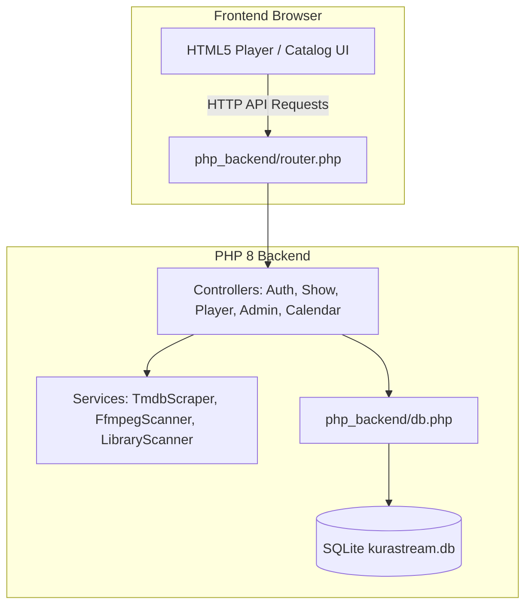

# Modular PHP Backend Migration Implementation Plan

> **For agentic workers:** REQUIRED SUB-SKILL: Use superpowers:subagent-driven-development to implement this plan task-by-task. Steps use checkbox (`- [ ]`) syntax for tracking.

**Goal:** Completely replace the Node.js backend with a clean, decoupled, modular PHP 8.x architecture (`php_backend/`) supporting SQLite PDO, JWT authentication, TMDB/AniList scraping, FFmpeg probing, and HTTP 206 video streaming.

**Architecture:**
1. `php_backend/config.php` & `php_backend/db.php` for environment constants and SQLite PDO data access.
2. `php_backend/services/` for TMDB scraping, AniList schedule fetching, and FFmpeg video probing.
3. `php_backend/controllers/` for Auth, Shows, Player, Calendar, History, and Admin endpoints.
4. `php_backend/router.php` front controller serving static files and routing API requests.

**Architecture Diagram:**

**Tech Stack:** PHP 8.x, PDO SQLite, cURL, FFmpeg, Vanilla JS/HTML5.

## Global Constraints
- Preserve exact JSON API response formats.
- Maintain 1:1 schema compatibility with `kurastream.db`.
- Modular separation into controllers and services.

---

### Task 1: Core Setup, Config, PDO Database & Services

**Files:**
- Create: `php_backend/config.php`
- Create: `php_backend/db.php`
- Create: `php_backend/services/TmdbScraper.php`
- Create: `php_backend/services/FfmpegScanner.php`
- Create: `php_backend/services/LibraryScanner.php`

- [ ] **Step 1: Create `php_backend/config.php`**

Define paths, JWT secret, salt, and CORS headers.

- [ ] **Step 2: Create `php_backend/db.php`**

Initialize PDO SQLite connection and helper methods (`getShows`, `saveShow`, `deleteShow`, `getEpisodes`, `getHistory`, `getFavorites`, `getStagedImports`, `publishStagedImport`).

- [ ] **Step 3: Create `php_backend/services/TmdbScraper.php`**

Implement search and details metadata extraction using cURL.

- [ ] **Step 4: Create `php_backend/services/FfmpegScanner.php` & `LibraryScanner.php`**

Implement video probing with `ffprobe`/`ffmpeg` CLI and folder scanner logic.

---

### Task 2: Controllers & Router Front Controller

**Files:**
- Create: `php_backend/controllers/AuthController.php`
- Create: `php_backend/controllers/ShowController.php`
- Create: `php_backend/controllers/PlayerController.php`
- Create: `php_backend/controllers/CalendarController.php`
- Create: `php_backend/controllers/HistoryController.php`
- Create: `php_backend/controllers/AdminController.php`
- Create: `php_backend/router.php`

- [ ] **Step 1: Implement Controllers**

Write each controller class with individual static handling methods.

- [ ] **Step 2: Implement `php_backend/router.php`**

Front controller handling static asset serving and REST endpoint routing.

- [ ] **Step 3: Test PHP Backend HTTP server locally**

Run: `php -S 0.0.0.0:3000 php_backend/router.php`
Verify API endpoints return expected JSON.
