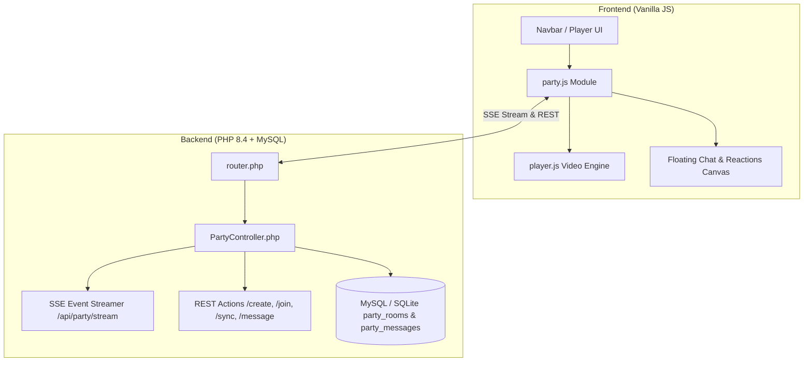

# Watch Party (Salas Virtuales en Vivo) Implementation Plan

> **For agentic workers:** REQUIRED SUB-SKILL: Use superpowers:subagent-driven-development to implement this plan task-by-task. Steps use checkbox (`- [ ]`) syntax for tracking.

**Goal:** Implement full Watch Party real-time synchronized group playback with integrated floating chat, flying reactions, room codes/links, and host controls using PHP SSE + REST and Vanilla JS.

**Architecture:** A lightweight Server-Sent Events (SSE) stream on PHP (`/api/party/stream`) broadcasts real-time play, pause, seek, episode change, user join/leave events and chat/reactions with sub-second latency and an automatic fallback polling mechanism. The frontend client integrates smoothly into the VLC-style player with drift correction (smoothly adjusting playbackRate for minor offsets <1.5s and instant seek for major jumps).

**Architecture Diagram:**



**Tech Stack:** PHP 8.4, MySQL / SQLite, Server-Sent Events (SSE), HTML5 Video API, JavaScript Vanilla (ES Modules), CSS3 Glassmorphism Animations.

## Global Constraints
- No external WebSocket daemons or extra ports (runs natively on PHP server port 3000).
- Pure local execution and testing (no remote SSH access needed).
- Full compatibility with existing VLC-style player controls and fullscreen mode.

---

### Task 1: Database Schema and Helpers for Watch Party

**Files:**
- Modify: `php_backend/db.php`
- Test: `php_backend/tests/test_party_rooms.php`

**Interfaces:**
- Produces: `DbHelper::createPartyRoom()`, `DbHelper::getPartyRoom()`, `DbHelper::updatePartyRoom()`, `DbHelper::addPartyMessage()`, `DbHelper::getPartyMessages()`, `DbHelper::getPublicPartyRooms()`, `DbHelper::cleanupExpiredPartyRooms()`

- [ ] **Step 1: Write the test suite for Party Database helpers**

```php
<?php
require_once __DIR__ . '/../config.php';
require_once __DIR__ . '/../db.php';

// Initialize schema
Database::initializeSchema();

// Test 1: Create Party Room
$roomId = DbHelper::createPartyRoom([
    'id' => 'KURA-TEST1',
    'host_user' => 'Carlos',
    'episode_id' => 'Sousou_no_Frieren_S01_E01',
    'is_public' => 1,
    'allow_guest_controls' => 0
]);
assert($roomId === 'KURA-TEST1', 'Room creation failed');

// Test 2: Get Room
$room = DbHelper::getPartyRoom('KURA-TEST1');
assert($room !== null && $room['host_user'] === 'Carlos', 'Room retrieval failed');

// Test 3: Update Playback State
$up = DbHelper::updatePartyPlayback('KURA-TEST1', true, 125.5, 'Sousou_no_Frieren_S01_E01');
assert($up === true, 'Room update failed');
$roomUpdated = DbHelper::getPartyRoom('KURA-TEST1');
assert((int)$roomUpdated['is_playing'] === 1 && (float)$roomUpdated['current_time'] === 125.5, 'Playback sync mismatch');

// Test 4: Add & Retrieve Messages
$msgId = DbHelper::addPartyMessage('KURA-TEST1', 'Carlos', '¡Hola a todos!', 'chat');
assert($msgId > 0, 'Message insertion failed');
$messages = DbHelper::getPartyMessages('KURA-TEST1', 0);
assert(count($messages) === 1 && $messages[0]['message'] === '¡Hola a todos!', 'Message retrieval mismatch');

echo "✅ Task 1 Database Tests Passed!\n";
```

- [ ] **Step 2: Run test to verify it fails before implementation**

Run: `php php_backend/tests/test_party_rooms.php`
Expected: Error or undefined method in DbHelper.

- [ ] **Step 3: Implement database tables and helper methods in `php_backend/db.php`**

Add table creation for `party_rooms` and `party_messages` in `Database::initializeSchema()` and implement helper methods in `DbHelper`.

- [ ] **Step 4: Run test to verify it passes**

Run: `php php_backend/tests/test_party_rooms.php`
Expected: `✅ Task 1 Database Tests Passed!`

- [ ] **Step 5: Commit**

```bash
git add php_backend/db.php php_backend/tests/test_party_rooms.php
git commit -m "feat(party): add party_rooms and party_messages schema and DbHelper methods"
```

---

### Task 2: Backend Controller and SSE Streamer

**Files:**
- Create: `php_backend/controllers/PartyController.php`
- Modify: `php_backend/router.php`
- Test: `php_backend/tests/test_party_rooms.php`

**Interfaces:**
- Produces: `PartyController::createRoom()`, `PartyController::joinRoom()`, `PartyController::leaveRoom()`, `PartyController::syncPlayback()`, `PartyController::sendMessage()`, `PartyController::streamEvents()`, `PartyController::pollEvents()`, `PartyController::getPublicRooms()`

- [ ] **Step 1: Add API endpoint assertions to `test_party_rooms.php`**

Verify JSON response structures for `/api/party/create`, `/api/party/sync`, `/api/party/message`, and `/api/party/poll`.

- [ ] **Step 2: Run test to verify it fails**

Run: `php php_backend/tests/test_party_rooms.php`
Expected: Controller not found.

- [ ] **Step 3: Implement `php_backend/controllers/PartyController.php`**

Implement complete room creation with random code generation (e.g. `KURA-XXXX`), participant tracking, message handling, SSE stream loop with headers (`text/event-stream`, `no-cache`, `flush()`), and fallback polling endpoint.

- [ ] **Step 4: Wire routes in `php_backend/router.php`**

Add `/api/party/*` routes.

- [ ] **Step 5: Run test to verify it passes**

Run: `php php_backend/tests/test_party_rooms.php`
Expected: `✅ All Backend Party API Tests Passed!`

- [ ] **Step 6: Commit**

```bash
git add php_backend/controllers/PartyController.php php_backend/router.php php_backend/tests/test_party_rooms.php
git commit -m "feat(party): implement PartyController with SSE streaming and REST endpoints"
```

---

### Task 3: Frontend Watch Party Client Engine (`party.js`)

**Files:**
- Create: `frontend/js/modules/party.js`
- Modify: `frontend/app.js`

**Interfaces:**
- Produces: `PartyClient` class managing SSE connection, drift correction, message publishing, reaction emitting, and member list state.

- [ ] **Step 1: Implement `frontend/js/modules/party.js`**

Implement client logic:
- `connectToRoom(roomId, userNickname)`
- SSE `EventSource` listener with fallback to 1.5s interval polling
- Drift correction engine comparing `video.currentTime` against `room.current_time`
- Reaction trigger broadcasting flying emoji particles across the canvas
- Chat message sender and UI message queue

- [ ] **Step 2: Verify syntax**

Run: `node --check frontend/js/modules/party.js`
Expected: 0 syntax errors.

- [ ] **Step 3: Commit**

```bash
git add frontend/js/modules/party.js
git commit -m "feat(party): add frontend party client engine with SSE listener and drift sync"
```

---

### Task 4: Player UI Integration & Floating Chat / Reactions

**Files:**
- Modify: `frontend/player.js`
- Modify: `frontend/index.html`
- Modify: `frontend/style.css`

- [ ] **Step 1: Add Watch Party controls in `player.js`**

- Add **"🎉 Watch Party"** button to player control bar and top header.
- Add collapsible floating chat sidebar with glassmorphic dark theme.
- Add quick reaction buttons (🔥, 😭, 😱, ❤️, 🎉) with animated CSS float-up trajectories.
- Add host indicator 👑 and room sharing modal (copy link / QR code).
- Connect player `play`, `pause`, `seeking`, and `ended` events to `PartyClient.syncPlayback()`.

- [ ] **Step 2: Add Watch Party hub and modals in `index.html` and `style.css`**

- Add Watch Party tab to main navigation to browse active public rooms and join via room code.
- Add CSS animations for flying emoji reactions, translucent chat bubbles, and pulsing live badges.

- [ ] **Step 3: Validate syntax and local UI rendering**

Run: `node --check frontend/player.js && node --check frontend/app.js`
Expected: 0 errors.

- [ ] **Step 4: Commit**

```bash
git add frontend/player.js frontend/index.html frontend/style.css frontend/app.js
git commit -m "feat(party): integrate floating chat, flying reactions, room modals, and player sync"
```

---

### Task 5: End-to-End Verification and Walkthrough

**Files:**
- Test: `php_backend/tests/test_party_rooms.php`
- Create: `walkthrough.md`

- [ ] **Step 1: Run complete automated test suite**

Run: `php php_backend/tests/test_party_rooms.php && php php_backend/tests/test_torrent_downloader.php`
Expected: All tests pass.

- [ ] **Step 2: Document implementation in walkthrough.md**

Update walkthrough artifact with features, testing instructions, and screenshots/demos.

- [ ] **Step 3: Commit final changes**

```bash
git add .
git commit -m "chore(party): finalize Watch Party integration and verification suite"
```
