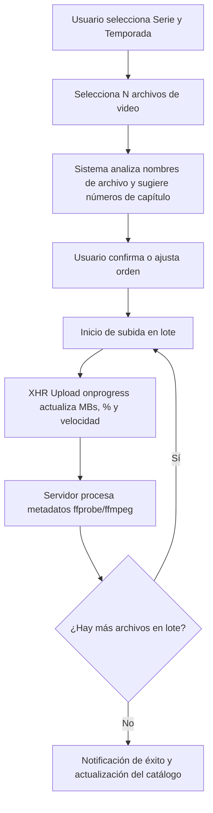

# Especificación de Diseño: Carga Masiva por Temporada y Barra de Progreso de Subida

**Fecha:** 2026-08-05  
**Estado:** Propuesto / En revisión  

---

## 1. Visión General
Mejorar el módulo de importación de contenido en el Panel de Administración de KuraStream para permitir:
1. **Barra de Progreso de Subida en Tiempo Real:** Visualización en vivo del porcentaje transferido (0% - 100%), MBs subidos/totales y estado del procesamiento en servidor (`ffprobe`/`ffmpeg`).
2. **Carga Masiva de Capítulos por Temporada:** Posibilidad de seleccionar o arrastrar múltiples archivos de video a la vez (`.mkv`, `.mp4`, `.avi`, `.webm`), autodetectando inteligentemente la numeración de los capítulos desde los nombres de archivo y procesándolos secuencialmente en lote.

---

## 2. Arquitectura de Componentes

### 2.1. Frontend (`frontend/index.html`, `frontend/app.js`, `frontend/style.css`)
- **Zona de Arrastre / Selección Múltiple:**
  - Atributo `multiple` habilitado en el selector de archivos `<input type="file" id="import-file" accept=".mkv,.mp4,.avi,.webm" multiple>`.
  - Etiqueta interactiva `selected-file-label` que indica la cantidad de archivos seleccionados (ej: `"12 archivos seleccionados"`).
  - Previsualización interactiva en tabla/lista desplegable de los archivos detectados con sus números de capítulo auto-extraídos.
- **Barra de Progreso y Monitor de Subida:**
  - Componente de barra de carga con degradado `var(--accent-color)` a `#00e08f`.
  - Métrica general de lote (ej: `Capítulo 3 de 12 (25%)`).
  - Métrica en tiempo real del archivo en curso: `45% · 450 MB / 1.0 GB (15 MB/s)`.
  - Transición automática al estado de extracción con `ffprobe`/`ffmpeg` una vez completada la transferencia del archivo.
- **Lógica del Cliente (`XMLHttpRequest`):**
  - Migración de `fetch()` a `XMLHttpRequest` con listener `xhr.upload.onprogress` para calcular el porcentaje exacto de bytes transferidos.

### 2.2. Backend (`backend/server.js`)
- **Manejador `/api/import`:**
  - Mantiene compatibilidad total con la importación individual.
  - Procesa cada archivo multipart de la serie/temporada, extrayendo pistas de audio/subtítulos y miniaturas.
  - Retorna estado JSON de éxito por capítulo.

---

## 3. Experiencia de Usuario y Flujo de Trabajo

---

## 4. Plan de Pruebas y Verificación

1. **Prueba de Subida Individual:** Verificar que la importación de 1 solo archivo o ruta local continúe funcionando sin regresiones.
2. **Prueba de Subida Masiva:** Subir 3 archivos de video simultáneamente asignados a Temporada 1, verificando que los capítulos 1, 2 y 3 se registren en la base de datos con sus miniaturas y códecs.
3. **Prueba de Barra de Progreso:** Verificar que el listener `onprogress` muestre la animación y el avance porcentual continuo de 0 a 100%.
