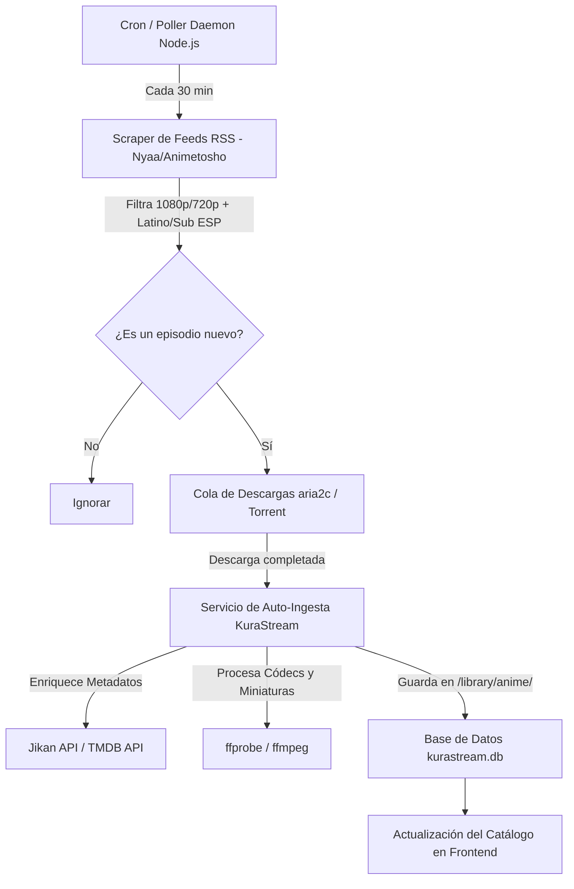

# Especificación de Diseño: Motor Automatizado de Descarga de Anime por Torrent e Ingesta Automática

**Fecha:** 2026-08-06  
**Estado:** En revisión / Propuesto  
**Servidor Objetivo:** `dserver-calos@192.168.18.4` (Servidor Debian local) y entorno de desarrollo.

---

## 1. Visión General

El objetivo de esta funcionalidad es automatizar completamente el descubrimiento, descarga e ingesta de animes en **Español Latino** y **Subtitulado en Español** en la plataforma KuraStream.

El sistema funcionará sin intervención humana mediante un servicio daemon de Node.js en el servidor, utilizando **feeds RSS y búsquedas automatizadas en Nyaa/Animetosho**, descargando los archivos mediante **`aria2c` / torrent engine**, procesándolos con `ffprobe`/`ffmpeg` e integrándolos automáticamente a la base de datos de KuraStream.

---

## 2. Arquitectura del Sistema

---

## 3. Componentes Detallados

### 3.1. Daemon Automatizado (`backend/scripts/anime_autodownloader.js`)
* **Intervalo de Escaneo:** Configurable (por defecto cada 30 minutos).
* **Filtros de Contenido:**
  * Palabras clave requeridas: `[Latino]`, `[Sub Español]`, `[ESP]`, `Español`, `Castellano` / `Latino`.
  * Formatos soportados: `.mkv`, `.mp4`.
  * Filtro anti-duplicados: Almacena hashes e identificadores de torrents descargados en SQLite (`downloaded_torrents`).

### 3.2. Cliente de Torrents Headless (`aria2c` RPC / Downloader Engine)
* **Descarga Liviana:** Utiliza `aria2c` en segundo plano en el servidor Debian local.
* **Directorio Temporal:** `/library/downloads/temp/`
* **Manejo de Eventos:** Evento `onDownloadComplete` notifica inmediatamente al pipeline de ingesta.

### 3.3. Ingesta Automática y Enriquecimiento de Metadatos
* **Analizador de Títulos:** Extrae el nombre del anime, temporada y episodio utilizando expresiones regulares robustas (ej. `[Fansub] Oshi no Ko - S02E05 [1080p Latino].mkv`).
* **Consulta de Metadatos:** Busca portadas y descripciones usando Jikan API (MyAnimeList) y TMDB API.
* **Procesamiento de Video:** Genera vistas previas y miniaturas optimizadas con `ffmpeg`.
* **Registro en SQLite:** Agrega la serie, temporada y capítulo en `kurastream.db`.

### 3.4. Integración en el Panel de Administración de KuraStream
* **Controles en UI Admin (`frontend/index.html` & `frontend/app.js`):**
  * Interruptor ON / OFF del servicio de auto-descarga.
  * Botón "Escanear y Buscar Nuevos Animes Ahora".
  * Monitor de descargas activas (Barra de progreso de descarga del torrent, velocidad KB/s y tiempo restante).
  * Historial de animes auto-descargados e importados.

---

## 4. Endpoints API backend

| Método | Endpoint | Descripción |
|---|---|---|
| `GET` | `/api/admin/autodownload/status` | Devuelve estado del daemon, descargas activas e historial. |
| `POST` | `/api/admin/autodownload/toggle` | Activa/Desactiva el auto-downloader. |
| `POST` | `/api/admin/autodownload/scan` | Ejecuta un escaneo e ingesta manual inmediato. |

---

## 5. Plan de Pruebas y Verificación

1. **Prueba de Parsing y Filtrado RSS:** Verificar que el script extraiga correctamente torrents con etiquetas `[Latino]` y `[Sub Español]` omitiendo contenido no deseado.
2. **Prueba de Descarga e Ingesta:** Simular/ejecutar la descarga de 1 episodio de prueba y verificar que se mueva a `/library/anime/...`, genere su miniatura y aparezca en la UI de KuraStream.
3. **Prueba de Control desde Admin Panel:** Verificar que activar/desactivar el servicio desde el panel admin funcione correctamente y persista el estado.
